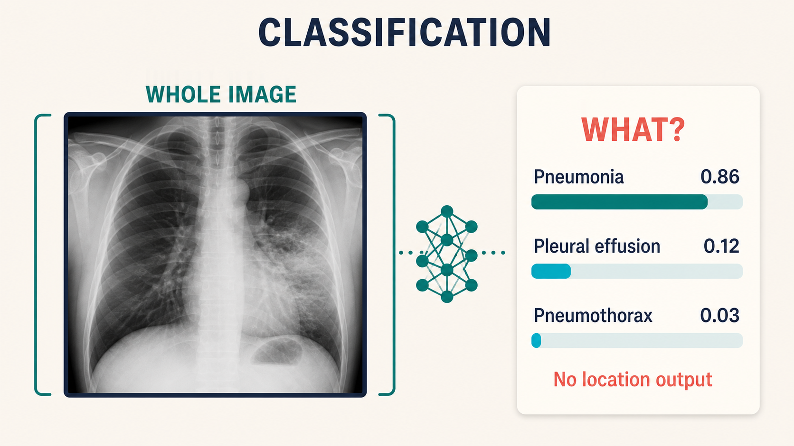
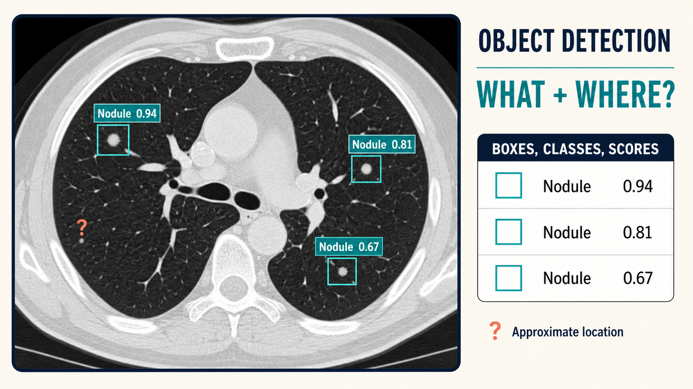
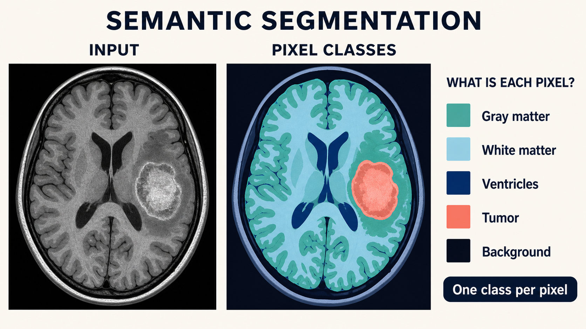
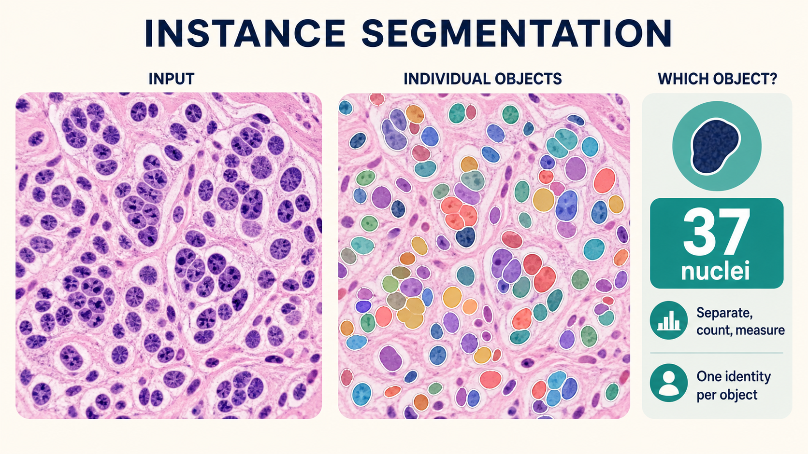

# What Computer Vision Can Do {#sec-cv-tasks}

Almost every claim in the rest of this book reduces to one of a small set of visual tasks: *is there disease in this image?*, *where is it?*, *what is its shape and extent?*, *has it changed since the last scan?*, or *what should the report say?* The task determines the data you need, the architecture you choose (@sec-architectures), and the metric that decides whether the system works. This chapter walks through those tasks, each anchored in a medical example and its standard evaluation.

::: {.callout-tip title="For the engineer"}
Resist the temptation to call everything "image classification." Choosing the right task formulation — detection instead of classification, segmentation instead of bounding boxes, ordinal regression instead of classes — is often the single highest-leverage design decision in a medical AI project.
:::

::: {.callout-tip title="For the clinician"}
Each section below is a different answer to the question "what should the AI output look like?" A likelihood, a box, an outline, a number, a new image, or a paragraph — each carries different information and different failure modes, and knowing which you were promised is the first step in reviewing any vendor claim.
:::

## Four tasks, four kinds of answer

Classification, object detection, semantic segmentation, and instance segmentation can all inspect the same pixels, but they answer different questions and require different annotations. The distinction is easiest to see in the shape of the output:

| Task | Question | Training annotation | Model output | Typical medical use |
|---|---|---|---|---|
| Classification | **What is present?** | One or more labels per image, series, or study | Class score(s) | Triage, screening, view recognition, quality control |
| Object detection | **What is present, and roughly where?** | A box and class for every target | Boxes, classes, confidence scores | Nodules, polyps, fractures, devices |
| Semantic segmentation | **What class is each pixel or voxel?** | A class mask | One class label per pixel or voxel | Organ and tumor volumes, treatment planning |
| Instance segmentation | **Which individual object owns each pixel?** | A separate mask for every object | Object identity, class, mask, score | Nucleus counting, lesion counting, cell morphology |

The tasks form an information ladder. Classification compresses an image to a few scores. Detection adds approximate location. Semantic segmentation restores exact spatial extent but merges objects of the same class. Instance segmentation preserves both exact boundaries and individual identity. More detailed output is not automatically better: it costs more to label, train, validate, store, and integrate.

## Classification: one decision for the whole image

**Classification** assigns a label—or a set of scores—to an entire input. For a chest radiograph the question might be *does this image contain pneumonia?* The answer may be clinically useful for triage, but it does not say which lung contains the opacity or how large it is. The unit being classified must be explicit: one image, one series, one 3D study, or one patient can produce very different datasets and models.

{#fig-classification-example fig-alt="A chest radiograph is treated as one whole input and mapped to probabilities for pneumonia, pleural effusion, and pneumothorax. No box, contour, or location is shown."}

There are several important variants:

- **Binary classification** asks one yes/no question, such as pneumothorax present versus absent.
- **Multiclass classification** chooses one mutually exclusive class, such as frontal versus lateral versus oblique view.
- **Multi-label classification** assigns several independent labels because one image can simultaneously contain cardiomegaly, effusion, and consolidation.
- **Ordinal classification** predicts ordered categories such as mild, moderate, and severe. Treating these as unrelated classes discards their clinical ordering.

Training labels are comparatively cheap: they may come from a report, diagnosis code, or study-level review. That convenience creates the task's characteristic weakness—**label ambiguity**. A positive report does not prove the finding is visible on every image in the study, and a negative report does not prove it was absent. Models may also exploit shortcuts such as portable-scanner markers or laterality tokens instead of anatomy.

**How it is evaluated.** AUROC measures ranking across all thresholds; sensitivity and specificity describe one operating point; precision depends strongly on prevalence and therefore better reflects the false-alert burden in deployment. If scores drive a clinical threshold, **calibration** matters too: among cases assigned 0.8 probability, roughly 80% should truly be positive.

## Object detection: a list of findings and locations

**Object detection** predicts a variable-length list of objects. Each prediction usually contains a class, a confidence score, and a rectangular or cuboidal bounding box. Detection therefore answers *what is present and roughly where?* It is appropriate when the workflow must direct attention, count candidates, or crop regions for a second model, but does not require an exact boundary.

{#fig-object-detection-example fig-alt="An axial lung CT contains three pulmonary nodules enclosed by separate rectangular boxes with confidence scores. A small unboxed candidate illustrates a possible missed detection."}

Creating a detection dataset requires an annotator to mark **every relevant object**, not merely one representative lesion. Missing annotations are especially damaging: a real nodule left unboxed is treated during training as background. Box definitions must also be consistent—does a box include surrounding edema, pleural contact, or only the solid lesion? In 3D imaging, teams must decide whether to annotate boxes per slice or one 3D cuboid per lesion.

Detectors fail in two clinically visible ways. **False positives** create extra boxes and consume reader attention; **false negatives** leave a real finding completely unmarked. Small lesions are difficult because they occupy few pixels, and multiple predictions around one lesion require **non-maximum suppression** or a set-prediction design to collapse duplicates.

**How it is evaluated.** A predicted box is matched to a reference using **intersection over union (IoU)**. Precision–recall is then summarized as **average precision (AP)**, and averaged across classes or IoU thresholds as **mAP**. For lesion-finding systems, sensitivity at a fixed number of false positives per image or scan is often more interpretable: *what fraction of nodules are found if the system is allowed one false alarm per CT?*

::: {.callout-note title="A heatmap is not a detector"}
A class-activation heatmap shows which region influenced a classification score; it does not produce a validated object list. Weakly supervised localization is useful for explanation and cheap prototyping, but a diffuse hot region should not be reported as if it were a measured lesion box.
:::

## Semantic segmentation: a class for every pixel

**Semantic segmentation** labels every pixel in 2D—or every voxel in 3D—with a class. All liver pixels share the liver label; all tumor pixels share the tumor label; background receives its own label. The result preserves exact spatial extent, which makes segmentation the workhorse of quantitative imaging: organ volume, tumor burden, cartilage thickness, radiation dose planning, and surgical margins all begin with a mask.

{#fig-semantic-segmentation-example fig-alt="A grayscale axial brain MRI is shown beside the same slice with colored masks assigning each pixel to gray matter, white matter, ventricles, tumor, or background."}

A segmentation label is far more expensive than an image label or box. Experts must trace boundaries slice by slice, and legitimate disagreement occurs at infiltrative tumor edges, low-contrast organ borders, and partial-volume voxels. Annotation protocols therefore need explicit rules and often multiple reviewers. In volumetric imaging, geometry matters as much as pixels: a mask must remain aligned after resampling, orientation changes, and DICOM-to-NIfTI conversion.

The model outputs a class probability for every pixel or voxel, then converts those probabilities into a mask. Post-processing may remove tiny disconnected islands, fill holes, or keep only the largest component—but every such rule can also erase real disease. The U-Net family and its descendants dominate this task because their encoder–decoder structure combines semantic context with fine boundaries (@sec-architectures).

**How it is evaluated.** The **Dice coefficient** measures overlap and is robust to the severe foreground–background imbalance common in medicine. **IoU** measures similar overlap more strictly. **Hausdorff distance**, usually HD95, measures boundary error and exposes thin spillovers that overlap scores can hide. For clinical use, add a task-specific measure—volume error, maximum diameter error, or dose impact—because two masks with the same Dice score may not be equally useful.

## Instance segmentation: a mask for every object

**Instance segmentation** combines detection and segmentation. It assigns a class and an exact mask to each individual object, so two touching nuclei remain nucleus 17 and nucleus 18 rather than merging into one region. The output supports counting, per-object measurements, tracking across frames, and analysis of spatial relationships.

{#fig-instance-segmentation-example fig-alt="An H-and-E histology field is shown beside an overlay where individual nuclei have separate colored masks and boundaries. A result card reports a nucleus count and per-object measurement capability."}

The difference from semantic segmentation is fundamental. If ten adjacent nuclei are all colored simply *nucleus*, semantic segmentation may represent them as one connected blob. Instance segmentation must find ten centers or proposals, separate ten boundaries, and return ten identities. This makes crowded scenes—pathology, blood smears, microscopy, and clustered lesions—its natural domain.

Instance annotations are the most laborious of the four core tasks because every object needs a separate contour. Models must balance three errors: **missed instances**, **duplicate instances**, and **merged or split instances**. A visually convincing foreground mask can still produce a wildly wrong cell count if touching objects merge.

**How it is evaluated.** Per-instance AP evaluates whether each predicted mask matches a reference object at an IoU threshold. **Panoptic quality** combines recognition and mask quality. Counting error and per-object measurement error should be reported when those are the clinical purpose. In pathology, object-level precision and recall may matter more than aggregate pixel overlap (@sec-digital-pathology).
## Keypoints, landmarks and registration

Some clinical questions are answered by points rather than regions:

- **Keypoint detection** finds anatomically defined landmarks — the corners of a vertebra, the apex of the heart, the center of a femoral head — and from those landmarks derives angles, lengths, and alignment measurements. Orthopedics, craniofacial analysis, and cardiac geometry all live here. Landmark error is usually reported in millimeters.
- **Registration** aligns two images into a common frame: the pre-operative MRI to the intraoperative CT, this month's MRI to last year's, the motion-corrected sequence to the reference. It is the invisible plumbing behind longitudinal comparison ("has this lesion grown?") and image-guided intervention. Quality is judged by target registration error (TRE) in millimeters.

Longitudinal comparison deserves emphasis: **change detection** — registering follow-up to baseline and analyzing the difference — is how growth, response to therapy, and progression are quantified, and it is one of the most immediately useful forms of AI in clinical workflow.
## Depth estimation

Monocular depth estimation predicts how far away each pixel is from a single image. In medicine its value concentrates in video-based fields: laparoscopic surgery (@sec-surgical-video), where instrument-to-tissue distance matters for autonomy and safety, and bronchoscopy or endoscopy, where 3D scene understanding supports navigation. It is also the enabling layer behind novel-view synthesis and the reconstruction tasks in @sec-frontier-models.

## Image-to-image

Image-to-image models transform one image into another while preserving spatial layout:

- **Denoising and artifact removal** — reduce scan noise or motion artifacts, often to enable lower radiation dose or shorter acquisition times. Evaluation is subtle: the output must be *diagnostically* faithful, not merely pretty.
- **Super-resolution** — synthesize a sharper, higher-resolution image from an acquired lower-resolution one. Tempting, and genuinely useful for display and downstream tasks, but it hallucinates detail where none was acquired — a caveat that matters enormously in diagnosis.
- **Modality translation** — synthesize a CT from an MRI, or a contrast image from a non-contrast one. Clinically valuable when the target modality is expensive, uncomfortable, or unavailable, and as a data-augmentation trick to make paired datasets go further.
- **Virtual contrast / virtual staining** — predict how tissue would appear under a stain or contrast agent that was never administered.

These tasks blur into the generative methods of @sec-frontier-models; the difference is mostly in intent and evaluation. Here the goal is a *usable clinical image*; there, it is often a *realistic sample*.

## Image-to-text

- **Report generation** produces natural-language findings from an image. The engineering challenge is not fluency — language models produce fluent text trivially — but **faithfulness**: the report must be supported by pixels, complete, and clinically actionable. Hallucinated findings are a safety-critical failure, not an inconvenience.
- **Visual question answering (VQA)** lets a user ask "is there a pneumothorax?" and get an answer grounded in the image. In medical use, VQA doubles as an education and second-opinion tool, but the same grounding requirement applies.
- **Captioning and structured extraction** convert a report into structured fields or an image into a structured finding list — the quiet workhorse that connects AI analysis to the EHR.

All three are vision-language problems and share machinery with the models discussed in @sec-frontier-models.

## Text-to-image

Text-to-image generation in medicine serves three honest purposes: **synthetic data augmentation** (rare findings, balanced demographic representation), **education and communication** (illustrations a patient can actually understand), and **privacy-preserving research data**. It must never be conflated with diagnostic truth. A generated image can be realistic and wrong; every synthetic-image claim in this book should be read with that sentence in mind.
<!-- Synthesis and augmentation. -->

## How we measure success

Choosing the metric is choosing what the system optimizes for. The core toolkit:

| Metric | Task family | What it rewards | Medical caveat |
|---|---|---|---|
| AUROC | classification | ranking positives above negatives | insensitive to prevalence; a great AUROC can still miss the clinically chosen threshold |
| Sensitivity / specificity | classification | catches disease / avoids false alarms | must be reported together, at a clinically meaningful operating point |
| Dice | segmentation | volumetric overlap | insensitive to small boundary errors that may matter |
| HD95 | segmentation | worst-case boundary error | sensitive to outlier blobs |
| mAP | detection | precise boxes, ranked by confidence | hides per-class behavior; small-lesion performance needs its own view |
| F1 / IoU | instance segmentation | correct instances, not just pixels | counting accuracy often matters more |
| Landmark error (mm) | keypoints | physical accuracy | the only metric that maps directly to anatomy |
| Calibration (ECE) | classification | honest probabilities | essential whenever output feeds a decision threshold |

Beyond any single number, three questions decide whether a metric is trustworthy:

1. **What was the test set?** Patient-level splits, external validation, and representative case mix (@sec-ml-concepts).
2. **Does the metric match the decision?** A triage tool needs high sensitivity; a quantitative biomarker needs accuracy in physical units; a report generator needs faithfulness, not BLEU score.
3. **Is the uncertainty communicated?** A confidence estimate that is honest (calibrated) is worth more than a point prediction, especially when the downstream consumer is a clinician deciding whether to trust the output.

The next chapter examines the architectures that make these outputs possible.
<!-- AUROC, Dice, Hausdorff, mAP, calibration. -->
