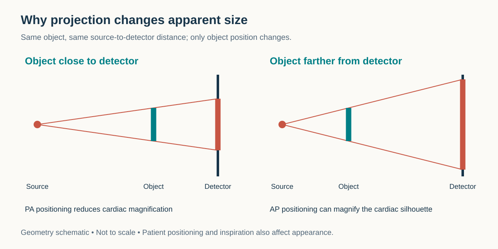
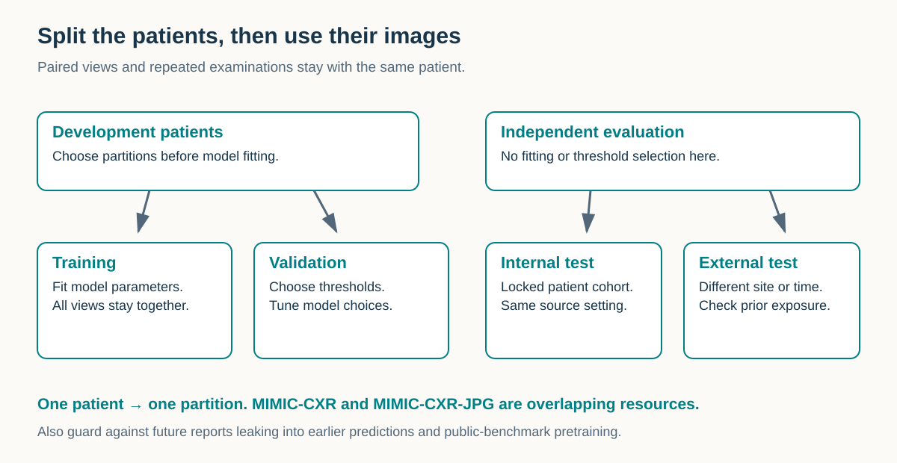
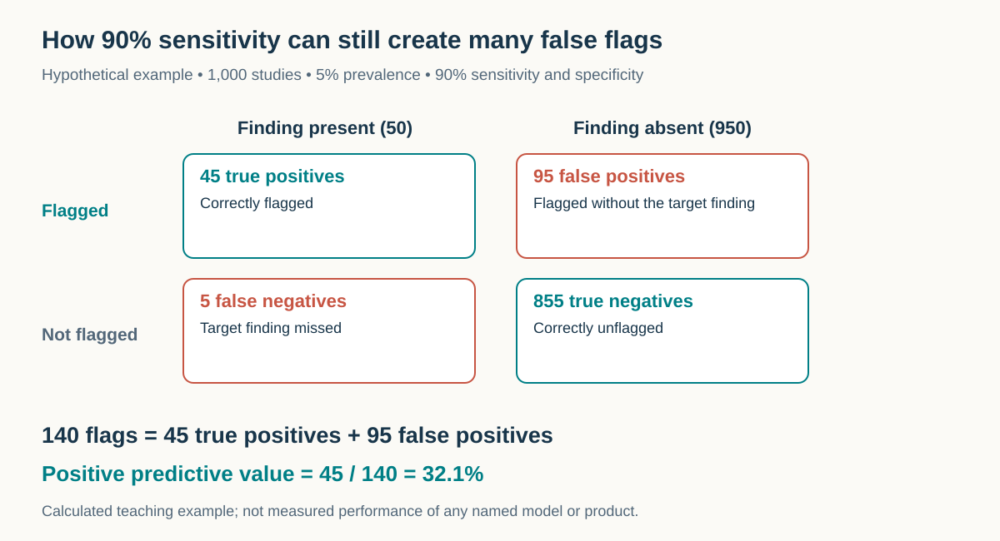
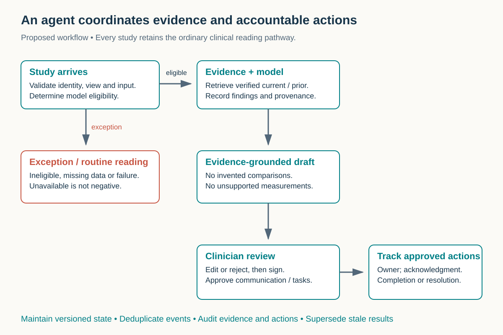

---
execute:
  freeze: false
---

# Chest X-ray {#sec-chest-xray}

A chest radiograph is a compact image of a complicated clinical situation. A single exposure can show lung opacities, pleural air, the cardiac silhouette, and the course of a support device. It can also hide disease behind the heart, exaggerate heart size through projection, and make unrelated processes look alike. This combination of accessibility and ambiguity makes chest X-ray (CXR) an excellent first modality for understanding imaging AI: the input is relatively simple, while the reasoning and workflow around it are not.

This chapter follows the examination from acquisition to interpretation, then connects clinical tasks to datasets, models, commercial devices, and tool-calling systems. By the end, the reader should be able to define a CXR AI task, choose an appropriate reference standard, understand a product's clearance, and design a small evaluation that measures something useful.

::: {.callout-tip title="For the engineer"}
The unit of care is the **study**, which may contain several images and depend on earlier examinations. A PNG and a disease label discard much of that context. Always ask which view, patient population, and clinical question the data represent, and what information was available when the reference was produced.
:::

::: {.callout-tip title="For the clinician"}
A model can learn image-level findings, locations, anatomical outlines, or report text. These outputs need different labels and validation. A high pneumothorax score does not establish that the system has located pleural air, determined its clinical significance, or improved care.
:::

## What is a chest X-ray?

### A projection, not a slice

An X-ray tube sends photons through the thorax to a detector. Tissue attenuates the beam, and the detector records the transmitted signal. In a simplified monoenergetic model, $I = I_0 e^{-\int \mu(s)\,ds}$: transmission depends on attenuation integrated along the ray. Bone attenuates more than aerated lung; on the usual display, bone is light and lung is dark. Real systems use a spectrum of photon energies, scattered radiation, detector corrections, and display processing. The displayed gray value is not a standardized tissue measurement like a CT Hounsfield unit.

Every pixel combines structures along a path through the body. Ribs overlap lungs; the heart overlaps the left lower thorax; a small opacity can blend with a vessel. A second projection can separate some overlapping structures but does not reconstruct a CT volume. A neural network cannot reliably recover information that the acquisition never resolved. Apparent success on hidden disease may instead reflect correlated visible findings or dataset shortcuts.

### PA, AP, and lateral views

In a **posteroanterior (PA)** examination, the beam travels from the patient's back toward a detector against the anterior chest. An upright patient usually inspires and holds their breath. In an **anteroposterior (AP)** examination, the beam travels from front to back; this is common for portable imaging of patients who cannot attend the radiography room. The heart is farther from the detector in AP geometry and may appear magnified. A low-volume portable film is consequently a poor substitute for an upright PA image when judging apparent cardiac enlargement.

The **lateral** projection supplies a different view of retrosternal, retrocardiac, and basal regions. PA and lateral views often form a two-image study, while a portable examination may contain one AP image. Position and acquisition quality remain part of interpretation, not merely metadata to strip away. @fig-cxr-projection illustrates the geometry; @fig-cxr-pa and @fig-cxr-lateral show real radiographs in complementary projections.

{#fig-cxr-projection fig-alt="Two ray diagrams show a near-detector object with a smaller shadow and a farther object with a larger shadow."}

_chest_radiograph_(X-ray).jpg).](../figures/ch11/normal-pa.jpg){#fig-cxr-pa width="70%" fig-alt="Frontal PA radiograph showing lungs, ribs, cardiac silhouette and diaphragms without added AI markings."}

.jpg).](../figures/ch11/normal-lateral.jpg){#fig-cxr-lateral width="60%" fig-alt="Lateral chest radiograph showing overlapping ribs, the spine and the anterior cardiac silhouette."}

### What an engineer receives

A clinical digital radiograph is a two-dimensional, usually single-channel image, often a few thousand pixels in each direction. Matrix size, detector pitch, stored bit depth, and compression vary. For scale, a **hypothetical** 3000 × 3000 image stored at 16 bits requires 18 million bytes, about 17.2 MiB, for uncompressed pixels alone. Two such views double that payload; headers, compression, and derived images change actual file size. A float32 tensor at the same size occupies about 34.3 MiB before batch dimensions and model activations.

Research releases may downsample images or convert them to 8-bit JPEG/PNG. Those choices affect small nodules, fine interstitial markings, and device tips more than coarse global patterns. Preserve the source and record every conversion. Verify photometric interpretation, orientation, padding, and the model's expected intensity transformation; a DICOM pixel array is not automatically a correctly displayed image. The hospital data model is developed in @sec-images-in-the-hospital.

## Why and when it's ordered

CXR often provides an initial structural assessment for respiratory symptoms, fever, chest injury, or suspected cardiopulmonary disease. It can also assess support-device position and complications. The clinical question matters: looking for a new opacity in a febrile patient, checking a tube, and assessing interval change in edema are different tasks even when the image format is identical. See the [ACR/RSNA overview](https://www.radiologyinfo.org/en/info/chestrad) for common uses and limitations.

An initial test does not close every diagnostic pathway. A normal radiograph does not exclude pulmonary embolism or a small malignancy. An opacity does not identify an organism or establish that infection explains the patient's symptoms. Downstream decisions combine imaging with symptoms, examination, laboratory results, and earlier studies. An AI system should make its information boundary explicit: image-only evidence differs from a prediction conditioned on clinical context.

Screening introduces another setting. The [WHO's 2025 policy statement](https://www.who.int/publications/i/item/9789240110373) describes CAD products meeting its standards for TB screening in people aged 15 years and older. This specific screening application is not a blanket authorization for autonomous general chest reporting. Radiographic screening belongs in a pathway that includes appropriate diagnostic testing and follow-up. Thresholds must fit the population and testing capacity; WHO provides [local calibration guidance](https://tdr.who.int/activities/calibrating-computer-aided-detection-for-tb).

For development, write an intended-use sentence before collecting data. For example: “Prioritize eligible adult frontal chest studies with suspected pneumothorax for radiologist review.” That sentence specifies population, input, target, and action. “Read chest X-rays” specifies none of them. It leaves unanswered whether the system supports emergency care, screening, longitudinal monitoring, or documentation.

## What diagnoses are made from it

### Findings, explanations, and actions

Radiology describes visual evidence and interprets it. **Consolidation** is a pattern; **pneumonia** is a clinical diagnosis that may explain it. **Pleural effusion** describes fluid around the lung; its cause requires additional context. A model ontology should preserve these distinctions instead of treating every report noun as an equivalent disease class.

This teaching taxonomy connects evidence to computational tasks. It is broader than any one benchmark's label list and is not a diagnostic checklist for independent practice.

::: {.table-responsive}

| Finding family | What the reader assesses | Suitable target | Important ambiguity |
|---|---|---|---|
| Airspace opacity | Distribution, focality, air bronchograms | Classification; localization | Infection, edema, hemorrhage, and other processes overlap |
| Atelectasis | Opacity with volume loss | Finding plus location and extent | Basal bands and low inspiration can be difficult to distinguish |
| Interstitial abnormality | Reticular or diffuse markings | Pattern classification | Chronicity and cause often need priors or CT |
| Pleural effusion | Basal opacity and costophrenic contour | Detection; laterality; extent | Position changes appearance; a box is not a volume |
| Pneumothorax | Pleural line and peripheral absence of lung markings | Detection; localization; triage | Skin folds and supine positioning complicate interpretation |
| Cardiomediastinal change | Cardiac silhouette and mediastinal contours | Classification; measurement | Projection and inspiration affect apparent size |
| Nodule or mass | Focal rounded opacity | Lesion detection | Overlap can conceal or imitate a lesion |
| Hyperinflation or chronic change | Lung volumes and structural patterns | Classification with comparison | Radiography alone does not establish physiological impairment |
| Devices and postoperative findings | Course, tip location, configuration | Detection; landmarks; anatomical relations | Correctness depends on device type and intended position |
| Bones and soft tissues | Fracture, surgical change, subcutaneous air | Detection; localization | Lung-only cropping removes relevant evidence |

:::

A study may have several findings simultaneously. For fixed-label classification, independent sigmoid outputs are usually more natural than a softmax that forces mutually exclusive classes. Output semantics still matter: a score for “effusion” does not specify side, severity, or change. Those require explicit targets and annotations.

“No finding” is particularly slippery. In a mined dataset it may mean the labeler found none of its target concepts, rather than a radiologist certified the image as entirely normal. A negative mention, an uncertain statement, and an unmentioned feature must not silently become the same label. Nor should “no acute abnormality” erase a chronic abnormality. Define these distinctions before computing prevalence or training a classifier.

### Reading as a structured search

A systematic review considers quality, lungs, pleura, heart and mediastinum, diaphragms, bones, soft tissues, and devices. The value for an AI developer is coverage: concentrating on the highest-scoring label can leave other abnormalities unexamined. Multi-label output does not itself guarantee a complete search.

For longitudinal interpretation, attach change to a particular finding: a left effusion can improve while a right basal opacity appears. A single study-level “worse” label loses that structure. A useful representation stores finding, laterality, location, certainty, comparison date, and direction of change separately. This also makes drafting auditable: each sentence can be traced to supporting evidence.

## How it works in a modern hospital

### Acquisition and quality

The referring team enters an order and indication. Scheduling or bedside logistics determine how the study is acquired. The technologist verifies identity, selects the protocol, positions the patient, acquires the image, and evaluates technical adequacy. Rotation, incomplete inspiration, motion, clipped anatomy, exposure problems, and external objects affect interpretation. A repeat decision belongs to the acquisition workflow and must account for patient condition and radiation exposure.

For AI routing, validate actual images against the intended input. A description containing “chest” does not prove that the series is an eligible frontal radiograph. Check modality, view, image count, age eligibility where relevant, and successful decoding. If information is missing or contradictory, record an exception rather than translating it into a negative disease result. This distinction becomes essential when counting failures during validation.

### From PACS to a signed report

Images reach PACS and become available on a worklist. The radiologist reviews the current study, relevant priors, and the clinical question, then documents findings and an impression. Reports commonly separate examination details, indication, technique, comparison, findings, and impression, although local templates differ. The [ACR/RSNA report guide](https://www.radiologyinfo.org/en/info/article-chest-xray-report) explains these sections and the signed-report handoff.

An AI service may receive a routed copy or retrieve an eligible study, then return a case-level flag, measurements, overlays, or a draft. Outputs need a clear destination in the existing workflow. A separate dashboard creates another place to check, and a result arriving after interpretation may have little triage value. Identify exact studies, image instances, model versions, and processing times to prevent stale results attaching to repeated or corrected examinations.

Turnaround expectations depend on setting and urgency; there is no universal CXR deadline. Measure acquisition-to-availability, availability-to-first-review, first-review-to-signature, and required communication intervals separately. Report distributions, including delayed cases, rather than only a mean. Fast inference cannot compensate for slow routing or an unacknowledged critical-result handoff.

### A worked workflow example

Consider an invented evaluation case: an eligible portable AP study arrives, and a pneumothorax service returns a flag. The worklist displays that flag, a radiologist opens the complete study and relevant prior, and the radiologist decides whether the finding is present. If communication is needed, the established process records recipient, time, and acknowledgment. A rejected flag remains an auditable disagreement, not a silently deleted prediction.

Now consider a timeout. The study must still reach the ordinary worklist. The result state is “unavailable,” not “negative.” This distinction affects both care and the denominator of an accuracy study. The agent loop later in this chapter extends these principles to retrieval and drafting without assuming that a triage clearance covers those additional actions.

## The data landscape

This living table is filtered from `data/datasets.csv`. It describes representative resources, not an exhaustive catalog. **CXR entries checked 4 September 2026.** Counts refer to stated releases; images, studies, patients, and reports are different units. Access is governed by each resource's agreement, not the shorthand “public.”

::: {.table-responsive}

```{python}
#| echo: false
#| output: asis
import csv
from pathlib import Path

def cxr_table(filename, columns):
    with (Path("../data") / filename).open(encoding="utf-8", newline="") as handle:
        rows = [r for r in csv.DictReader(handle) if r["modality"] == "cxr"]
    def cell(value):
        return value.replace("|", "\\|").replace("\n", " ")
    print("| " + " | ".join(title for key, title in columns) + " |")
    print("|" + "---|" * len(columns))
    for row in rows:
        print("| " + " | ".join(
            "[Source](" + row[key] + ")" if key == "link" else cell(row[key])
            for key, title in columns) + " |")
    print()

cxr_table("datasets.csv", [
    ("name", "Dataset"), ("size", "Release size"), ("labels", "Supervision"),
    ("license/access", "Access / terms"), ("notes", "Caveat"), ("link", "Source")])
```

:::

### Choose supervision that matches the task

**ChestX-ray14** offers a widely used starting point for image-level classification, with report-mined labels. Consult the [NIH release](https://nihcc.app.box.com/v/ChestXray-NIHCC) for its data dictionary and partitions. Mining reports makes scale possible but does not create a uniform image-level expert reference standard.

**CheXpert** explicitly represents uncertainty in report-derived observations. Its [official description](https://stanfordmlgroup.github.io/competitions/chexpert/) distinguishes large-scale training supervision from expert evaluation. Decide how to handle uncertain labels before seeing test results. Masking them, assigning them to one class, or using soft targets answer different learning questions; report the choice by finding.

**MIMIC-CXR** provides DICOM images and free-text reports; **MIMIC-CXR-JPG** provides processed images, structured labels, and reference splits. These are related representations, not independent external datasets. Follow the [DICOM documentation](https://physionet.org/content/mimic-cxr/) and [JPG documentation](https://physionet.org/content/mimic-cxr-jpg/) rather than assuming identical report counts across versions. Access requires credentialing and a data-use agreement.

**PadChest** broadens geography and reporting language, but mixes manual and automated annotation. Its [research-use agreement](https://bimcv.cipf.es/bimcv-projects/padchest/padchest-dataset-research-use-agreement/) restricts reuse; downloadable data are not automatically redistributable or commercially unrestricted. **VinDr-CXR** supplies local annotations and global labels from Vietnamese hospitals. Its [release](https://physionet.org/content/vindr-cxr/1.0.0/) distinguishes 22 local findings from six global categories. Calling these “28 bounding-box findings” would misdescribe the supervision.

### Split patients before processing images

Repeated examinations are central to CXR. Keep a patient's studies together when constructing independent partitions, including paired PA/lateral images. For longitudinal tasks, control the time boundary: a future report must not become context for an earlier prediction. Follow official splits when comparing with published benchmarks, and document additional exclusions.

{#fig-cxr-splits fig-alt="Patient groups remain intact in training, validation and test cohorts; an external site supplies a separate test."}

External validation should challenge the intended use: a new site, later time period, different detector, or different clinical setting. Randomly holding out more images from the same archive is not sufficient. Document pretraining exposure too; a foundation model may have encountered a public benchmark. If this cannot be excluded, describe possible contamination instead of claiming unseen-site performance.

## The model landscape

The table is generated from `data/models.csv`, filtered to CXR. Model availability and deployment readiness are separate questions. An open code license, downloadable weights, training-data rights, and permission for clinical use are distinct. Pin the exact checkpoint and inspect its model card before running or adapting it.

::: {.table-responsive}

```{python}
#| echo: false
#| output: asis
cxr_table("models.csv", [
    ("model", "Model / library"), ("task", "Task"), ("weights", "Weights"),
    ("license", "License / terms"), ("notes", "Interpretation"), ("link", "Source")])
```

:::

### Classifiers, localizers, and language models

**TorchXRayVision** is a practical research baseline for pretrained CXR classifiers and related tools. Its [repository](https://github.com/mlmed/torchxrayvision) documents expected normalization and transformations. Reusing weights without matching preprocessing can create a valid-looking tensor and an invalid experiment. Classification is appropriate for fixed finding outputs; detection and segmentation require their own supervision and validation.

**CheXagent** targets CXR vision-language tasks. Stanford's [repository](https://github.com/Stanford-AIMI/CheXagent) identifies the work as research-only; its [checkpoint collection](https://huggingface.co/collections/StanfordAIMI/chexagent) includes distinct releases and report-generation variants. Use the selected checkpoint's supported interface and tasks. A name containing “agent” does not establish that a model manages PACS, executes a workflow, or has authority to issue reports.

**MedGemma** is a medical multimodal model family for downstream development. Google's [model card](https://developers.google.com/health-ai-developer-foundations/medgemma/model-card) describes intended use, limitations, and version-specific behavior. Outputs require adaptation and validation for the application; general medical image understanding is not validated longitudinal CXR reporting. Multi-image inputs, multi-turn interaction, and changed prompts need their own evaluation.

Commercial systems may combine proprietary classifiers, routing, viewer integration, support, and monitoring. Their weights are often unavailable, so evaluation depends on the supplied version, interface, and independent testing. The next section identifies specific cleared examples. It is not a ranking against open models: tasks, populations, references, and permitted workflows differ too much for a single leaderboard to be meaningful.

### What is mature, and what remains difficult?

Fixed-label classification has established research tools and benchmarks; selected triage tasks have cleared products. General reporting, reliable comparison with priors, complete device assessment, and end-to-end autonomous interpretation require broader evidence. Fluent language is easier to demonstrate than complete, correctly grounded reporting across the clinical long tail.

Report evaluation should separate omitted findings, unsupported findings, wrong location or laterality, incorrect certainty, and invented change. Text overlap can reward standard phrasing while missing a consequential negation. A report can resemble the reference yet say the opposite about pneumothorax. Human adjudication should examine factual errors and clinical importance alongside automated metrics.

### A reproducible hands-on exercise

Start with a locally held, authorized research sample and a documented pretrained classifier. Define a narrow task and verify label mapping. Inspect source images in a viewer, apply documented transforms, and save predictions with identifiers and checkpoint information. The aim is to understand the experiment before scaling; this chapter's illustrative radiographs are teaching images, not a validation set.

Prepare a CSV with `patient_id`, `study_id`, `view`, `label`, `score`, and `split`. Keep uncertain labels separate, and record processing failures explicitly. Choose a threshold on validation data only, then lock it. This dependency-free calculation evaluates an already fixed operating point; it does not run a model or establish clinical validity.

```python
def operating_point(labels, scores, threshold):
    """Binary adjudicated labels and a prespecified threshold."""
    import math
    if len(labels) != len(scores) or not labels:
        raise ValueError("Provide equal, nonempty sequences")
    if any(y not in (0, 1) for y in labels):
        raise ValueError("Handle uncertain labels separately")
    if not math.isfinite(threshold) or not 0 <= threshold <= 1:
        raise ValueError("Invalid threshold")
    if any(not math.isfinite(s) or not 0 <= s <= 1 for s in scores):
        raise ValueError("Scores must be finite and between zero and one")
    predicted = [s >= threshold for s in scores]
    tp = sum(y == 1 and p for y, p in zip(labels, predicted))
    fp = sum(y == 0 and p for y, p in zip(labels, predicted))
    fn = sum(y == 1 and not p for y, p in zip(labels, predicted))
    tn = sum(y == 0 and not p for y, p in zip(labels, predicted))
    ratio = lambda a, b: a / b if b else None
    return {"tp": tp, "fp": fp, "fn": fn, "tn": tn,
            "sensitivity": ratio(tp, tp + fn),
            "specificity": ratio(tn, tn + fp),
            "ppv": ratio(tp, tp + fp)}
```

Interpret counts alongside coverage and subgroup results. When patients contribute repeated studies, confidence intervals should respect grouping, for example through patient-level bootstrap resampling. The exercise is complete when exclusions, preprocessing, threshold choice, and failures are reproducible—not when it produces a striking AUROC.

## FDA-cleared AI products

This living table uses `data/fda-products.csv`. **These are selected historical clearances verified on 4 September 2026, not a complete current market inventory or a claim about each product's latest version.** Device identity, population, input restrictions, and indication must remain attached to the clearance number.

::: {.table-responsive}

```{python}
#| echo: false
#| output: asis
cxr_table("fda-products.csv", [
    ("product", "Device"), ("vendor", "Vendor"), ("clearance", "Clearance"),
    ("indication", "Scope"), ("notes", "Boundary"), ("link", "FDA summary")])
```

:::

Read the indication before the brand. [Critical Care Suite K183182](https://www.accessdata.fda.gov/cdrh_docs/pdf18/K183182.pdf) concerns pneumothorax triage and notification in adult-size patients. [Red Dot K191556](https://www.accessdata.fda.gov/cdrh_docs/pdf19/K191556.pdf) concerns adult pneumothorax prioritization, not general abnormality detection. [Lunit INSIGHT CXR Triage K211733](https://www.accessdata.fda.gov/cdrh_docs/pdf21/K211733.pdf) concerns suspected pleural effusion and/or pneumothorax for adult case-level triage. Broader international marketing does not expand these specific US indications.

Case-level prioritization does not automatically authorize lesion localization, disease exclusion, or autonomous diagnosis. Adding a language model that explains a flag creates a new behavior; the explanation is not made clinically valid by the underlying clearance. A drafting wrapper has its own failure modes and evidence requirements.

For procurement or research review, extract the exact population, supported views, exclusions, intended user, output, and action from the labeling. Then ask whether your workflow matches. The [FDA describes 510(k)](https://www.fda.gov/medical-devices/510k-clearances/search-releasable-510k-database) as a substantial-equivalence pathway; a cleared device is not a universal interpreter of chest pathology. The broader framework appears in @sec-model-to-product.

## Open challenges

### Shortcuts and dataset shift

Portable markers, scanner processing, positioning, and support devices can correlate with illness or setting. Models may exploit these relationships instead of intended visual evidence. [Zech and colleagues](https://journals.plos.org/plosmedicine/article?id=10.1371/journal.pmed.1002683) demonstrated variable cross-hospital pneumonia performance and recognition of hospital-specific information. This motivates evaluating acquisition environments as well as disease labels.

Use error review to formulate targeted checks: does performance change between PA and AP, with and without devices, or across sites? Associations do not prove a shortcut, but identify where controlled analysis is needed. Blindly removing corners or device-containing cases can remove relevant information or distort the population. Report interventions and compare performance on the intended population.

### Labels, uncertainty, and the reference standard

The right reference depends on the claim. Image review may suit visible pneumothorax; pneumonia diagnosis may require clinical information; TB screening may use a microbiological reference. Agreement with report mining answers a different question from agreement with an adjudicated clinical endpoint. Preserve these distinctions when comparing papers.

Reference readers also disagree. Record the annotation protocol, access to priors and clinical information, and disagreement resolution. If a model sees one image while the reader sees the entire study, acknowledge that information imbalance. Confidence scores should not hide uncertainty from missing information or an ambiguous reference.

### Thresholds, prevalence, and workload

AUROC measures ranking over thresholds. It does not tell a department how many flags it will receive or how many contain true findings. Positive predictive value depends on prevalence as well as sensitivity and specificity:

$$
\mathrm{PPV} = \frac{\mathrm{sensitivity}\times p}{\mathrm{sensitivity}\times p + (1-\mathrm{specificity})(1-p)}.
$$

In a **hypothetical** cohort of 1,000 studies with 5% prevalence, 90% sensitivity, and 90% specificity, expected counts are 45 true positives, 5 false negatives, 95 false positives, and 855 true negatives. Only about 32% of 140 flags are true positives. @fig-cxr-workload visualizes this arithmetic; these are not measured results for any named model.

{#fig-cxr-workload fig-alt="Counts are 45 true positives, 95 false positives, 5 false negatives and 855 true negatives; PPV is 32.1 percent."}

Evaluate sensitivity and specificity at the chosen threshold, predictive values, calibration, unsupported-input rate, and failures. Localization needs location-sensitive metrics; measurements need agreement and repeatability; reporting needs error adjudication. Deployment also needs time-to-review, communication completion, workload, and downstream consequences. No single scalar captures all of these.

### Small findings and unusual populations

Downsampling can erase subtle signs; lung cropping can remove devices and extrapulmonary findings. Children, altered postoperative anatomy, unusual devices, and severe positioning limitations can differ substantially from development data. Eligibility checks define coverage, but excluding difficult cases without reporting them inflates apparent service performance.

Monitor deployment over time. A detector upgrade, routing change, or new checkpoint can alter behavior without changing the interface. Store pipeline versions and examine drift in inputs, results, failures, and adjudicated outcomes. A stable average score distribution is not proof of stable clinical accuracy.

## The agentic outlook

A useful CXR agent coordinates evidence and tasks: retrieving a prior, invoking an eligible model, assembling findings, preparing comparisons, and drafting language. These are **proposed design patterns**, not claims that current open checkpoints or listed clearances support autonomous end-to-end care. High throughput makes small workflow improvements attractive, but multiplies the consequences of recurring errors.

### A bounded study-level loop

{#fig-cxr-agent fig-alt="Eligible studies proceed through evidence and drafting to clinician review; exceptions retain routine reading and approved actions enter tracked follow-up."}

Begin with a study event and eligibility decision. Retrieve current images and appropriate priors through authorized interfaces. Verify patient and study identity instead of matching display names. The model returns structured findings with image references and version information. A drafting component may express these findings, but must not manufacture comparisons, measurements, or communication events.

A comparison component verifies that the prior arrived and is suitable. If unavailable, the draft should say so rather than produce “unchanged.” Separate evidence from language: observations should carry source images, methods, certainty, and comparison provenance. This lets reviewers assess support and reject unsupported claims quickly.

### Tools, state, and human decisions

The orchestration layer needs explicit capabilities: query/retrieve images, call a model, read permitted context, write a draft, and propose a task. Keep final signing, communication, and follow-up authority consistent with clinical workflow. A tool schema provides a software interface, not a professional role or regulatory indication.

Use persistent states such as received, eligible, processing, draft-ready, reviewed, and exception. Make repeated events idempotent: one study notification must not create duplicate drafts or follow-up tasks. Keep model failures distinct from negative findings. Record which image or report version a result refers to, so corrections invalidate or supersede stale material.

Report text, image annotations, and retrieved documents are clinical content, not permission to execute tools. This matters when untrusted text resembles an instruction. Restrict tools to authorized context and log actions and evidence references. The audit record should remain useful without access to a model's private reasoning.

### Closing a loop means checking the outcome

An incidental-finding tracker could turn an approved recommendation into a task, associate an owner, and record completion or a documented decision not to proceed. “Message sent” and “follow-up completed” are different states. Track the recommendation the responsible clinician approved rather than creating obligations from unreviewed generated text.

Test controlled scenarios: absent prior, wrong-patient candidate prior, duplicate arrival, incompatible image, unavailable model, rejected draft, amended report, and unacknowledged handoff. Measure omissions, incorrect change statements, duplicate actions, review time, and unresolved tasks. Start in a shadow workflow, then evaluate the clinician-plus-system process prospectively if moving toward use. The goal is dependable completion of a defined task with visible exceptions.

## Further reading

For clinical orientation, read the [ACR/RSNA examination overview](https://www.radiologyinfo.org/en/info/chestrad) and [report guide](https://www.radiologyinfo.org/en/info/article-chest-xray-report), then inspect a study in a viewer. For development, read labeling and partition documentation before a leaderboard. For deployment, read indications before performance headlines.

- **Datasets:** [CheXpert](https://stanfordmlgroup.github.io/competitions/chexpert/), [MIMIC-CXR](https://physionet.org/content/mimic-cxr/), [MIMIC-CXR-JPG](https://physionet.org/content/mimic-cxr-jpg/), [PadChest](https://bimcv.cipf.es/bimcv-projects/padchest/), and [VinDr-CXR](https://physionet.org/content/vindr-cxr/1.0.0/).
- **Models:** [TorchXRayVision](https://github.com/mlmed/torchxrayvision), [CheXagent](https://github.com/Stanford-AIMI/CheXagent), and [MedGemma's model card](https://developers.google.com/health-ai-developer-foundations/medgemma/model-card).
- **Generalization:** [Zech et al., PLOS Medicine, 2018](https://doi.org/10.1371/journal.pmed.1002683).
- **Screening:** [WHO's 2025 CAD policy](https://www.who.int/publications/i/item/9789240110373) and [TB calibration guidance](https://tdr.who.int/activities/calibrating-computer-aided-detection-for-tb).
- **Regulatory scope:** FDA summaries for [GE](https://www.accessdata.fda.gov/cdrh_docs/pdf18/K183182.pdf), [Behold.ai](https://www.accessdata.fda.gov/cdrh_docs/pdf19/K191556.pdf), and [Lunit](https://www.accessdata.fda.gov/cdrh_docs/pdf21/K211733.pdf), alongside @sec-model-to-product.

::: {.callout-note title="Check your understanding"}
Why can AP imaging exaggerate heart size? Why is MIMIC-CXR-JPG not an independent external test of a model trained on MIMIC-CXR? What does triage clearance leave unproven about a generated report? Why do false-positive flags outnumber true-positive flags in the worked example? These questions connect acquisition, evaluation, regulation, and workflow.
:::
