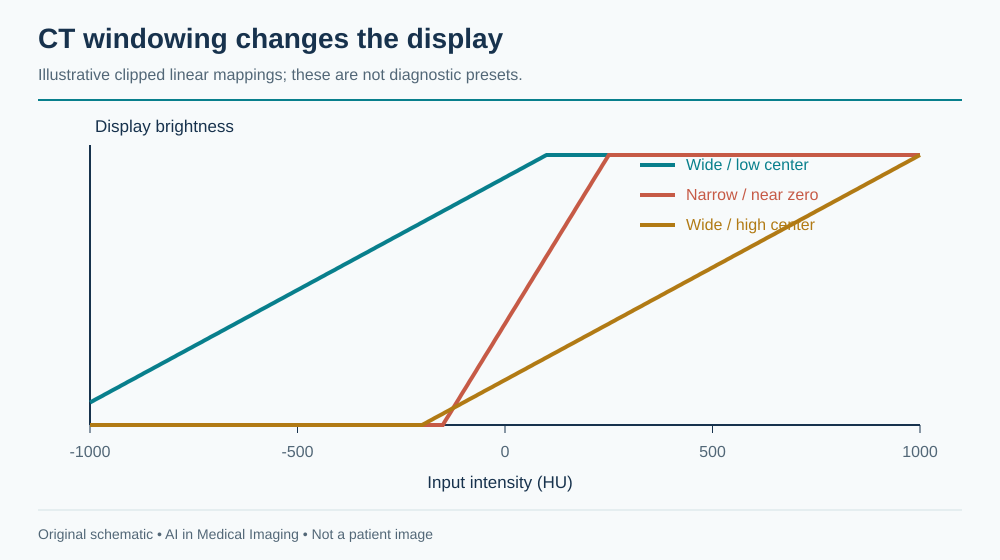
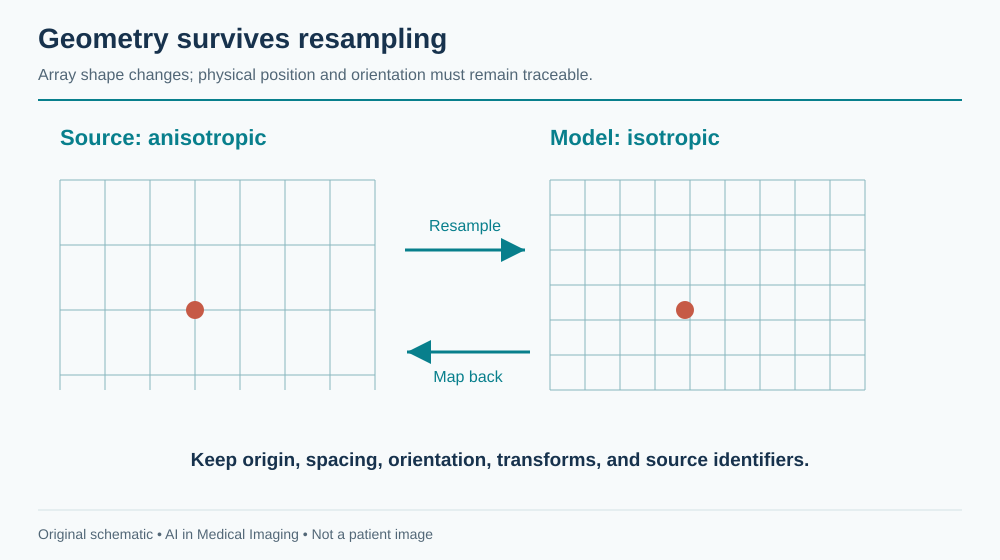
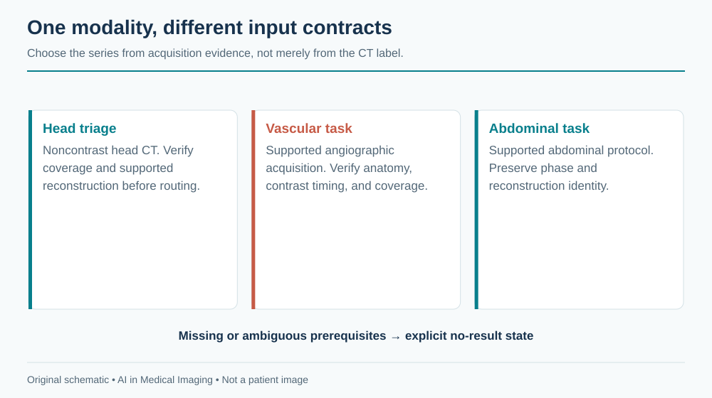
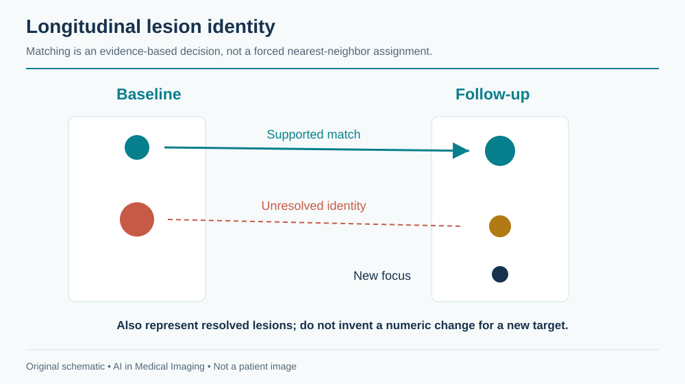

---
execute:
  freeze: false
---

# Computed Tomography (CT) {#sec-computed-tomography}

CT turns many X-ray projections into a spatial description of the body. Its speed makes it central to emergency imaging; its coverage makes it central to cancer staging; its calibrated attenuation values make it attractive for quantitative analysis. None of these advantages makes a CT study a single standardized tensor. One examination may contain a localizer, several contrast phases, thin and thick reconstructions, different kernels, and reformatted images. Selecting the right series is part of the task.

This chapter develops a CT pipeline from acquisition through clinical action. The running example is a hypothetical abdominal organ and lesion measurement service. The same principles apply to head-CT triage, lung nodules, vascular analysis, and treatment-response assessment, but the input requirements and evidence differ.

::: {.callout-tip title="For the clinician"}
A segmentation is an anatomical hypothesis on a particular image grid. It becomes a measurement only after geometry, units, structure definition, and coverage have been checked. An attractive three-dimensional rendering can conceal a missing superior slice or a wrong contrast phase.
:::

::: {.callout-tip title="For the engineer"}
A study contains candidate inputs, not a ready-made volume. Record why a series was selected and preserve its original identifiers. Never use file order as a substitute for spatial geometry.
:::

## What is CT?

### Attenuation, reconstruction, and Hounsfield units

A rotating X-ray source and detector measure transmission from many angles. Reconstruction estimates spatial attenuation. Helical acquisition combines rotation with table movement; different reconstruction settings can produce several image series from the same underlying acquisition. The [ACR/RSNA CT overview](https://www.radiologyinfo.org/en/info/bodyct) describes its clinical role and acquisition context.

The familiar intensity scale is the Hounsfield unit (HU):

$$HU = 1000\frac{\mu-\mu_{water}}{\mu_{water}}.$$

Water is approximately 0 HU and air approximately −1000 HU. These anchors are useful, but do not make all tissue measurements invariant. Tube energy, contrast material, reconstruction kernel, patient size, artifacts, and calibration influence observed values. In conventional DICOM CT, stored values commonly require a rescale slope and intercept before they represent HU. Enhanced objects and quantitative maps can require additional interpretation; the DICOM appendix explains why blindly applying one formula to every image is unsafe.

**Windowing** maps an attenuation interval to a display range. It does not change the underlying CT values. A narrow soft-tissue window displays subtle differences over a smaller interval; lung and bone displays use different ranges. For learning, either use a documented HU transformation or construct defined windows as channels. A screenshot discards much of the quantitative range and may introduce annotations and display-specific processing.

{#fig-ct-windows fig-alt="Three clipped linear intensity curves illustrate different CT display window widths and centers."}

### Dimensions, spacing, and memory

A reconstructed CT series is usually a 3D array, but its voxels need not be isotropic. A hypothetical 512 × 512 × 400 series stored with two bytes per voxel occupies 200 MiB before compression and headers. Its float32 representation occupies 400 MiB; intermediate model activations, masks, copies, and multiple phases add substantially more. Memory planning based only on the compressed archive size will fail.

Slice thickness describes reconstruction extent along the slice direction; it is not necessarily the distance between adjacent slice centers. Overlapping reconstructions can have smaller spacing than thickness. Determine positions from image geometry, sort along the slice normal, and check for missing or duplicate locations. A NIfTI affine preserves spatial relationships only if conversion was correct.

Resampling is a modeling choice. Isotropic voxels simplify 3D processing but do not restore resolution absent from a thick-slice acquisition. Interpolate continuous images and discrete masks differently. Save the transform back to source geometry, because a result aligned in a model workspace must still overlay the correct patient anatomy in the viewer.

{#fig-ct-geometry fig-alt="An anisotropic source grid and an isotropic model grid share a physical frame, with an explicit inverse mapping for outputs."}

## Why and when it's ordered

CT supports assessment of trauma, acute neurological presentations, chest and abdominal disease, vascular pathology, and malignancy. The clinical question determines anatomy, acquisition timing, and reconstruction. A noncontrast head CT, a CT pulmonary angiogram, and a portal-venous abdominal CT are not interchangeable samples of one general task.

Contrast phase is especially important. Iodinated contrast changes the attenuation of vessels and perfused tissues over time. A lesion's conspicuity and apparent boundary can differ between phases. A pulmonary arterial study seeks a different enhancement pattern from a study intended to assess liver lesions. An agent can suggest a protocol for review, but cannot infer that every contrast-enhanced series satisfies every vascular task.

Screening also changes the denominator. Lung-cancer screening examines an eligible population with a planned downstream pathway; evaluation on a lesion-enriched collection does not estimate screening workload. Opportunistic measurements use images acquired for another reason, which introduces a selection process that should be described. People who receive abdominal CT are not a random sample of the population.

The intended-use statement should name both output and action: “Measure liver volume on eligible complete abdominal CT for research review” is narrower and more testable than “Analyze the abdomen.” If a tool excludes postoperative anatomy or incomplete coverage, the system must recognize and report those exclusions, not quietly generate numbers.

## What diagnoses are made from it

CT tasks span detection, anatomical segmentation, quantification, and temporal comparison. The distinction matters because an organ mask does not diagnose a lesion inside it, and a lesion detector does not establish histology.

| Clinical question | Computational representation | Suitable evaluation | Common failure |
|---|---|---|---|
| Suspected intracranial hemorrhage | Case-level flag or localized hemorrhage | Sensitivity at fixed alert burden; time to review | Calcification or postoperative material mistaken for blood |
| Large-vessel occlusion on CTA | Eligible-study triage output | Patient-level sensitivity and workflow timing | Inappropriate phase or incomplete coverage |
| Pulmonary nodule | 3D lesion candidates with size | Lesion sensitivity versus false positives per scan | Vessels, scars, and small lesions |
| Organ volume | Anatomical mask in physical space | Volume agreement and contour error | Truncation, surgical change, wrong label |
| Cancer burden | Linked lesions and measurements | Lesion correspondence; measurement repeatability | New lesion omitted or wrong prior matched |
| Vascular anatomy | Centerlines, lumen masks, measurements | Landmark and diameter agreement | Calcification and contrast mixing |

A system also needs an explicit vocabulary for uncertainty and non-evaluability. “Not detected,” “outside coverage,” and “uninterpretable because of artifact” are different outcomes. Collapsing them into zero produces biased datasets and misleading reports.

### Measurement is not response classification

For a segmented structure, volume equals the sum of included voxel volumes. If spacing is uniform and orthogonal, $V=N\Delta x\Delta y\Delta z$; divide cubic millimeters by 1000 to obtain milliliters. For irregular geometry, integration requires more care. A model's output array shape alone is insufficient.

Oncologic response adds lesion selection, measurement conventions, timepoint rules, new-lesion assessment, and non-target disease. A change in one automatically segmented mass is not a complete response determination. [RECIST guidance](https://recist.eortc.org/) should govern a RECIST implementation, including exceptions; this chapter does not substitute a simplified volume rule for that standard.

## How it works in a modern hospital

The order is protocolled, patient and contrast considerations are reviewed, the examination is acquired, and reconstructed series are sent to PACS. Radiologists examine appropriate windows, multiplanar views, and priors. Urgent findings require communication through established local procedures, while quantitative outputs may feed a structured report or a research database.

An AI router must wait for an adequate input set. “First image arrived” does not mean “series complete.” Conversely, waiting for every optional reconstruction may delay an urgent service. Define task-specific readiness: the required series, expected coverage, geometry checks, and an inactivity or completion event. If a late image changes the input, decide whether the previous result is superseded and reprocessing is required.

{#fig-ct-routing fig-alt="A study inventory branches to noncontrast head, angiographic and abdominal analysis only after task-specific eligibility checks."}

### An implementable research pipeline

For the hypothetical abdominal service, construct an inventory of series and select one eligible phase. Decode pixels, verify HU conversion, inspect coverage, and convert to the model grid. Run anatomical segmentation, map results back, and compute physical measurements. Save a machine-readable result containing source UIDs, software version, transforms, labels, units, and quality state. Review overlays in at least two planes before accepting a measurement.

A research command can be simple while its surrounding validation is substantial. The [TotalSegmentator documentation](https://github.com/wasserth/TotalSegmentator) provides a CT interface such as:

```bash
TotalSegmentator -i eligible_ct.nii.gz -o segmentations
```

Pin the installed version and task. The command does not verify that your study fits your intended measurement claim. Inspect task-specific licenses, expected labels, geometry, and outputs. The project's documentation explicitly distinguishes the research software from an independently validated medical-device implementation.

Keep the original acquisition and any corrected output separately. A reviewer editing a mask creates a new annotation version, which should remain linked to the original prediction. Otherwise a later audit cannot distinguish model quality from the quality of human-corrected results.

## The data landscape

The live catalog below selects CT datasets. Counts and licenses are release-specific. These resources address different targets and should not be treated as one interchangeable benchmark.

```{python}
#| echo: false
#| output: asis
import sys
from pathlib import Path
sys.path.insert(0, str(Path("../scripts").resolve()))
from book_catalog import render_catalog
render_catalog('datasets', ['ct'], include_general=False)
```

LIDC-IDRI provides a classic setting for lung-nodule analysis with multiple readers. Reader disagreement is valuable information: an apparently precise contour may not be a unique truth. The original [LIDC-IDRI study](https://doi.org/10.1118/1.3528204) describes the annotation design. TotalSegmentator provides anatomical segmentation data; its available label set and release must be distinguished from the evolving software task list. KiTS provides a kidney-tumor setting rather than comprehensive abdominal diagnosis; use the [challenge documentation](https://kits-challenge.org/) for edition-specific definitions.

### A dataset manifest that survives reuse

At minimum, record patient group, study, selected series, contrast status, reconstruction properties, body coverage, reference source, split, and exclusion reason. Hash the manifest and version it with the experiment. Store an adjudication note when two reasonable candidates exist instead of silently choosing one by filename.

Split patients before selecting slices or patches. Keep reconstructions from one acquisition together. If a site contributes both thin and thick versions, placing one in training and one in testing is leakage even when their image files differ. For external validation, use a genuinely separate population and document any overlap with foundation-model pretraining.

Annotation scope also matters. A dataset labeled for kidney tumors may contain other abnormalities without labels. Those regions are not automatically verified negative examples for another task. A research repository's convenience should not redefine the medical question.

## The model landscape

```{python}
#| echo: false
#| output: asis
import sys
from pathlib import Path
sys.path.insert(0, str(Path("../scripts").resolve()))
from book_catalog import render_catalog
render_catalog('models', ['ct'], include_general=True)
```

TotalSegmentator is useful as anatomical infrastructure. nnU-Net is a framework for training supervised segmentation pipelines, not a universal pretrained diagnostic model. Promptable segmentation can help a reviewer delineate a known target, but an interactive model's performance depends on how prompts are created and how much corrective effort is allowed. Compare automatic and interactive workflows separately.

For nodule detection, a two-stage system may generate 3D candidates and then classify them with local and broader context. For organ segmentation, patch-based 3D inference is common because complete scans may exceed memory. Overlapping patches require an aggregation policy, and boundary artifacts should be checked. A fast 2D model may be appropriate for a constrained task, but its speed does not resolve inconsistent through-plane predictions.

Commercial CT platforms often supply several modules under a common interface. Evaluate the exact module, version, input, and service—not just the platform brand. Sharing a viewer does not imply a shared validation population. The same caution applies to broad research model collections.

### What to measure beyond Dice

A large liver can achieve a strong Dice score while a small but important lesion is missed. For lesion tasks, match predicted and reference objects under a prespecified rule, then report missed lesions and false positives per scan. For measurements, examine bias and limits of agreement. For triage, measure coverage, false-alert workload, and time to clinical review.

For repeated scans, measurement noise limits detectable change. In an illustrative case, a 2 mL change means little if repeated processing under plausible acquisition differences varies by 10 mL. Establish repeatability before turning every numerical delta into a statement about biology.

## FDA-cleared AI products

This table contains selected historical FDA authorizations, checked against the linked records. It is not a comprehensive market inventory, and “authorized” includes De Novo grants as well as 510(k) clearances.

```{python}
#| echo: false
#| output: asis
import sys
from pathlib import Path
sys.path.insert(0, str(Path("../scripts").resolve()))
from book_catalog import render_catalog
render_catalog('fda-products', ['ct'], include_general=False)
```

[ContaCT, DEN170073](https://www.accessdata.fda.gov/cdrh_docs/reviews/DEN170073.pdf), analyzes brain CTA for suspected large-vessel occlusion to support a parallel notification workflow. Its original indication is not autonomous diagnosis or a decision to perform thrombectomy. [BriefCase, K180647](https://www.accessdata.fda.gov/cdrh_docs/pdf18/K180647.pdf), is a specific head-CT triage example; do not combine that submission with separate pulmonary-embolism modules under an undifferentiated brand entry.

Anatomical quantification, acute triage, and reconstruction are different intended uses. If one service chains them, assess the combined behavior. A cleared upstream module does not validate an added report generator or a new treatment-response rule. Reading the submission's indication is more informative than counting how many AI tools a vendor sells.

## Open challenges

### Reconstruction shift and artifact

Sharper kernels increase apparent edge detail and noise; smoother kernels alter texture. Metal streak, motion, beam hardening, and incomplete coverage can create systematic errors. An algorithm may be robust to scanner variation in its training distribution yet fail on an acquisition deliberately optimized for another task. Compare performance by relevant protocol groups, not just scanner manufacturer.

Dose reduction introduces a second ambiguity: an image can look smoother after learned processing while task-relevant detail changes. Pixel similarity does not establish preserved lesion detection. Evaluate the diagnostic target and quantitative stability in addition to visual preference, including small or low-contrast findings.

### Longitudinal identity and geometry

Registration can help align anatomy, but deformation is not proof that two regions represent the same lesion. A lesion can merge, split, disappear, or be resected. Reviewable lesion identity is a separate data object from the spatial transform. Avoid assigning the nearest detected region to the previous lesion without recording uncertainty.

{#fig-ct-longitudinal fig-alt="Two visits contain matched, new and unresolved lesion identities rather than a forced one-to-one nearest-neighbor match."}

### A worked measurement audit

Suppose a hypothetical liver mask contains 1,500,000 voxels at 1 mm isotropic spacing. The volume is 1,500 mL. If the same count is mistakenly interpreted using a 2 mm slice spacing, the reported volume doubles. This is an engineering error, not model uncertainty. Include a geometry sanity check that compares the stored mask grid with its referenced source.

Next suppose the superior liver is outside the acquired field. A plausible 1,100 mL result is still incomplete. The correct output is a qualified or non-evaluable measurement, depending on the protocol, rather than an unqualified normal-looking number. Finally, inspect a postoperative case: a model may hallucinate a familiar organ boundary in altered anatomy. These cases illustrate why mask appearance, numerical range, and task eligibility must be reviewed together.

For a pilot, prespecify accepted inputs, annotation conventions, failure handling, reviewer effort, and error thresholds. Lock the model and preprocessing before evaluation. Include consecutive eligible studies, retain exclusions in the flow diagram, and report performance at the patient or study level with confidence intervals that respect repeated examinations.

## The agentic outlook

A CT agent can inventory series, propose task routing, retrieve priors, invoke approved analysis tools, and assemble a measurement dossier. It can check that a requested phase is present before analysis and flag missing coverage. These are proposed workflow capabilities; they are not claims that existing general models can independently protocol patients or interpret arbitrary CT.

The most useful agent output is often an exception explained in concrete terms: “No eligible angiographic series found,” “Prior unavailable,” or “Segmentation requires review at the surgical bed.” Such output supports the clinical team without converting missing evidence into a negative diagnosis.

For longitudinal oncology, maintain a lesion registry, measurement history, protocol version, and reviewer decisions. Let the agent draft a comparison only from verified evidence. Any response framework should be implemented as explicit, versioned rules with clinician review, not improvised from memory by a language model. Preserve the standard reading pathway during timeouts or model failure.

## Further reading

Read [ACR/RSNA's CT introduction](https://www.radiologyinfo.org/en/info/bodyct) for clinical orientation, the [LIDC-IDRI publication](https://doi.org/10.1118/1.3528204) for reader annotations, [TotalSegmentator](https://github.com/wasserth/TotalSegmentator) and [nnU-Net](https://github.com/MIC-DKFZ/nnUNet) for implementation, and [RECIST](https://recist.eortc.org/) for standardized response assessment. The catalog's FDA links document the precise historical product scope.

::: {.callout-note title="Check your understanding"}
Why is slice thickness not always slice spacing? How can the wrong contrast phase invalidate a technically successful segmentation? Why can a high organ Dice score coexist with poor lesion detection? Design one test that distinguishes missing coverage from a genuinely small organ.
:::
