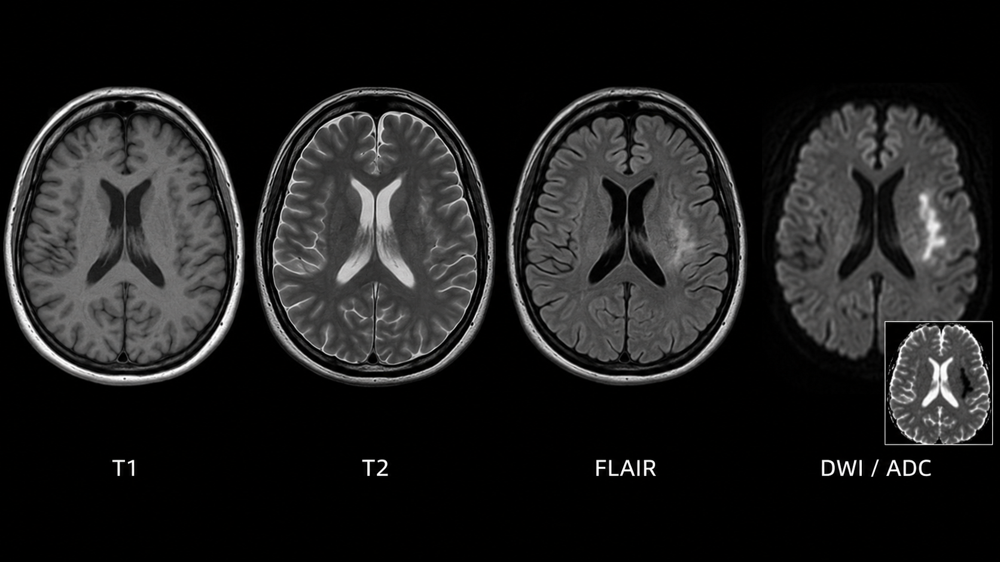
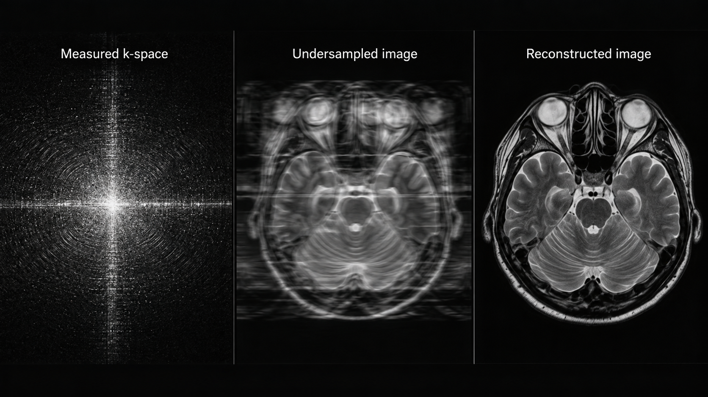
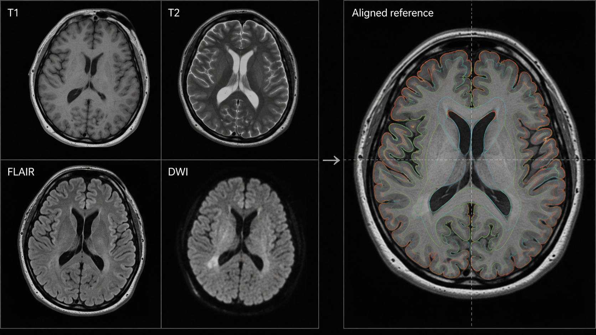
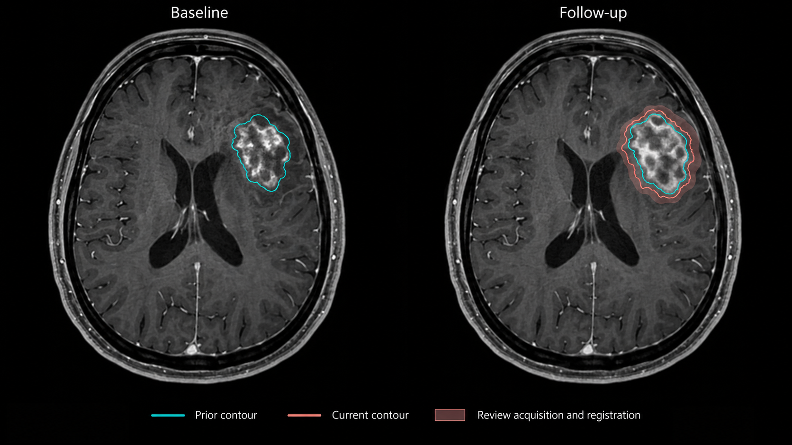

---
execute:
  freeze: false
---

# Magnetic Resonance Imaging (MRI) {#sec-mri}

An MRI examination is a collection of experiments on the same anatomy. One sequence emphasizes fluid, another diffusion, another susceptibility, and another the response to contrast material. A model that receives the wrong experiment can return a plausible answer to the wrong question. Sequence identity, spatial alignment, and acquisition quality therefore belong inside the inference contract.

::: {.callout-tip title="For the clinician"}
Ask which sequences the model requires, how missing sequences are handled, and whether its measurements remain comparable after a scanner or protocol change. A successful brain segmentation is not an explanation for a patient's symptoms.
:::

::: {.callout-tip title="For the engineer"}
MRI signal values generally lack the universal physical scale that conventional CT approximates with HU. Preserve sequence and acquisition metadata; do not assume a fixed intensity threshold has the same meaning across scanners.
:::

## What is MRI?

### From spins to images

A strong magnetic field establishes a net magnetization. Radiofrequency pulses perturb it, and receiver coils measure signals as magnetization evolves. Magnetic-field gradients encode position. The sampled spatial-frequency data, called **k-space**, are reconstructed into images. Repetition time, echo time, flip angle, preparation pulses, sampling pattern, and reconstruction all influence the result. The [ACR/RSNA MRI overview](https://www.radiologyinfo.org/en/info/bodymr) introduces the examination and its safety considerations.

T1-weighted, T2-weighted, and fluid-attenuated inversion recovery (FLAIR) images are contrasts, not interchangeable photographs. FLAIR suppresses much of the cerebrospinal-fluid signal to make some adjacent abnormalities more conspicuous. Diffusion-weighted imaging depends on water motion and acquisition settings; the apparent diffusion coefficient (ADC) is a derived quantitative estimate. Bright diffusion-weighted signal alone does not establish restricted diffusion: interpretation uses the ADC map and other sequences. Susceptibility-sensitive imaging responds to local field variation. Post-contrast imaging requires the agent, timing, and pre-contrast comparison to be understood.

{#fig-mri-sequences fig-alt="Matched axial brain MRI images show T1, T2, FLAIR, and DWI with an ADC inset."}

Images may be acquired as two-dimensional slices with gaps or as three-dimensional volumes. A stack of thick slices is not equivalent to an isotropic volume simply because software resamples it into cubes. Partial-volume effects and missing information remain. A routine study may contain hundreds or thousands of images across sequences, while raw multicoil k-space can be much larger than the reconstructed images. Storage and compute requirements must be measured on the intended protocol.

### Reconstruction is a different task from interpretation

Reconstruction estimates an image from measurements. Segmentation estimates an anatomical label from an image. Disease classification estimates a clinical category. These operations have different reference standards. A reconstruction model with excellent pixel similarity can still alter a small lesion; a lesion classifier cannot validate the fidelity of every reconstructed structure.

Undersampling reduces acquired measurements and can shorten examinations, but creates an inverse problem. Learned priors help choose among possible images consistent with the measurements. Data consistency constrains that choice; it does not by itself prove that all diagnostically relevant information has been preserved. Evaluation should include the acquisition pattern, coils, scanner field strength, anatomy, and abnormalities expected in deployment.

{#fig-mri-reconstruction fig-alt="Three panels show measured k-space, an aliased undersampled brain image, and a reconstructed diagnostic brain MRI."}

## Why and when it's ordered

MRI provides soft-tissue contrast without ionizing radiation. Common questions involve the brain and spine, joints and soft tissues, liver and pelvis, breast, and heart. Its value depends on the question and protocol: an abbreviated screening examination, a dedicated epilepsy study, and a multiparametric prostate examination should not share a generic eligibility rule.

Acquisition is comparatively sensitive to motion and often requires the patient to remain still for a sustained period. Implant conditions, metallic foreign bodies, monitoring equipment, claustrophobia, and the need for sedation or contrast can affect feasibility. These are clinical screening responsibilities. A scheduling assistant can collect documented information and highlight unresolved checks, but cannot infer implant safety from a device name found in free text.

The ordering question also determines what constitutes success. In a multiple-sclerosis follow-up study, detecting new lesions and comparing prior examinations may matter more than an exact whole-brain mask. In preoperative planning, boundaries near eloquent anatomy matter. In a dementia work-up, regional volumes are one piece of a broader assessment; normative percentiles do not independently establish a diagnosis.

## What diagnoses are made from it

MRI supports recognition and characterization of many conditions, but a useful model specification names a narrower task.

| Clinical question | Possible model output | Necessary boundary |
|---|---|---|
| Acute neurologic deficit | Candidate diffusion abnormality | Correlate with ADC, other sequences, symptoms, and timing |
| Brain tumor follow-up | Enhancing and nonenhancing lesion masks | Treatment effect and tumor progression can overlap in appearance |
| Demyelinating disease | Lesion burden and candidate new lesions | Registration and protocol differences can mimic change |
| Neurodegeneration assessment | Regional brain volumes | Normative reference and clinical interpretation remain essential |
| Musculoskeletal injury | Structure localization or suspected lesion | Anatomy, sequence, and reference diagnosis must match the task |
| Cardiac function | Chamber contours across cine frames | Temporal phase, contour convention, and image quality affect measurements |

A label called “tumor” may combine viable tumor, edema, necrosis, or a challenge-specific union of regions. If a training dataset defines one composite label and the clinical application needs another, no amount of model accuracy repairs the semantic mismatch. Include a label dictionary with every exported mask.

For a longitudinal lesion service, distinguish three questions: did the algorithm delineate the visible lesion correctly; did it match the same lesion across visits; and does the observed change imply clinically meaningful progression? These require separate evidence. A lesion can have a reproducible volume without a reliable biological interpretation.

## How it works in a modern hospital

### Build a sequence inventory

The technologist selects a protocol, checks safety, positions the patient and coils, and acquires sequences. Images are reconstructed and sent to PACS. Radiologists interpret the examination with prior studies and clinical information. Some protocols evolve during acquisition when a finding or quality problem warrants additional sequences.

An AI service should build an inventory before selecting inputs. Useful metadata include modality, body region, acquisition type, repetition and echo times, inversion time, flip angle, diffusion parameters, image type, and contrast information when available. Series descriptions help but are not standardized enough to be the sole source of truth. Local naming conventions, derived images, motion-corrected series, and repeat acquisitions create ambiguity.

For each required input, record a status such as present, missing, ambiguous, or inadequate. Do not silently replace post-contrast T1 with pre-contrast T1, or a calculated image with an acquired image. A classifier may assist sequence identification, but uncertain classifications need an explicit fallback.

### Align without destroying provenance

Multi-sequence models often require registration, orientation normalization, resampling, and intensity normalization. Their order and parameters are part of the model. Rigid registration may suffice for some within-session brain tasks; deformable registration introduces stronger assumptions and can distort disease-related anatomy. Brain extraction may fail after surgery or with unusual anatomy.

{#fig-mri-alignment fig-alt="Four source MRI sequences are shown beside a larger aligned reference image with thin anatomical contours."}

Keep the original images immutable. Store transforms, interpolation methods, reference-series identity, and the inverse mapping used for output. Use nearest-neighbor interpolation for categorical labels where appropriate; do not linearly interpolate class IDs. Quantitative maps need their own unit and interpolation policy. Inspect overlays in all three planes and on the source sequence that makes the abnormality visible.

### Return an interpretable result

A result should identify the selected sequences, unsupported or missing inputs, measured structures, units, model version, and quality flags. If a downstream viewer cannot show the relevant sequence or overlay, the result is not reviewable. A report should distinguish automated measurement from clinician interpretation and preserve edited versions of masks instead of overwriting the original model output.

For a hypothetical lesion-burden service, define an idempotent job key from the study, selected series, model version, and configuration. Repeated sends from PACS should not generate duplicate clinical findings. A revised sequence selection must generate a new traceable result, with the earlier result marked superseded rather than deleted.

## The data landscape

MRI datasets frequently answer different questions despite sharing an anatomical region. Raw-data collections support reconstruction research; annotated image collections support segmentation or classification. Challenge datasets may be registered, skull-stripped, and resampled before release. A model trained on those inputs has not demonstrated that it can perform the missing preprocessing on routine hospital examinations.

```{python}
#| echo: false
#| output: asis
import sys
from pathlib import Path
sys.path.insert(0, str(Path("../scripts").resolve()))
from book_catalog import render_catalog
render_catalog('datasets', ['mri'], include_general=False)
```

The [fastMRI project](https://github.com/facebookresearch/fastMRI) provides reconstruction resources and baseline implementations. The specific release, anatomy, coil configuration, and split matter more than an aggregate image count. BraTS is a family of tasks and releases, not one timeless dataset. Record the edition, tumor population, preprocessing, available sequences, and definition of each target region.

Split data by patient before creating patches, slices, or augmented examples. Repeated scans from the same person belong together unless the evaluation explicitly models a prospective temporal deployment and prevents future information from leaking backward. For multisite work, reserve an external site or scanner/protocol combination when possible. Report performance on missing-sequence and postoperative cases separately if they are within scope.

Reference labels also have uncertainty. Expert contours vary at infiltrative tumor margins, poorly defined lesions, and partial-volume boundaries. A consensus mask is a useful target, but it does not remove biological ambiguity. Document annotator expertise, adjudication, and whether the reference was established with access to follow-up or additional imaging unavailable to the model.

## The model landscape

Reconstruction models operate on complex-valued measurements or reconstructed images, sometimes with explicit coil-sensitivity modeling and iterative data-consistency steps. Segmentation models range from task-specific three-dimensional networks to self-configuring frameworks and interactive foundation models. A promptable model can accelerate annotation, but its output still depends on prompts, anatomy, and sequence characteristics.

```{python}
#| echo: false
#| output: asis
import sys
from pathlib import Path
sys.path.insert(0, str(Path("../scripts").resolve()))
from book_catalog import render_catalog
render_catalog('models', ['mri'], include_general=True)
```

Start with a strong task-specific baseline and an explicit preprocessing contract. [nnU-Net](https://github.com/MIC-DKFZ/nnUNet) is useful for assessing whether additional architectural complexity improves the actual task. General frameworks listed here are development tools, not evidence that every checkpoint supports every MRI sequence.

### Evaluate the claim, not just the mask

For segmentation, report overlap and boundary metrics alongside structure-level volume error and failures. For small lesions, lesion-wise sensitivity and false positives per examination can be more informative than a single global Dice score. For longitudinal analysis, test matching accuracy and change estimates. For reconstruction, combine image-fidelity metrics with blinded clinical assessment appropriate to the proposed use.

A practical validation matrix includes scanner vendor and field strength, protocol, pathology burden, age range, image quality, and prior surgery. Small subgroups yield uncertain estimates; show the number of patients and intervals rather than interpreting every difference as established bias. Thresholds and preprocessing should be fixed before evaluating a held-out set.

### Worked longitudinal example

Suppose a lesion mask measures 2.0 mL at baseline and 2.3 mL at follow-up. The arithmetic change is 15%. This is an illustrative calculation, not a progression criterion. Before interpreting it, check whether both masks describe the same target, whether contrast timing differs, whether registration aligns the lesion rather than merely the skull, and whether boundary disagreement is large relative to 0.3 mL.

{#fig-mri-longitudinal fig-alt="Baseline and follow-up post-contrast brain MRI show an enhancing tumor with prior and current contours."}

If the follow-up sequence is absent, the correct outcome may be “not comparable.” If the lesion is new, it has no baseline volume. If surgery changed the anatomy, a routine matching algorithm may be inappropriate. These states should be represented explicitly rather than coerced into a numeric percentage.

## FDA-cleared AI products

The table gives selected historical US authorizations with links to the actual submission. It is not a comprehensive current inventory or an endorsement. Not every automated imaging product uses deep learning, and a quantitative post-processing authorization is not an authorization for autonomous diagnosis.

```{python}
#| echo: false
#| output: asis
import sys
from pathlib import Path
sys.path.insert(0, str(Path("../scripts").resolve()))
from book_catalog import render_catalog
render_catalog('fda-products', ['mri'], include_general=False)
```

The original NeuroQuant record describes automated labeling, visualization, and volumetric quantification of brain structures. Its scope should not be rewritten as a claim to diagnose dementia or another cause of symptoms. Subsequent product versions require their own review. Check supported image acquisition and the population represented by any normative reference before clinical use.

## Open challenges

MRI domain shift is multidimensional: field strength, coils, sequences, reconstruction software, motion, and patient anatomy can all change simultaneously. Intensity harmonization may improve robustness but can also suppress meaningful information. A harmonization method belongs in validation, not in an unrecorded deployment patch.

Missing sequences create another challenge. Training with simulated missing inputs can improve tolerance, but cannot establish that a clinically essential contrast is dispensable. Report which input combinations were evaluated and which require abstention. A model that accepts all tensors syntactically may still be semantically unsupported.

Measurement drift deserves ongoing monitoring. A scanner upgrade may alter apparent tissue contrast without changing a protocol name. Track failure rates, volume distributions, and selected-series characteristics by site and version. Distribution changes are signals for investigation, not automatic proof of degraded diagnostic performance.

Finally, accelerated reconstruction creates coupled systems: a downstream detector may behave differently after the reconstruction method changes. Validate the combined acquisition–reconstruction–interpretation chain when that combination is the deployed product.

## The agentic outlook

A bounded MRI agent can check protocol completeness while the patient is still available, gather prior examinations, propose sequence matches, launch approved tasks, and assemble a traceable comparison. It should expose the reason for every routing decision. Missing safety information or unsupported inputs should trigger a defined human review path.

The agent should not independently add contrast, authorize an implant, or translate a segmentation into a disease diagnosis outside the validated workflow. A useful state machine is: inventory, eligibility check, preprocessing, inference, quality review, clinician acceptance, and export. Failures should stop at the appropriate state while retaining acquired images and logs.

For deployment, measure whether the system actually reduces repeat processing, missed comparisons, or reporting burden. Counting successful model calls says little about clinical usefulness. An agent that reliably recognizes an incomplete examination may be more valuable than one that confidently summarizes it.

## Further reading

- [ACR/RSNA: MRI of the body](https://www.radiologyinfo.org/en/info/bodymr) — acquisition and patient-facing context.
- [fastMRI](https://github.com/facebookresearch/fastMRI) — reconstruction data interfaces and reference implementations.
- [BraTS challenge portal](https://www.synapse.org/brats) — choose the specific task and release used in an experiment.
- [nnU-Net](https://github.com/MIC-DKFZ/nnUNet) — reproducible segmentation baseline.
- [Original NeuroQuant FDA summary](https://www.accessdata.fda.gov/cdrh_docs/pdf6/K061855.pdf) — the boundary between quantification and diagnosis.

**Review questions.** Why is a FLAIR image not an acceptable silent substitute for T2? Which information must be preserved to return a mask to its original grid? What additional evidence is needed before interpreting a 15% lesion-volume change?
