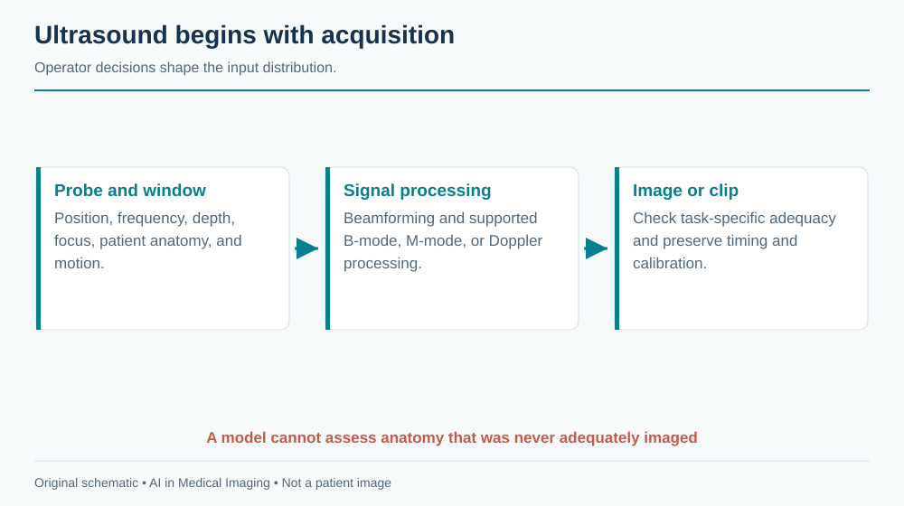
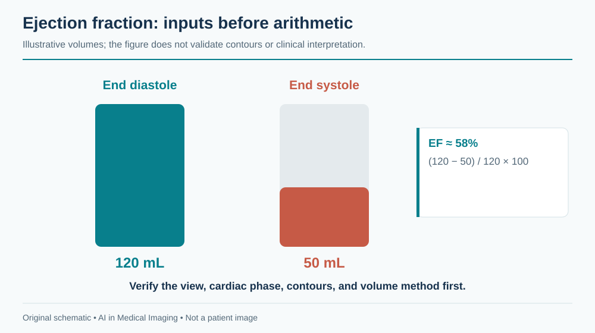
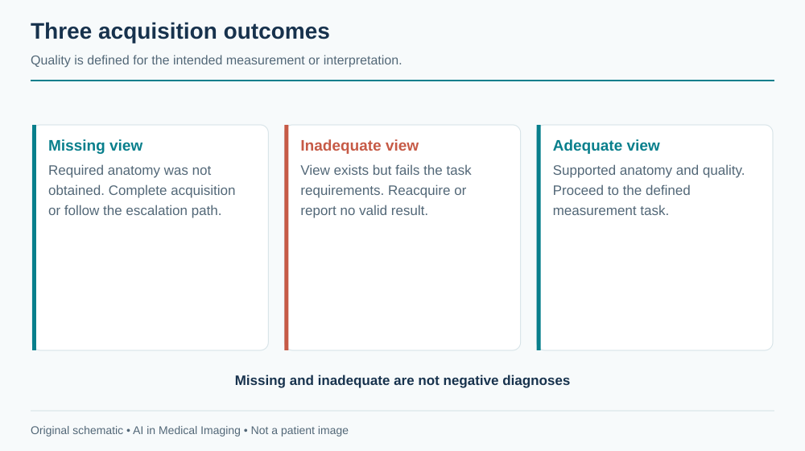
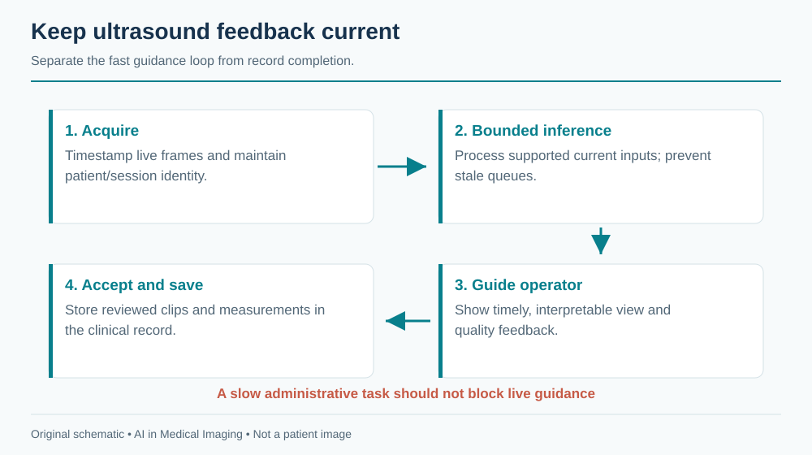

---
execute:
  freeze: false
---

# Ultrasound & Echocardiography {#sec-ultrasound-echo}

Ultrasound is an interaction between an operator, a patient, a probe, and a changing acoustic window. The image is only one product of that interaction. A model trained on selected still images may never encounter the difficult moments that determine whether an examination is diagnostic. Useful AI therefore spans acquisition guidance, view recognition, quality assessment, measurement, and interpretation, with a different evidence requirement for each.

::: {.callout-tip title="For the clinician"}
A correct measurement on a foreshortened or poorly selected view can still misrepresent physiology. Review acquisition quality and contour conventions before accepting an automated number.
:::

::: {.callout-tip title="For the engineer"}
Treat a clip as a timed signal with provenance. Frame rate, pixel calibration, view, ECG timing when available, and the operator's selection process can matter as much as the pixel values.
:::

## What is ultrasound?

A transducer emits acoustic pulses and receives echoes from tissue interfaces and scatterers. Echo timing helps estimate depth; echo amplitude contributes to brightness in B-mode imaging. The familiar image is produced through beamforming and extensive signal processing, not by directly photographing anatomy. Frequency trades penetration against spatial resolution, while probe geometry and the acoustic window affect coverage. The [ACR/RSNA ultrasound overview](https://www.radiologyinfo.org/en/info/genus) describes common acquisition methods and uses.

B-mode shows anatomy. M-mode displays motion along a selected line over time. Doppler techniques estimate motion-related frequency shifts and support assessment of flow; the measured component depends on beam–flow geometry. Color maps, spectral Doppler traces, and grayscale clips are different input types. Their rendered colors and overlays should not be interpreted as a universal physical scale without metadata and system context.

{#fig-us-acquisition fig-alt="Probe and acoustic window feed beam formation, B-mode or Doppler processing, and a quality-reviewed image or clip."}

Speckle is an intrinsic feature of coherent acoustic imaging. Shadowing, reverberation, attenuation, and enhancement can obscure anatomy or provide useful clues. A generic denoiser may remove features relevant to interpretation. Gain, depth, dynamic range, focus, and machine presets influence appearance. Cropping away interface decorations can reduce shortcuts, but must preserve necessary calibration and orientation information elsewhere.

A study may contain still images, short cine loops, Doppler traces, measurements, and structured reports. Some exports contain only rendered video with burned-in text. Others preserve calibrated DICOM ultrasound regions. Know which representation you actually possess before promising physical measurements.

## Why and when it's ordered

Ultrasound is portable, provides real-time imaging, and uses no ionizing radiation. It supports abdominal and pelvic assessment, obstetrics, vascular evaluation, musculoskeletal examinations, procedural guidance, and point-of-care questions. Echocardiography focuses on cardiac structure, function, valves, and hemodynamics. A comprehensive transthoracic examination differs from a focused bedside assessment or a transesophageal study.

The operator adapts the examination to the patient and question. Body habitus, bowel gas, pain, wounds, breathing, and positioning influence access. A model can only interpret the anatomy represented in its inputs. “No abnormality detected” in a narrow clip is not equivalent to a complete negative examination.

A workflow should specify whether AI is intended to help acquire a view, quantify a visible structure, flag an abnormality, or support a final interpretation. Combining these claims into “AI ultrasound” hides the most important clinical distinction: can the user trust that the necessary anatomy was adequately examined?

## What diagnoses are made from it

| Application | Potential AI task | Principal limitation |
|---|---|---|
| Cardiac systolic function | Chamber segmentation and ejection-fraction estimation | View quality, loading conditions, rhythm, and method affect interpretation |
| Valve assessment | View selection and measurement assistance | A single grayscale clip cannot replace a complete Doppler examination |
| Venous thrombosis assessment | Anatomy recognition and compression guidance | Required segments and adequate compression must be demonstrated |
| Obstetric imaging | Standard-plane recognition and biometry | Gestational context and full examination remain necessary |
| Thyroid or breast imaging | Nodule segmentation and feature assessment | Risk classification requires the relevant features and clinical pathway |
| Point-of-care assessment | Focused view adequacy or finding detection | Scope is limited to the specified bedside question |

An end-to-end diagnostic label can conceal acquisition failure. Separate “view not obtained,” “view inadequate,” “finding absent,” and “finding present.” These states require different actions. In a screening workflow, technical failure may warrant reacquisition or referral; it must not be counted as a negative diagnostic result.

### A measurement example: ejection fraction

Left-ventricular ejection fraction is conventionally expressed as

$$EF = \frac{EDV-ESV}{EDV}\times100\%,$$

where EDV and ESV are end-diastolic and end-systolic volumes. If a hypothetical examination yields 120 mL and 50 mL, the calculated EF is about 58%. This arithmetic does not validate the contours, view, cardiac-cycle selection, or clinical interpretation.

{#fig-echo-ef fig-alt="End-diastolic volume 120 milliliters and end-systolic volume 50 milliliters produce an illustrative ejection fraction of about 58 percent."}

A two-dimensional area change is not automatically a volume-based EF. If a model directly predicts EF from a clip, explain whether its reference was a clinician's reported value, a particular measurement method, or another modality. These targets have different error and reproducibility properties. Arrhythmia and variable image quality can make one selected beat unrepresentative.

## How it works in a modern hospital

### Acquisition precedes inference

A sonographer, clinician, or other trained operator acquires the examination, stores representative material, and records measurements. Images and clips reach PACS or a dedicated cardiovascular system; a specialist interprets them with clinical context. At the bedside, storage and reporting may be less standardized, which makes governance more important rather than optional.

An acquisition assistant needs a fast local feedback loop. It should recognize the target view, assess quality, and provide bounded guidance without overwhelming the operator. Guidance should be evaluated by the quality and completeness of the resulting examination, not merely by frame classification accuracy. A confusing prompt can worsen acquisition even if its underlying classifier is accurate.

{#fig-us-quality fig-alt="View availability branches to missing, inadequate, or adequate; only an adequate supported view proceeds to measurement."}

### Preserve temporal and spatial calibration

For cine analysis, retain frame timestamps or validated frame timing. Converting variable-rate video to a fixed rate can change the implied duration. If frames are sampled for inference, preserve the mapping to source frames. ECG overlays may aid phase selection but can also become shortcuts if training labels correlate with acquisition systems.

For length and area measurements, inspect ultrasound region calibration rather than assuming one pixel spacing applies to the entire rendered image. Spectral traces and grayscale regions may use different axes and units. A millimeter scale burned into an image is not a safe substitute for calibrated metadata unless a dedicated, validated extraction method is part of the pipeline.

Return contours on the original clip, identify selected end-diastolic and end-systolic frames, and let the reviewer adjust them. Save the original prediction and the accepted measurement separately. If a reviewer changes a frame selection, recompute derived values and preserve the relationship between the revised contours and result.

## The data landscape

Public echo datasets are valuable but often narrower than routine practice. A collection of selected apical four-chamber clips cannot establish performance across all views, congenital abnormalities, devices, and acquisition systems. Patient-level sampling, selection criteria, and label derivation are central to interpretation.

```{python}
#| echo: false
#| output: asis
import sys
from pathlib import Path
sys.path.insert(0, str(Path("../scripts").resolve()))
from book_catalog import render_catalog
render_catalog('datasets', ['us'], include_general=False)
```

[EchoNet-Dynamic](https://echonet.github.io/dynamic/) supports research on ventricular function from apical four-chamber videos. [CAMUS](https://www.creatis.insa-lyon.fr/Challenge/camus/) provides another setting for chamber segmentation using two- and four-chamber views. They answer related but distinct questions. Mixing them requires explicit reconciliation of contour definitions, timing, image characteristics, and patient grouping.

Split by patient and examination before extracting frames. Adjacent frames are extremely similar; distributing them across train and test sets can create impressive but meaningless performance. If the clinical goal is real-time acquisition assistance, include unselected acquisition footage in evaluation. A dataset of saved clips has already passed through an operator's quality filter.

Labels may be measurements from clinical reports rather than independent image annotations. The report might have used additional views unavailable to the model. Document this information asymmetry. For disease classification, avoid using text overlays or acquisition presets that reveal the referral question or diagnosis.

## The model landscape

Video encoders can learn motion and appearance jointly. Frame-based models with temporal aggregation provide simpler baselines. Segmentation approaches can produce interpretable contours and derived measures, while direct regression can learn a reported value without exposing the intermediate anatomy. Neither approach is intrinsically clinically superior; compare errors, failure visibility, and review effort.

```{python}
#| echo: false
#| output: asis
import sys
from pathlib import Path
sys.path.insert(0, str(Path("../scripts").resolve()))
from book_catalog import render_catalog
render_catalog('models', ['us'], include_general=True)
```

General segmentation frameworks are relevant to development but need ultrasound-specific training and evaluation. A checkpoint trained on CT anatomy should not be assumed to understand speckle, acoustic shadows, or cardiac phase. Interactive segmentation can assist annotation, but the distribution of human prompts is part of the method.

### Evaluation at several levels

For view recognition, report confusion between clinically similar views and the frequency of unsupported inputs. For quality assessment, assess whether the output predicts measurement reliability or expert adequacy. For segmentation, report contour and measurement errors. For EF regression, report bias, dispersion of paired errors, clinically relevant misclassification where justified, and performance across rhythm and image-quality groups.

Correlation is not agreement. Predictions can correlate strongly with reference EF while consistently overestimating low values. Bland–Altman-style analysis and error distributions expose patterns a single correlation coefficient hides. Repeated examinations can help characterize reproducibility, but disease and loading conditions may genuinely change between studies.

Real-time tools also need operational metrics: end-to-end latency, frame-drop rate, stability of prompts, reacquisition frequency, and task completion. A detector that is accurate on retrospectively sampled clips may lag behind the live scene. Evaluate on the hardware, capture pathway, and operator population intended for use.

{#fig-us-live fig-alt="Live frames enter a bounded queue and model; current guidance returns to the operator while accepted clips and measurements enter the clinical record."}

## FDA-cleared AI products

The selected record below illustrates acquisition assistance. It does not establish that every output of the vendor's wider product family has the same authorization.

```{python}
#| echo: false
#| output: asis
import sys
from pathlib import Path
sys.path.insert(0, str(Path("../scripts").resolve()))
from book_catalog import render_catalog
render_catalog('fda-products', ['us'], include_general=False)
```

The original [Caption Guidance De Novo review](https://www.accessdata.fda.gov/cdrh_docs/reviews/DEN190040.pdf) describes guidance for acquiring specified adult transthoracic echocardiographic views within a supported system. Acquisition guidance is distinct from autonomous interpretation of a complete echocardiogram. The operator remains responsible for the examination, and the reader must assess diagnostic adequacy. Check the exact device version, compatible hardware, users, and intended population.

## Open challenges

The strongest domain shift may occur before an image is saved. Operators respond to anatomy, patient discomfort, machine feedback, and their own experience. A new guidance system changes this behavior, so retrospective image validation alone cannot characterize its full effect. Prospective human-factors assessment is especially important for less experienced users.

Quality is also task-specific. A clip adequate for identifying a large effusion may be inadequate for precise chamber measurement. Avoid a universal “good image” score unless its meaning is clear. Systems should explain which requirement failed: missing apex, incomplete border visibility, incorrect view, insufficient temporal coverage, or unsupported acquisition.

Portable devices broaden access but introduce heterogeneous screens, compression, battery constraints, and connectivity. Offline operation needs local identity checks, secure storage, and safe synchronization. A delayed upload must not attach yesterday's result to today's patient session.

Performance monitoring should track technical failures and examination completion as well as accepted predictions. Excluding failures from the denominator can make a system appear more effective precisely where access is most difficult. When a model declines a case, record the reason and whether the patient ultimately obtained the intended assessment.

## The agentic outlook

An ultrasound agent can manage a checklist of required views, recognize incomplete acquisition, retrieve prior measurements, and prepare a structured worksheet. It can coordinate specialized models for view recognition, contouring, and measurement while preserving each model's input requirements.

The safest architecture keeps the fast acquisition loop separate from slower administrative tasks. A network language-model call should not block live probe feedback. A bounded state machine can mark views as pending, adequate, accepted, or requiring review. Only an authorized user should finalize the examination and its clinical interpretation.

A useful agent also recognizes when assistance has failed. Repeated unsuccessful prompts should trigger a clear escalation path rather than an endless loop. Evaluate whether the combined system improves diagnostic-quality acquisition, reduces operator burden, and preserves appropriate referral, not whether it produces more automated text.

## Further reading

- [ACR/RSNA: general ultrasound](https://www.radiologyinfo.org/en/info/genus).
- [EchoNet-Dynamic](https://echonet.github.io/dynamic/) — video-based cardiac function research.
- [CAMUS](https://www.creatis.insa-lyon.fr/Challenge/camus/) — cardiac ultrasound segmentation data.
- [EchoNet reference implementation](https://github.com/echonet/dynamic) — inspect preprocessing and evaluation alongside the model.
- [Caption Guidance FDA review](https://www.accessdata.fda.gov/cdrh_docs/reviews/DEN190040.pdf) — a concrete acquisition-assistance indication.

**Review questions.** Why can selected clips overestimate acquisition-assistance performance? What makes correlation insufficient for validating EF estimates? How should a system represent an examination in which a required view was never obtained?
