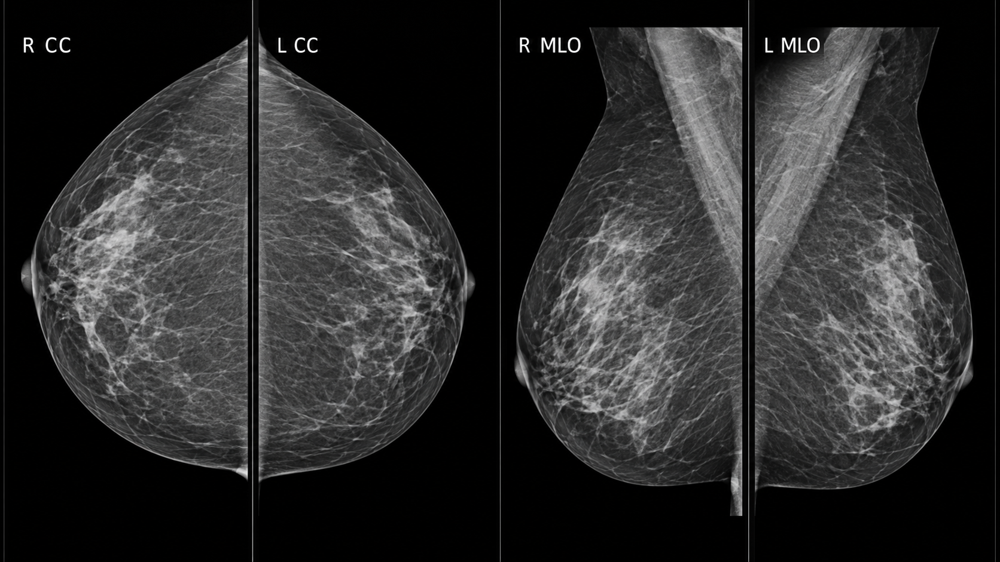
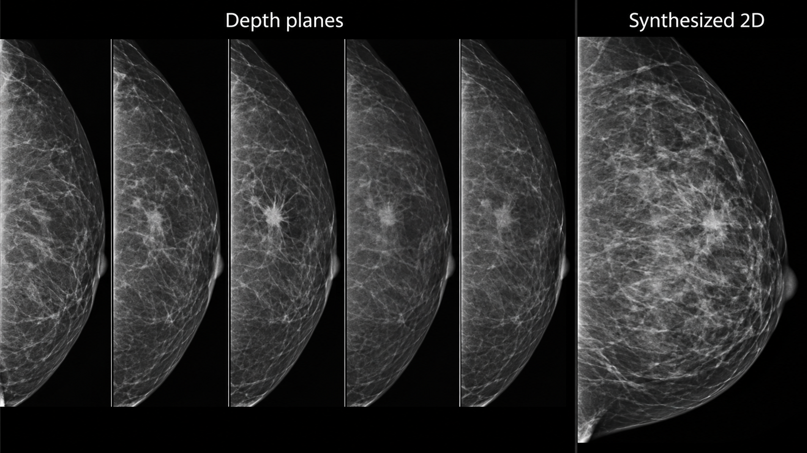
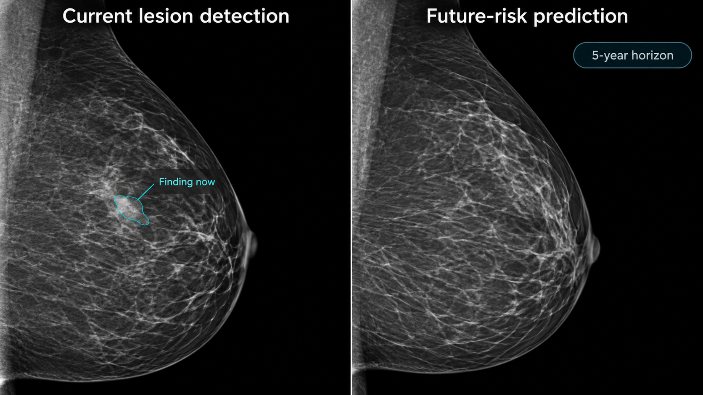
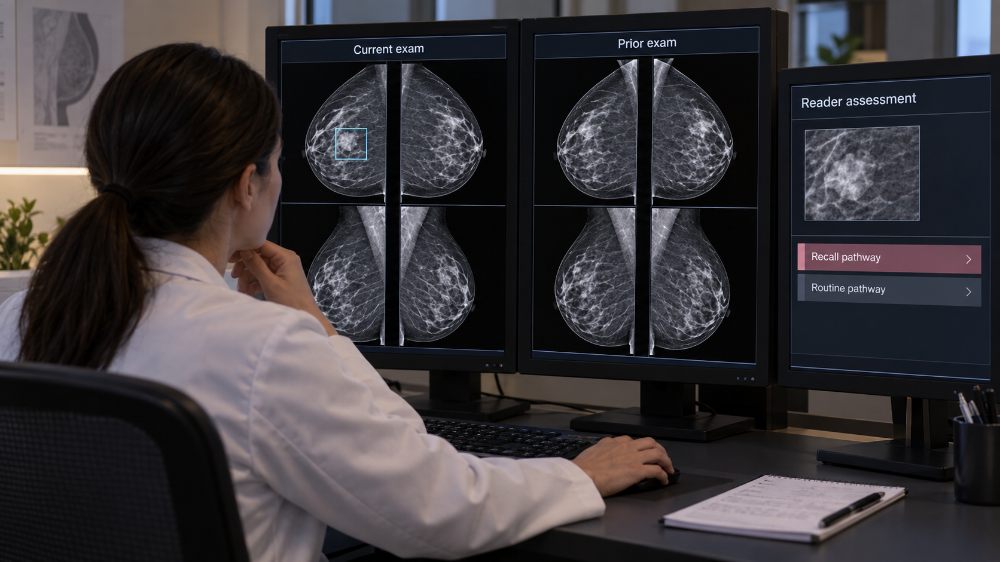

---
execute:
  freeze: false
---

# Mammography & Breast Imaging {#sec-mammography}

Breast screening asks a difficult statistical question: how can a system help identify uncommon consequential disease while limiting unnecessary recall and investigation? An image-level score is only one part of that answer. The examination contains multiple views, often prior studies, and a clinical pathway that determines what happens after a suspicious finding.

::: {.callout-tip title="For the clinician"}
Distinguish lesion detection, examination-level cancer assessment, and future-risk prediction. Their outputs may look like similar probabilities, but their target events, time horizons, and appropriate actions differ.
:::

::: {.callout-tip title="For the engineer"}
The unit of inference is usually an examination with laterality and view identity. Preserve left/right, craniocaudal/mediolateral-oblique identity, processing type, and prior-study timing throughout preprocessing.
:::

## What is mammography?

Mammography uses low-energy X-rays and breast compression to depict tissue with high spatial detail. Compression reduces thickness and motion and helps separate overlapping structures. Full-field digital mammography produces projection images. Digital breast tomosynthesis (DBT) acquires projections over a limited angular range and reconstructs a stack of planes. A synthesized two-dimensional image derived from DBT is not the same acquisition as a conventional two-dimensional exposure. The [ACR/RSNA overview](https://www.radiologyinfo.org/en/info/mammo) explains these methods in the examination context.

Routine screening commonly includes craniocaudal (CC) and mediolateral-oblique (MLO) views of each breast, with additional views when needed. Diagnostic examinations may include spot compression, magnification, targeted ultrasound, or other imaging. Implants, prior surgery, and positioning can change the expected image set. Do not define completeness solely as “exactly four files.”

{#fig-mammo-views fig-alt="A clinical hanging protocol shows right and left CC views and right and left MLO mammograms."}

Mammography's fine spatial sampling creates large images. Aggressive downsampling can erase small calcifications. DICOM objects may distinguish images intended for processing from those intended for presentation. Vendor-specific processing and intensity conventions influence appearance, so a model's accepted image type must be explicit. Keep original pixel data and metadata available for review even if inference uses a derived representation.

DBT reduces some superposition but introduces many reconstructed planes and substantial reading and compute workloads. Adjacent planes are correlated. Treating every plane as an independent sample exaggerates dataset size and can leak information across splits.

{#fig-mammo-dbt fig-alt="Five sequential tomosynthesis depth planes show a spiculated lesion becoming most visible in the center plane, beside a synthesized 2D mammogram."}

## Why and when it's ordered

Screening examines people without a specific presenting breast symptom according to an applicable clinical program. Diagnostic imaging evaluates symptoms, a screening recall, or a known finding. Their disease prevalence, image selection, and downstream decisions differ. A model evaluated on a diagnostic enrichment cohort cannot be assumed to have the same positive predictive value in routine screening.

Screening recommendations vary by jurisdiction, age, risk, and clinical history; this chapter does not prescribe an interval. The engineering requirement is to encode the population and pathway for which the tool has evidence. Supplemental imaging and high-risk surveillance introduce additional modalities and should not be silently folded into a mammography-only claim.

A cancer-free image at the time of acquisition can still contribute to prediction of future risk. Conversely, a high detection score might reflect an abnormality already present. These are different uses of the same data and require different outcome definitions and follow-up windows.

## What diagnoses are made from it

Readers assess masses, calcifications, architectural distortion, asymmetries, and associated changes. Distribution, morphology, location, comparison with priors, and clinical context influence assessment. A visible abnormality is not synonymous with malignancy; pathology and follow-up contribute to reference outcomes.

| Task | Output | Appropriate evaluation |
|---|---|---|
| Candidate detection | Marked region | Lesion sensitivity and false marks per examination |
| Examination assessment | Current-cancer score | Sensitivity, specificity, calibration, and screening-pathway outcomes |
| Density assessment | Category or quantitative estimate | Agreement, reproducibility, and consequences for the intended use |
| Future-risk estimation | Risk over a specified horizon | Time-aware calibration, discrimination, and subgroup performance |
| Workflow prioritization | Worklist order or reading allocation | Delays, missed cancers, recalls, workload, and human interaction |

Reference labels need careful construction. A biopsy proves something about the sampled target, not automatically every region in both breasts. A negative screening examination needs an outcome ascertainment window if it is used as a cancer-negative reference. Interval cancers, incomplete follow-up, and care outside the health system complicate that definition.

### Detection probability is not a management instruction

Suppose a hypothetical classifier has 90% sensitivity and 95% specificity in a population with 5 cancers per 1,000 examinations. Among 10,000 examinations, it would detect about 45 of 50 cancers and mark about 498 of 9,950 noncancer examinations positive. Its positive predictive value would be approximately 8.3%. These are invented teaching inputs, not performance claims about a product.

The example shows why prevalence and the chosen operating point matter. It does not imply that every positive result should lead directly to biopsy. Human assessment and the diagnostic pathway mediate the action. A model's value must be measured where it is actually inserted into that pathway.

{#fig-mammo-tasks fig-alt="A mammogram with a current outlined finding is compared with a normal-appearing screening mammogram carrying a five-year risk horizon."}

## How it works in a modern hospital

The technologist verifies identity, obtains appropriately positioned views, and checks image quality. Images enter PACS or a specialized breast workstation with prior examinations. Depending on the program, interpretation may involve one reader, multiple readers, arbitration, or computer assistance. AI can operate concurrently, as a second reader, or in a workflow-specific triage role, but evidence from one configuration does not automatically transfer to another.

An input assembler should identify patient, examination, breast, view, acquisition type, and processing type. It should recognize supplementary and repeated views and preserve a documented selection policy. A missing MLO view, a unilateral examination, or a prior mastectomy should produce an explicit supported or unsupported state rather than a fabricated four-view input.

Prior-image retrieval requires correct temporal ordering. Never let a model evaluated at the index screening date see a later diagnostic study or pathology result. If a prior is unavailable, record that fact. A system trained only on complete longitudinal pairs may fail disproportionately for people entering a new health system.

### Integrating marks and scores

Display a candidate mark on the correct source image and breast. If inference used a crop or resized image, maintain the inverse coordinate mapping. Mark size should communicate what the algorithm localized; a single point is not a lesion boundary. Overlays must be easy to toggle so that the underlying image remains inspectable.

Scores need names and units that match their calibration. A ranking score between zero and one is not necessarily a probability of cancer. If a report incorporates an AI result, identify the version and intended task and preserve the clinician's final assessment. Do not let an unread AI mark silently populate a diagnosis field.

{#fig-mammo-workflow fig-alt="A radiologist reviews current and prior four-view mammograms with one restrained AI mark and a reader-assessment panel."}

## The data landscape

Public datasets differ in acquisition era, modality, population, and reference labels. Digitized film is useful for research but does not reproduce the processing and image characteristics of current digital systems. A dataset of annotated suspicious findings may be enriched relative to screening practice.

```{python}
#| echo: false
#| output: asis
import sys
from pathlib import Path
sys.path.insert(0, str(Path("../scripts").resolve()))
from book_catalog import render_catalog
render_catalog('datasets', ['mammo'], include_general=False)
```

[VinDr-Mammo](https://physionet.org/content/vindr-mammo/1.0.0/) supplies a defined full-field digital mammography release with expert annotations. CBIS-DDSM is a curated derivative of a digitized-film collection. Neither should be described as a universal modern DBT benchmark. Dataset access conditions and rights to redistribute images differ from the license of accompanying code.

Split by patient, keeping both breasts, all views, and longitudinal studies together where required by the evaluation design. Deduplicate derived versions and crops. For lesion tasks, maintain the relationship between an annotation, its source view, breast, and clinical outcome. For risk prediction, record censoring and follow-up rather than labeling everyone without a recorded cancer as a long-term negative.

External evaluation should include the acquisition systems and populations that matter to deployment. Assess performance across age, breast density, prior surgery, and relevant demographic groups when valid data and adequate sample sizes are available. Missing demographic data and incomplete outcome capture limit the claims that can be made.

## The model landscape

Multi-view architectures combine complementary projections. Some systems aggregate image features at the examination level; others detect local candidates and integrate them with global context. DBT models must manage depth and image volume without discarding the detail needed for small findings. Temporal models compare current and prior examinations, adding both potential value and opportunities for leakage.

```{python}
#| echo: false
#| output: asis
import sys
from pathlib import Path
sys.path.insert(0, str(Path("../scripts").resolve()))
from book_catalog import render_catalog
render_catalog('models', ['mammo'], include_general=True)
```

Mirai is an example of research on future breast-cancer risk. It belongs to a different task category from a concurrent lesion-detection aid. General-purpose segmentation tools may support annotation or breast-region extraction, but their presence in the catalog is not evidence of validated mammographic cancer detection.

### Evaluating the reading strategy

Retrospective discrimination is an early step. Reader studies assess whether clinicians using the tool perform differently, but case enrichment, reading conditions, and memory effects can limit generalization. Prospective workflow studies address actual recall, cancer detection, interval outcomes, delays, and workload. The appropriate design depends on the claim.

Report per-examination metrics at a prespecified operating point, with uncertainty. If AI changes which cases receive a second read, evaluate the whole allocation policy. Saving reading time on most cases is not sufficient if the remaining failures are harder to detect. Record technical exclusions and how excluded examinations are routed.

For risk models, assess calibration over the stated horizon and in the intended population. A high-risk group should have an observed event rate compatible with the stated estimate, subject to follow-up and censoring. Changes in screening intensity can affect which cancers are observed, making causal interpretation difficult.

## FDA-cleared AI products

The table cites a specific historical version, rather than treating a product name as an unlimited claim.

```{python}
#| echo: false
#| output: asis
import sys
from pathlib import Path
sys.path.insert(0, str(Path("../scripts").resolve()))
from book_catalog import render_catalog
render_catalog('fda-products', ['mammo'], include_general=False)
```

The [Transpara 2.1.0 summary](https://www.accessdata.fda.gov/cdrh_docs/pdf24/K241831.pdf) describes physician assistance with supported screening mammography and DBT inputs. Its locations and scores support interpretation; they do not make autonomous patient-management decisions. Supported manufacturers, acquisition modes, and software versions must be checked in current labeling before implementation. An authorization for concurrent reading does not by itself establish a safe no-reader pathway.

## Open challenges

The hardest endpoints often emerge after the initial examination. Interval cancers and missed disease require reliable follow-up, while false-positive recalls impose immediate burden. A deployment evaluation needs both near-term workflow measures and a plan for delayed outcomes. Otherwise, early operational success may conceal a clinically important tradeoff.

AI can also change reader behavior. Frequent low-value marks can create alert fatigue; highly persuasive scores can produce anchoring. Interface design, training, and the order in which AI is shown should be evaluated as part of the system. Readers need a clear way to disagree and document the accepted interpretation.

Future-risk prediction raises questions about actionability and equity. A model can be statistically informative without establishing which intervention improves outcomes. Differences in access to follow-up imaging or biopsy can widen inequity even if image-level performance is similar. Measure completion of downstream care where the application is intended to improve screening outcomes.

## The agentic outlook

A breast-imaging agent can verify view completeness, retrieve priors, reconcile laterality, route supported examinations, and prepare a comparison workspace. It can track whether a recommendation has entered the appropriate follow-up process, within authorized clinical systems and roles.

It should not merge current-detection and future-risk scores into a single unexplained recommendation. Each output needs its own target, horizon, source images, and validated action pathway. Uncertain identity, laterality, or input compatibility should stop automated result posting. The useful agent is a reliable coordinator of evidence and tasks, with final clinical assessment assigned to the appropriate professional.

## Further reading

- [ACR/RSNA: mammography](https://www.radiologyinfo.org/en/info/mammo).
- [VinDr-Mammo version 1.0.0](https://physionet.org/content/vindr-mammo/1.0.0/).
- [CBIS-DDSM at TCIA](https://www.cancerimagingarchive.net/collection/cbis-ddsm/).
- [Mirai research implementation](https://github.com/yala/Mirai).
- [Transpara 2.1.0 FDA summary](https://www.accessdata.fda.gov/cdrh_docs/pdf24/K241831.pdf).

**Review questions.** Why does prevalence change positive predictive value? What evidence would justify moving from concurrent assistance to autonomous screening? How would you prevent temporal leakage when using prior examinations?
