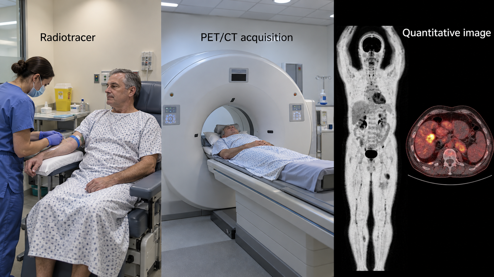
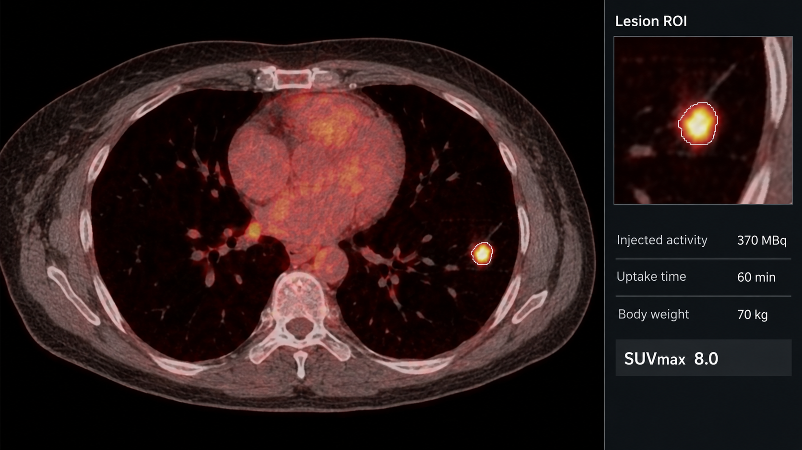
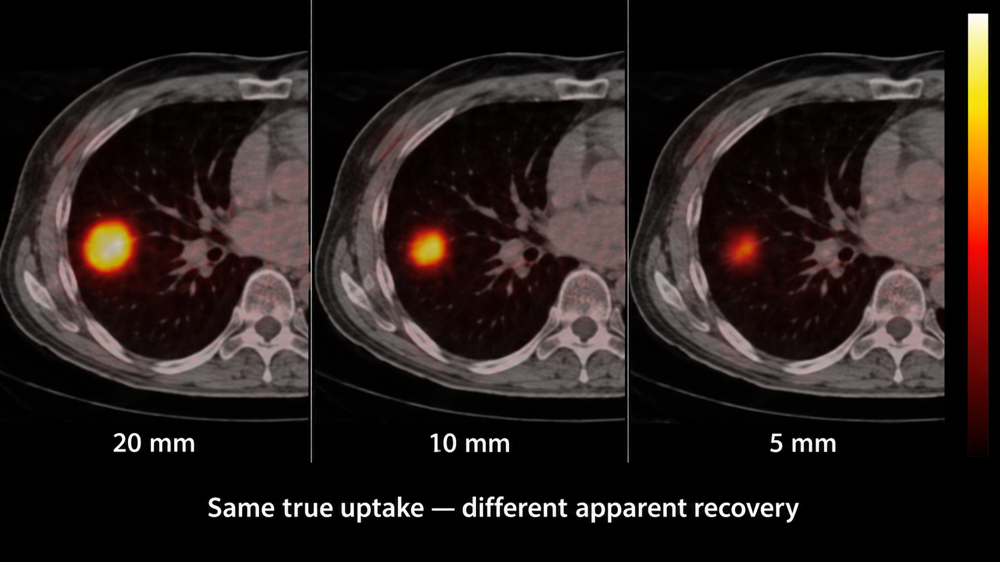
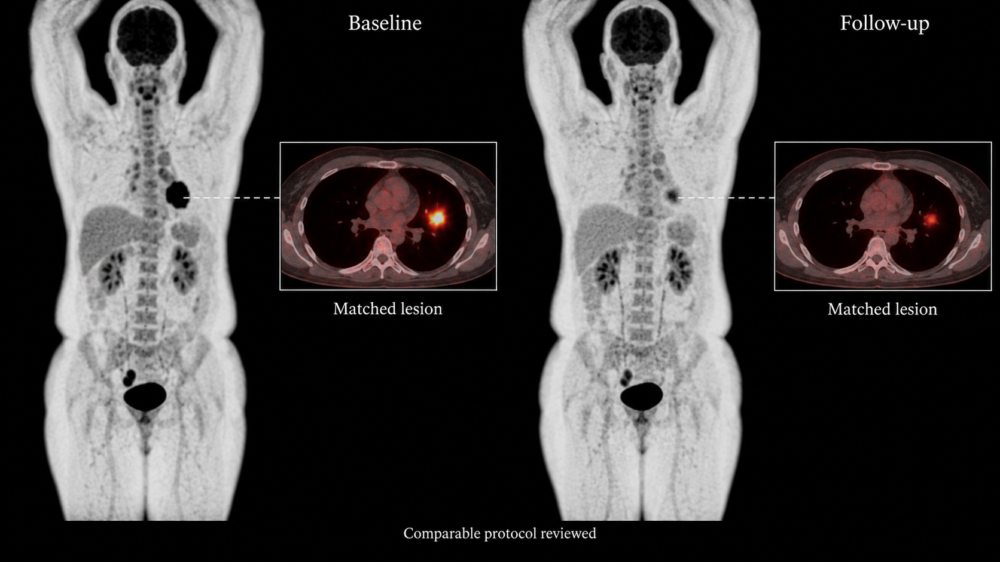

---
execute:
  freeze: false
---

# Nuclear Medicine: PET & SPECT {#sec-nuclear-medicine}

Nuclear medicine measures the distribution of an administered radiopharmaceutical over time. The image reflects a biological process, tracer kinetics, acquisition, and reconstruction. It is not simply a bright-region map of disease. AI applications must preserve that chain of meaning, especially when they produce quantitative measurements or combine functional and anatomical images.

::: {.callout-tip title="For the clinician"}
Ask whether an automated uptake value is comparable across examinations and whether every high-uptake focus is actually part of the target disease. Physiologic activity, treatment effects, and technical artifacts can all influence the result.
:::

::: {.callout-tip title="For the engineer"}
Tracer identity, timing, units, calibration, corrections, and reconstruction are model inputs even when they are not tensor channels. PET and CT in a hybrid examination are related but not guaranteed to be perfectly aligned.
:::

## What is nuclear medicine?

In PET, a positron-emitting tracer produces annihilation photons detected in coincidence. Reconstruction estimates tracer distribution from the recorded events, with corrections for effects such as attenuation, scatter, and random coincidences. SPECT detects emitted gamma photons through collimation and reconstructs their distribution from projections. Hybrid PET/CT, PET/MRI, and SPECT/CT combine functional and anatomical information. The [ACR/RSNA PET overview](https://www.radiologyinfo.org/en/info/pet) describes common clinical uses and examination steps.

Different tracers interrogate different processes. FDG is related to glucose metabolism; other tracers target different biological pathways. A model trained on FDG oncology studies should not be assumed to work on another tracer, even if both datasets use PET and have similar array dimensions. The distribution of normal uptake and the clinical target can change substantially.

{#fig-pet-acquisition fig-alt="A clinical sequence shows radiotracer injection, PET/CT scanning, and resulting whole-body and fused PET/CT images."}

The accompanying CT may serve attenuation correction and anatomical localization, or may be a diagnostic examination with its own protocol. These roles matter. A low-dose noncontrast localization CT cannot silently replace a diagnostic contrast-enhanced CT in a downstream model. Respiratory motion and differences in acquisition timing can cause misregistration, particularly near the diaphragm.

### Quantification and SUV

A simplified body-weight standardized uptake value is

$$SUV_{bw}=\frac{C(t)}{A_{ref}/m},$$

where $C(t)$ is activity concentration at an appropriate reference time, $A_{ref}$ is administered activity represented at a consistent decay reference, and $m$ is body mass. Unit consistency is essential. Alternative normalization conventions exist; an exported number should specify which was used.

This equation is not an implementation recipe for every DICOM object. Quantitative units, decay-correction status, administration time, residual activity handling, scanner calibration, and metadata conventions must be interpreted correctly. Some images already contain normalized values. Applying a second conversion can produce plausible but wrong measurements.

{#fig-pet-suv fig-alt="A fused axial chest PET/CT shows a hot pulmonary lesion with a region of interest and a panel listing injected activity, uptake time, body weight, and SUVmax."}

## Why and when it's ordered

PET and SPECT support questions in oncology, cardiology, neurology, infection and inflammation, and other areas. The indication determines tracer choice, preparation, acquisition timing, coverage, and interpretation. Oncology studies may support staging or treatment-response assessment; cardiac nuclear studies address different physiological questions and use different acquisition and analysis pathways.

Preparation and timing can influence comparability. For example, an FDG study's clinical interpretation considers factors beyond visible lesions, including physiologic uptake and patient preparation. This chapter does not prescribe a preparation protocol; the AI system should record whether the required clinical protocol was followed and whether deviations affect eligibility.

A disease-specific examination may contain multiple bed positions, reconstructions, attenuation-corrected and noncorrected series, CT, and derived displays. A maximum-intensity projection is a useful overview but discards depth and is not a substitute for the quantitative volume used by a lesion-measurement model.

## What diagnoses are made from it

| Task | Candidate output | Key ambiguity |
|---|---|---|
| Lesion detection | Candidate abnormal uptake focus | Physiologic and inflammatory uptake can resemble target disease |
| Disease-burden measurement | Lesion masks and aggregate volume | Lesion inclusion and boundary conventions change the result |
| Treatment comparison | Matched lesions and uptake changes | Timing, therapy, acquisition, and criteria affect interpretation |
| Image enhancement | Denoised or accelerated reconstruction | Smoother images may alter small lesions or uptake extrema |
| Organ quantification | Regional uptake or functional measures | Tracer, reference region, calibration, and task must match |

A lesion mask is not merely a thresholded bright region. Segmentation can depend on background activity, lesion size, contrast, reconstruction, and the reference protocol. If a dataset labels only malignant lesions, the model must learn to exclude physiologic and unrelated uptake. If annotations omit difficult lesions, evaluation may reward that omission.

Derived measures such as total lesion volume or total lesion glycolysis need explicit definitions. State which lesions are included, which uptake summary is used, and how partial coverage or uncertain foci are handled. A number without that policy is difficult to compare across software or visits.

## How it works in a modern hospital

The nuclear-medicine workflow includes radiopharmaceutical handling, administration records, an uptake or dynamic acquisition period as applicable, scanning, reconstruction, and interpretation. The patient, administration, acquisition, and reconstructed series must remain correctly linked. A missing administration record can invalidate quantitative post-processing even when an image is visually readable.

A robust input manifest records tracer, relevant times and time zones, quantitative units, correction information, reconstruction, coverage, and paired anatomical series. Do not select the largest series or the one whose name contains “PET” without checking its role. Derived screenshots, noncorrected images, and quantitative reconstructions are not interchangeable.

### Fusion is a hypothesis to inspect

Hybrid acquisition improves correspondence but does not eliminate motion. Verify registration before using CT anatomy to classify a PET focus or transferring a PET mask into CT coordinates. Resampling must preserve physical geometry, and interpolation can affect small structures and maximum values. Keep native-resolution measurements where required by the validated method.

{#fig-pet-partial fig-alt="Three fused PET/CT crops show equally avid lesions at 20, 10, and 5 millimeters, with reduced apparent recovery as size decreases."}

Return lesion overlays on both functional and anatomical images, identify the source reconstruction, and expose quality flags. A reviewer should be able to exclude physiologic uptake, correct a boundary, or mark a focus indeterminate. Preserve edits and recompute aggregate measures from the accepted lesion set.

### An illustrative comparison

Suppose a lesion has a reported SUV of 8.0 at one visit and 6.0 at another. The arithmetic decrease is 25%. That alone does not establish treatment response. Check the uptake measure, tracer, timing, reconstruction, patient preparation, lesion identity, and the response framework used by the clinical service. A change in which voxel supplies the maximum can affect an extreme-value measure even when the underlying lesion changes little.

{#fig-pet-comparison fig-alt="Baseline and follow-up whole-body PET images and fused axial insets show reduced uptake in the same matched lesion."}

## The data landscape

Public PET/CT resources often focus on a particular tracer and oncology population. The autoPET family of challenges demonstrates the distinction between recognizing uptake and segmenting the target lesion set. Dataset editions and challenge tasks can change; record exactly which release and splits are used.

```{python}
#| echo: false
#| output: asis
import sys
from pathlib import Path
sys.path.insert(0, str(Path("../scripts").resolve()))
from book_catalog import render_catalog
render_catalog('datasets', ['nm'], include_general=False)
```

Patient-level grouping is essential. Keep repeated visits and derivative reconstructions from crossing partitions in a way that leaks identity or outcome information. For multimodal models, verify that all channels describe the same acquisition episode and that preprocessing did not lose registration. Store missing metadata explicitly rather than replacing it with a population average and forgetting the substitution.

References may combine expert review with follow-up, pathology, or a defined segmentation protocol. There is no universal ground-truth contour for every uptake focus. Evaluate lesion inclusion and boundary agreement separately when possible. A model can achieve a high voxel overlap by segmenting a few large lesions while missing several small but clinically relevant lesions.

## The model landscape

Three-dimensional segmentation models can combine PET and CT channels. Their success depends on channel semantics and normalization, not just architecture. Some approaches first segment organs or identify likely physiologic uptake; others learn an end-to-end lesion mask. A two-stage pipeline offers intermediate checks but can propagate upstream errors.

```{python}
#| echo: false
#| output: asis
import sys
from pathlib import Path
sys.path.insert(0, str(Path("../scripts").resolve()))
from book_catalog import render_catalog
render_catalog('models', ['nm'], include_general=True)
```

Self-configuring segmentation frameworks provide useful baselines for an appropriately curated PET/CT task. General interactive tools may help curate lesions, but a model's availability does not establish quantitative validity. Image-enhancement models require an especially clear distinction between visually improved appearance and preserved lesion detectability and uptake measurements.

Evaluation should include lesion sensitivity, false-positive burden, segmentation agreement, and errors in the quantities actually used. Stratify by lesion size and location, disease burden, tracer, and acquisition settings within the intended scope. Report performance on examinations with no target lesions. A system that labels normal uptake as disease can impose substantial review burden.

For reduced-count or shorter-acquisition methods, test the deployed acquisition–enhancement chain. Retrospective count reduction is useful but may not reproduce all effects of a different clinical acquisition. Assess small lesions and out-of-distribution appearances explicitly. Do not validate a denoiser solely with image-similarity metrics against another reconstruction.

## FDA-cleared AI products

The selected product illustrates image processing rather than autonomous lesion diagnosis.

```{python}
#| echo: false
#| output: asis
import sys
from pathlib import Path
sys.path.insert(0, str(Path("../scripts").resolve()))
from book_catalog import render_catalog
render_catalog('fda-products', ['nm'], include_general=False)
```

The original [SubtlePET summary](https://www.accessdata.fda.gov/cdrh_docs/pdf18/K182336.pdf) describes processing that includes noise reduction for specified PET images, including supported hybrid workflows. Its indication should not be expanded into authorization to diagnose cancer, quantify every tracer, or choose a treatment. Check the specific supported inputs and current labeling for any contemplated implementation.

## Open challenges

Small lesions are difficult because image resolution and partial-volume effects blur boundaries and reduce apparent uptake. Reconstruction changes can alter both lesion visibility and quantitative summaries. Consistency across time is therefore an acquisition and software problem as well as a segmentation problem.

Multitracer generalization is another frontier. A useful system should identify the tracer and either select an appropriately validated model or abstain. Training a general model on mixed tracers requires enough examples and labels to distinguish normal biodistribution from disease for each setting; a modality tag alone is insufficient.

Whole-body disease burden creates a challenging review problem. A patient may have many lesions, confluent disease, or uncertain foci. The interface needs efficient lesion inventory management and a clear definition of what was counted. Aggregate scores should remain traceable to individual regions.

Finally, quantitative metadata are often less portable than pixels. A service that works on one scanner's exports may fail after a software upgrade or transfer between institutions. Include metadata validation and known-value checks in commissioning and revalidation.

## The agentic outlook

A nuclear-medicine agent can reconcile administration and acquisition records, verify quantitative prerequisites, identify compatible prior examinations, and prepare a lesion comparison workspace. It can flag incompatible tracers, missing units, or suspicious timing before a measurement is accepted.

It should separate technical computation from clinical response classification. A bounded agent can calculate a change from reviewed measurements and cite the chosen rule; it should not invent comparability or silently select a response framework. When prerequisites are unresolved, “comparison unavailable” is a useful result.

A mature workflow retains the original reconstruction, enhanced images if used, model masks, human revisions, and the final accepted measurement. This makes it possible to determine whether a discrepancy arose from acquisition, enhancement, segmentation, lesion selection, or interpretation.

## Further reading

- [ACR/RSNA: PET/CT](https://www.radiologyinfo.org/en/info/pet).
- [FDG-PET-CT-Lesions collection at TCIA](https://www.cancerimagingarchive.net/collection/fdg-pet-ct-lesions/).
- [autoPET challenge portal](https://autopet.grand-challenge.org/) — inspect the task and release rather than assuming all editions are identical.
- [nnU-Net](https://github.com/MIC-DKFZ/nnUNet).
- [SubtlePET FDA summary](https://www.accessdata.fda.gov/cdrh_docs/pdf18/K182336.pdf).

**Review questions.** Which metadata are needed before computing SUV? Why can PET/CT fusion be inaccurate despite hybrid acquisition? What additional evidence is needed to interpret a fall in an uptake value as treatment response?
