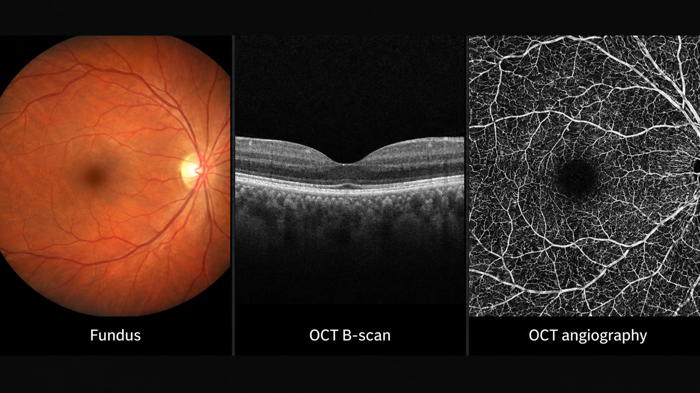
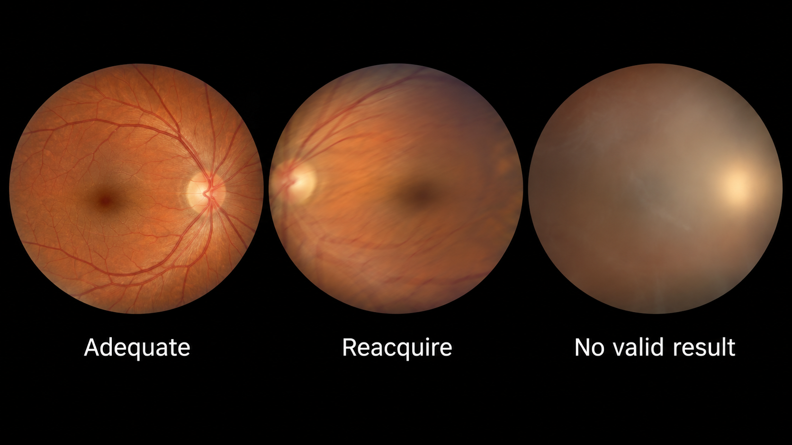
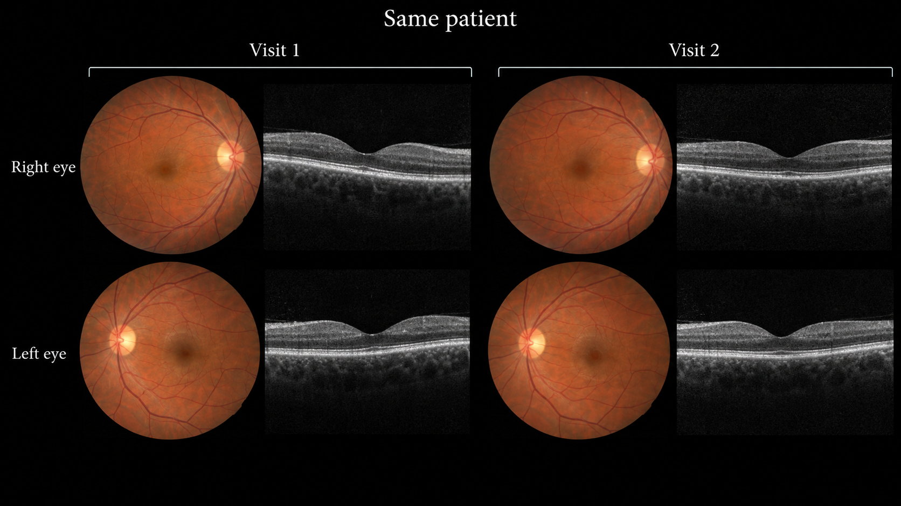
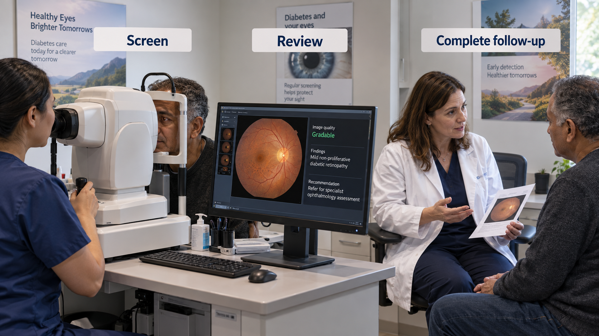

---
execute:
  freeze: false
---

# Ophthalmic Imaging {#sec-ophthalmic-imaging}

Ophthalmic imaging combines accessible optical anatomy with several distinct measurement systems. A fundus photograph shows a surface view; optical coherence tomography (OCT) resolves depth; angiographic methods depict vascular information. They are complementary, not interchangeable. The central engineering problem is to preserve which eye, modality, location, and visit each observation describes.

::: {.callout-tip title="For the clinician"}
An automated screening result answers a defined referral question in a defined population. It does not automatically constitute a comprehensive eye examination or exclude unrelated ocular disease.
:::

::: {.callout-tip title="For the engineer"}
Both eyes and repeated visits belong to one patient. Splitting images independently creates leakage. An unreadable image is a workflow outcome, not a healthy-eye label.
:::

## What is ophthalmic imaging?

Color fundus photography depicts the retina, optic disc, and visible vessels through the pupil. Field of view, illumination, pigmentation, focus, media clarity, and camera characteristics affect appearance. A macula-centered image differs from a disc-centered image; a wide-field system covers different anatomy. Image dimensions alone do not describe the field examined.

OCT uses optical interference to estimate depth-resolved reflectivity. A cross-sectional B-scan is assembled from depth profiles; a volume combines many B-scans. Retinal layer boundaries, fluid spaces, and other structural features can be assessed in this geometry. OCT angiography derives motion-related vascular contrast from repeated acquisitions. It is not equivalent to a color photograph or dye angiography.

{#fig-eye-modalities fig-alt="Three clinical panels show a color fundus photograph, macular OCT B-scan, and OCT angiography vascular map."}

OCT exports may include raw or proprietary volumes, rendered B-scans, segmentation lines, thickness maps, and reports. A screenshot can lose spacing, scan position, signal-quality information, and the relationship between B-scans. Preserve native geometry and the device's acquisition context when developing quantitative tools.

## Why and when it's ordered

Retinal imaging supports diabetic-eye screening, assessment of macular disease, glaucoma evaluation, vascular disease, and longitudinal treatment monitoring. The selected modality depends on the question. A photograph may show visible retinopathy lesions, while OCT provides structural information about retinal layers and fluid. A model validated on one cannot claim the full scope of the other.

Screening is particularly attractive for AI because image acquisition can occur outside a specialist clinic and the output can be a defined referral recommendation. The benefit depends on completing the pathway: acquiring adequate images, producing a valid result, communicating it, and obtaining follow-up care. A highly accurate classifier that increases unresolved referrals may not improve outcomes.

Monitoring presents a different challenge. Small changes in layer thickness or fluid volume require consistent scan placement, segmentation definitions, and image quality. A new device or scan pattern can change the apparent measurement without a corresponding biological change.

## What diagnoses are made from it

| Clinical question | Potential output | Scope boundary |
|---|---|---|
| Diabetic-retinopathy screening | Grade or referral category | Depends on image adequacy, population, and defined target disease |
| Macular disease monitoring | Fluid or layer segmentation | Structural change needs clinical interpretation |
| Glaucoma assessment | Disc features or layer measurements | No single image feature replaces a complete glaucoma assessment |
| Vascular abnormality assessment | Candidate lesion or vascular measure | Acquisition artifacts can resemble pathology |
| Image quality | Gradable/ungradable decision with reason | Quality is task-specific; some findings may still be visible |

A grade is a label under a grading system, not a universal physical quantity. Map training labels to the intended referral threshold explicitly. If two datasets use different severity scales or adjudication procedures, combining their integers without reconciliation can create contradictory supervision.

Similarly, a segmentation label such as “fluid” may combine intraretinal, subretinal, or other spaces with different clinical implications. State the compartments, annotation protocol, and treatment context. A model that measures one compartment should not silently report total disease activity.

## How it works in a modern hospital

Acquisition may occur in an ophthalmology clinic, screening service, primary-care site, or mobile program. Identity and laterality must be verified at capture. The examination may include multiple fields per eye, repeated images after quality review, and additional modalities. Images then enter a local imaging system, PACS, or vendor platform, with varying interoperability.

A screening pipeline should first check supported camera and field, laterality, and image quality. Reacquisition can resolve some failures. Persistent inability to obtain an adequate image needs a defined clinical pathway. Do not repeatedly select the most favorable score from multiple attempts without a validated aggregation policy.

{#fig-eye-quality fig-alt="Three fundus images show an adequate view, a motion-blurred image requiring reacquisition, and a retina obscured by media opacity."}

### Eye-level inference and patient-level action

A model may operate on one field, one eye, or a complete examination. The service must define how these outputs become a patient-level result. If either eye meets a referral criterion, the resulting action may differ from a policy that averages scores. Such aggregation is part of the validated product, not a convenient implementation detail.

For OCT, record scan location, spacing, laterality, and segmentation version. If a follow-up scan does not cover the same region, declare limited comparability. Return masks or layer boundaries on the correct B-scans, and let reviewers inspect failures caused by shadows, motion, poor signal, or unusual anatomy.

{#fig-eye-grouping fig-alt="A clinical contact sheet groups right- and left-eye fundus and OCT images across two visits for the same patient."}

## The data landscape

Public fundus datasets have enabled substantial research, but camera, population, grading, and image-quality distributions vary. Some labels are eye-level while files are image-level. Some releases contain several fields or repeated captures. Reconstruct these relationships before splitting or evaluating.

```{python}
#| echo: false
#| output: asis
import sys
from pathlib import Path
sys.path.insert(0, str(Path("../scripts").resolve()))
from book_catalog import render_catalog
render_catalog('datasets', ['ophtho'], include_general=False)
```

The EyePACS competition resource is a useful fundus benchmark, but competition labels and distributions are not a substitute for a prospective screening reference standard. For OCT, use a source with documented patient grouping and acquisition geometry when the goal is volumetric analysis. A collection of isolated B-scans may not support claims about whole-volume fluid burden.

Report whether ungradable images were excluded during dataset construction. Exclusion can inflate apparent performance and hide a major deployment burden. External validation should examine camera changes, pigmentation, media opacity, age range, and prior treatment as appropriate to the task. Small subgroup counts should be reported with uncertainty rather than converted into confident generalizations.

A screening reference may require expert adjudication and additional imaging not visible to the model. Document those inputs. For longitudinal outcomes, specify follow-up and whether care outside the dataset's health system could cause missed event ascertainment.

## The model landscape

Fundus models often begin with image encoders and task-specific classification heads. OCT models may operate on B-scans, volumes, or segmented layers. Multimodal models combine these representations with clinical data, but must account for missing modalities and timing. A fundus image and OCT acquired months apart are not automatically a paired contemporaneous sample.

```{python}
#| echo: false
#| output: asis
import sys
from pathlib import Path
sys.path.insert(0, str(Path("../scripts").resolve()))
from book_catalog import render_catalog
render_catalog('models', ['ophtho'], include_general=True)
```

[RETFound](https://github.com/rmaphoh/RETFound) is a research foundation-model resource for retinal imaging. Its representation must be adapted and evaluated for the intended task; pretraining does not confer an autonomous screening indication. Review the exact checkpoint, preprocessing, training data, and terms rather than assuming all versions share the same conditions.

### Evaluate the full screening service

Report sensitivity and specificity at the prespecified referral threshold, patient-level aggregation, technical failure rate, and the proportion completing follow-up. Include ungradable examinations in an explicit denominator. Positive predictive value changes with disease prevalence, so a benchmark result should not be transplanted into a new population without considering calibration and operating point.

For OCT segmentation, report boundary or compartment errors and their effect on derived measurements. A high average Dice score can conceal failure on a small but important fluid pocket. Longitudinal reproducibility requires consistent scan location and annotation definitions, not just a strong per-image metric.

An illustrative service might return three states: target condition detected, target condition not detected in an adequate supported examination, or no valid result. Those labels should not be collapsed into a binary database field. The third state is essential for safe follow-up and honest evaluation.

{#fig-eye-referral fig-alt="A retinal screening encounter shows fundus capture, workstation review, and a clinician discussing follow-up with the patient."}

## FDA-cleared AI products

The selected record illustrates a narrowly specified autonomous screening use. Autonomous does not mean unrestricted.

```{python}
#| echo: false
#| output: asis
import sys
from pathlib import Path
sys.path.insert(0, str(Path("../scripts").resolve()))
from book_catalog import render_catalog
render_catalog('fda-products', ['ophtho'], include_general=False)
```

The original [IDx-DR De Novo review](https://www.accessdata.fda.gov/cdrh_docs/reviews/DEN180001.pdf) defines a diabetic-retinopathy screening application for a specified adult diabetic population, compatible imaging system, and use conditions. It is not a general eye-disease detector. Its authorization cannot be transferred to a research fundus classifier because the two systems produce similar-looking grades. Later branding and product changes require review of the applicable labeling.

## Open challenges

Acquisition access and referral access are separate problems. A program may expand screening while leaving patients unable to obtain specialist care. Evaluate the distribution of technical failures, referrals, and completed care across sites and populations, not just model accuracy among usable images.

OCT interoperability remains difficult because acquisition, processing, and exports differ across devices. A layer measurement may depend on a vendor's segmentation convention. Harmonization needs a clearly defined target and validation against that target; it should not hide the original measurement method.

Longitudinal models can also learn treatment patterns rather than disease biology. If treatment decisions appear in the input, a model may predict clinician behavior or access to care. Define whether the target is morphology, future disease, treatment need, or observed treatment, and avoid presenting one as another.

## The agentic outlook

An ophthalmic agent can check image quality, guide reacquisition, reconcile laterality, assemble prior scans, and track the completion of a defined screening pathway. It can summarize which images and measurements support a referral, while leaving the scope of the validated classifier intact.

The agent should preserve the no-result state and avoid falsely reassuring language when images are inadequate. It should also distinguish screening referral from urgency decisions that require additional clinical context. For longitudinal OCT, a useful agent prepares matched views and highlights changed measurements with source links, then asks the responsible clinician to accept or revise the interpretation.

## Further reading

- [EyePACS diabetic-retinopathy competition data](https://www.kaggle.com/c/diabetic-retinopathy-detection).
- [RETFound repository](https://github.com/rmaphoh/RETFound).
- [IDx-DR FDA review](https://www.accessdata.fda.gov/cdrh_docs/reviews/DEN180001.pdf).
- [DICOM ophthalmic imaging information objects](https://dicom.nema.org/medical/dicom/current/output/chtml/part03/PS3.3.html) — consult the object appropriate to the acquisition rather than assuming every export is a generic photograph.

**Review questions.** Why must both eyes stay together during dataset splitting? How should ungradable examinations enter performance reporting? What distinguishes autonomous screening from a comprehensive eye examination?
