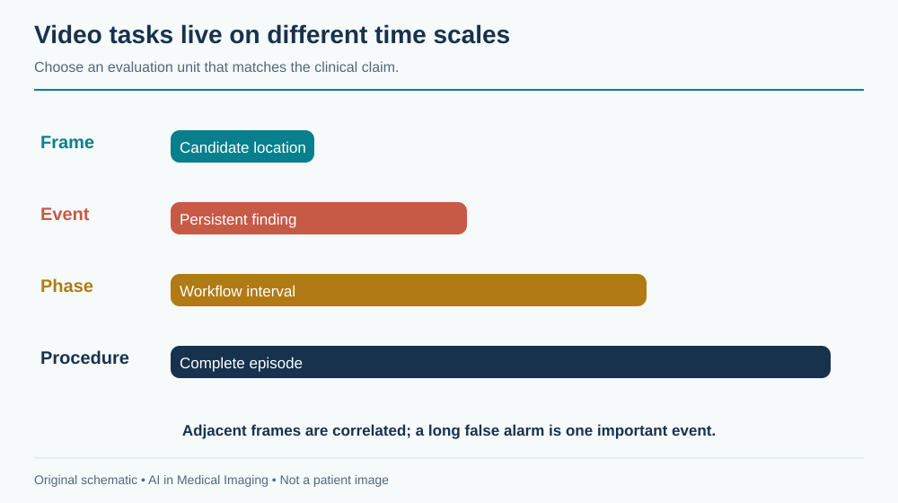
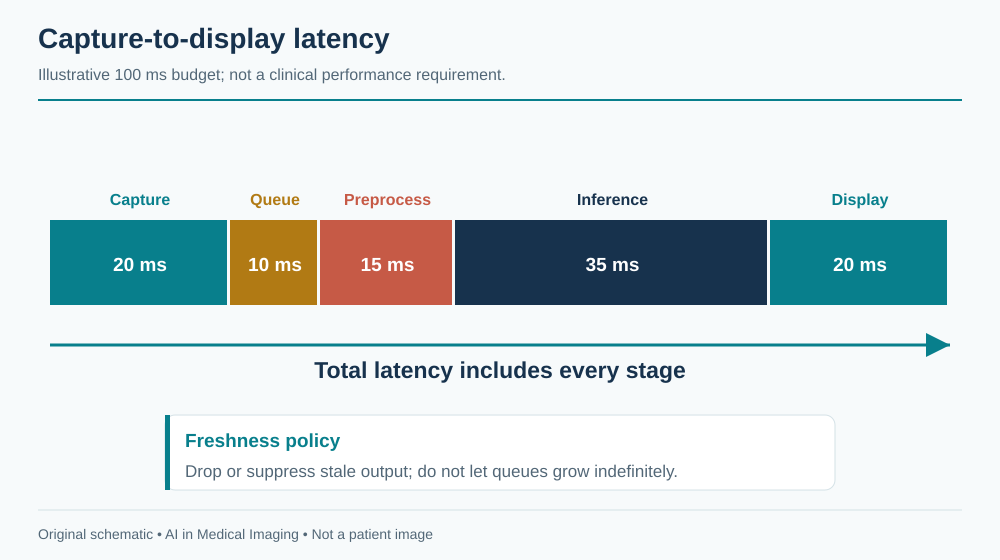
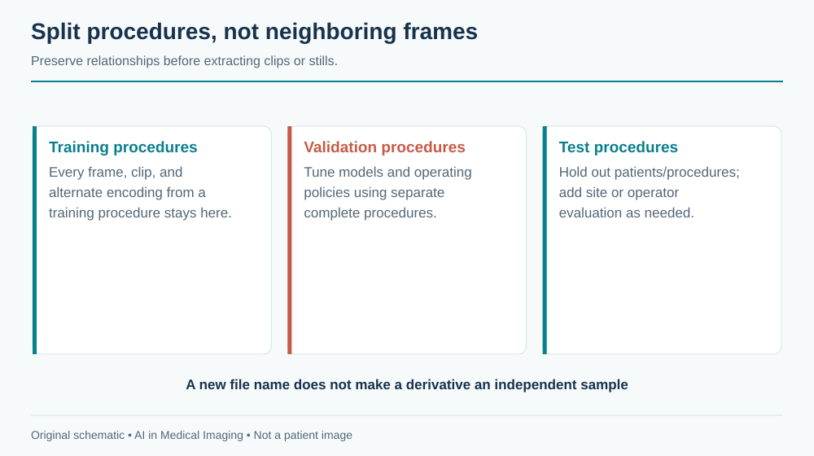
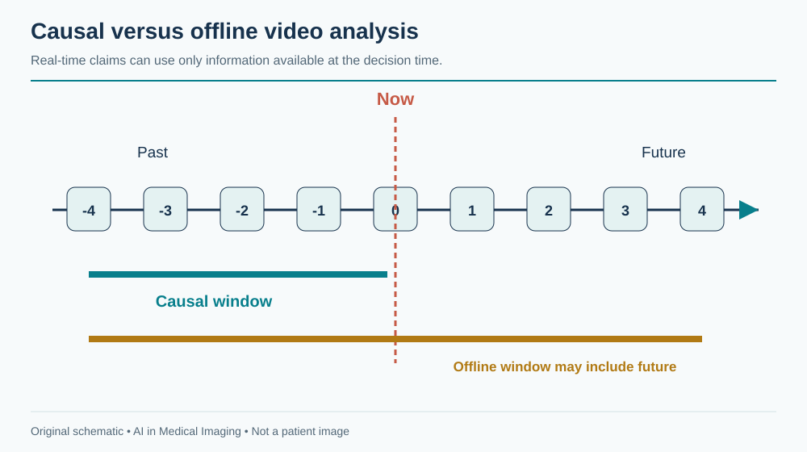

---
execute:
  freeze: false
---

# Surgical & Endoscopic Video {#sec-surgical-video}

Video AI must interpret a changing scene in time to be useful. A correct detection delivered after the camera has moved can be operationally wrong. Surgical and endoscopic systems therefore require both visual performance and a carefully specified temporal contract: which frames are available, how much delay is permitted, and what the user should do with the result.

::: {.callout-tip title="For the clinician"}
A detection box indicates where an algorithm found a candidate. It does not establish histology, complete mucosal inspection, safe dissection, or an appropriate intervention.
:::

::: {.callout-tip title="For the engineer"}
A model evaluated with future frames or whole-procedure context may not be usable live. Preserve timestamps, split by procedure and patient, and measure capture-to-display latency on the actual system.
:::

## What is surgical and endoscopic video?

Endoscopes and surgical cameras record reflected light from a scene shaped by illumination, optics, tissue, instruments, fluids, and camera motion. The appearance changes with distance, viewpoint, insufflation, smoke, blood, irrigation, and image enhancement. White-light, fluorescence, and other imaging modes have different semantics. A model should identify or be restricted to supported modes.

The data are sequences of frames with timing, compression, and sometimes audio or device telemetry. A nominal frame rate does not guarantee constant spacing between decoded frames. Dropped frames, buffering, transcoding, and network transport can all alter timing. Video can also contain patient identifiers, staff speech, and external-room views, making privacy review broader than pixel de-identification alone.

{#fig-video-timescales fig-alt="Frame detection, short temporal events, surgical phases, and complete procedures occupy progressively longer time scales."}

Spatial calibration is often less direct than in CT. Apparent size changes with camera distance and optical distortion. A pixel area should not be reported as a physical area without a validated calibration or reconstruction method. Instrument dimensions can sometimes provide a reference, but that is an additional model with assumptions, not a universal ruler.

## Why and when it's ordered

Endoscopic procedures can investigate symptoms, screen for disease, obtain tissue, and deliver therapy. Surgical video documents an intervention already underway. AI roles include candidate lesion detection, anatomy or instrument segmentation, phase recognition, quality assessment, documentation, and retrospective training or audit.

These roles have different risk profiles. A retrospective phase label may support education or operations; a real-time overlay can influence an immediate action. A system designed for post-procedure review should not be promoted to live guidance without evaluating the new timing and human-factors requirements.

The procedure's purpose matters to the reference outcome. In colonoscopy, a visible candidate, an endoscopically assessed lesion, a resected specimen, and a pathology-confirmed diagnosis are related but distinct entities. In surgery, a phase label describes workflow, not necessarily whether the operation was performed safely.

## What diagnoses are made from it

| Task | Unit of output | What it does not establish |
|---|---|---|
| Lesion detection | Region or event | Histology or appropriate treatment |
| Lesion characterization | Class estimate for a defined target | General validity across all lesion types and imaging modes |
| Instrument segmentation | Pixel mask or tracked object | Safe instrument use or tissue contact |
| Surgical phase recognition | Time interval | Correctness or quality of the surgical technique |
| Anatomy recognition | Candidate structure | Sufficient evidence for an irreversible action |
| Procedure quality support | Defined observable measure | Complete examination quality from an incomplete video |

Annotation granularity should match the claim. Frame labels cannot directly evaluate event detection unless there is a policy for joining consecutive detections. Phase boundaries are often ambiguous; report the annotation convention and tolerance. Skill labels require particularly careful interpretation because they can reflect case difficulty, surgeon experience, recording conditions, and subjective judgment.

## How it works in a modern hospital

A live system connects to a video source, processes frames, and displays assistance within the clinical environment. Capture hardware, resolution, color conversion, overlays, and display routing are all part of the deployed product. A development notebook reading a video file does not test this chain.

### Design for freshness

Measure latency from the acquisition timestamp to the displayed output, including capture, queueing, preprocessing, inference, postprocessing, and rendering. Report the distribution and worst relevant cases rather than only average neural-network time. If inference falls behind, an unbounded queue can show accurate results for an increasingly old scene.

{#fig-video-latency fig-alt="Capture, queue, preprocessing, inference, and display each contribute to total latency; stale frames trigger a defined drop or suppress policy."}

A bounded queue with a documented frame-dropping policy can preserve freshness, but it changes which events are observed. The system should suppress stale overlays and expose degraded operation. Loss of the AI service must not interrupt the primary clinical video feed. Test disconnection, overload, mode changes, and recovery on the intended hardware.

### Align overlays and preserve the source

Cropping, resizing, rotation, and lens correction alter coordinates. Return detections to the exact displayed frame and transformation state. An overlay on the wrong frame can be more misleading than no overlay. Store source timestamps, model version, threshold, and the relationship between event summaries and supporting frames.

For documentation, distinguish a machine-generated event from a clinician-confirmed finding. A procedure summary should link to the evidence and remain editable. Avoid inferring that a step occurred simply because it usually follows another phase. Video may be interrupted or fail to show a clinically important action.

## The data landscape

Public surgical video datasets often represent a small number of procedures at a limited set of institutions. Camera systems, surgeons, operative styles, and case difficulty may be highly correlated with labels. Endoscopy image datasets are useful for detection or segmentation, but selected still frames are not equivalent to complete live procedures.

```{python}
#| echo: false
#| output: asis
import sys
from pathlib import Path
sys.path.insert(0, str(Path("../scripts").resolve()))
from book_catalog import render_catalog
render_catalog('datasets', ['video'], include_general=False)
```

[Cholec80](https://camma.unistra.fr/datasets/) supports research on laparoscopic cholecystectomy workflow. Kvasir-SEG provides annotated polyp images for segmentation research. Their tasks and units differ: one is procedural video, the other an image collection. A method that performs well on either needs additional evidence for a live clinical claim.

Split by patient and procedure, with surgeon or site held out when relevant. Do not put neighboring frames from one operation into both training and test sets. Keep edited clips, alternate encodings, and extracted stills with their source procedure. Record whether the model sees the entire procedure or only a causal prefix.

{#fig-video-splits fig-alt="All clips, stills, and alternate encodings from a procedure remain in one partition; site-level evaluation is a separate generalization test."}

Reference annotations should identify who labeled the event, which context they saw, and how disagreements were resolved. A label assigned with future context may be impossible to determine at the first visible frame. That is not necessarily model failure; it may be a mismatch between retrospective annotation and live decision timing.

## The model landscape

Frame encoders can detect lesions or segment instruments. Temporal convolutional networks, recurrent models, and transformer-based systems aggregate information across time. Tracking and temporal smoothing can reduce flicker but may prolong false detections or delay the recognition of a new event. Every smoothing rule changes the clinical behavior of the system.

```{python}
#| echo: false
#| output: asis
import sys
from pathlib import Path
sys.path.insert(0, str(Path("../scripts").resolve()))
from book_catalog import render_catalog
render_catalog('models', ['video'], include_general=True)
```

[TeCNO](https://github.com/tobiascz/TeCNO) is a research example of temporal surgical-phase recognition. A causal architecture uses information available up to the current time; an offline bidirectional method can use future context. Their scores should not be compared as though they answer the same operational question.

{#fig-video-causality fig-alt="A timeline marks past, current, and future frames, with a causal window ending at the current frame and an offline window extending beyond it."}

### Evaluate events and users

Frame-level precision can hide a long false-positive episode or repeated flicker. Define an event-matching policy and report event sensitivity, false alarms per procedure or time, time to detection, and duration of distracting output. For phase recognition, include boundary accuracy and segment-level metrics alongside frame accuracy.

In detection assistance, measure the effect on users and the intended clinical endpoint. More candidate boxes do not necessarily mean better outcomes. Case mix, procedure technique, observation time, and user adaptation can change results. A reader or operator study must reproduce the way the tool will be shown and acted upon.

As an illustrative timing budget, a system targeting 100 ms total latency might allocate 20 ms to capture, 10 ms to queueing, 15 ms to preprocessing, 35 ms to inference, and 20 ms to display. These invented numbers are an engineering exercise, not a clinical requirement. If the measured display pathway alone takes 80 ms, optimizing the model by 5 ms will not solve the main bottleneck.

## FDA-cleared AI products

The selected example is endoscopic detection assistance, not autonomous endoscopy or surgical control.

```{python}
#| echo: false
#| output: asis
import sys
from pathlib import Path
sys.path.insert(0, str(Path("../scripts").resolve()))
from book_catalog import render_catalog
render_catalog('fda-products', ['video'], include_general=False)
```

The [GI Genius De Novo review](https://www.accessdata.fda.gov/cdrh_docs/reviews/DEN200055.pdf) describes a real-time aid for detecting colorectal mucosal lesions during colonoscopy with supported equipment and use conditions. A candidate highlight does not provide histology or independently determine treatment. Its authorization should not be generalized to upper endoscopy, arbitrary video sources, or surgical anatomy guidance.

## Open challenges

Rare but consequential events are difficult to collect and label. A model may perform well on routine phases yet fail precisely when bleeding, unusual anatomy, or an unexpected complication changes the scene. Evaluation should include relevant difficult conditions, and the interface should remain usable when the model is uncertain or unavailable.

Temporal feedback can change behavior. Operators may spend more time on highlighted regions or become dependent on the absence of an alert. Training and interface design need to address this without obscuring the underlying image. A system's failure mode should be predictable and visible.

Privacy and governance extend to staff and procedural audio. Retrospective training collections need defined access, retention, and de-identification procedures. Removing a patient-name overlay does not necessarily remove identifying speech or the possibility of linkage through metadata.

Finally, a video record is incomplete evidence of an operation. Some actions occur outside the camera view. Automated documentation should distinguish observed events, inferred events, and unknowns, especially when records may be used for quality review or accountability.

## The agentic outlook

A procedural agent can organize video into navigable events, prepare draft documentation, retrieve relevant timestamps, and reconcile detected events with device logs. Live assistance should remain a bounded, low-latency subsystem. A language-model agent can coordinate slower tasks without entering the critical video path.

The agent should not turn an uncertain anatomical label into an instruction for an irreversible action. It can surface supporting frames and uncertainty, but procedural decisions require the authorized clinical team and appropriately validated tools. For post-procedure review, provenance is central: every factual summary should point to an observed source or be marked as unverified.

## Further reading

- [CAMMA datasets](https://camma.unistra.fr/datasets/) — surgical workflow data and access conditions.
- [TeCNO](https://github.com/tobiascz/TeCNO) — causal temporal modeling for phase recognition.
- [Kvasir-SEG research resource](https://github.com/DebeshJha/Kvasir-SEG).
- [GI Genius FDA review](https://www.accessdata.fda.gov/cdrh_docs/reviews/DEN200055.pdf).

**Review questions.** Why is frame-level accuracy insufficient for live assistance? How would you detect and suppress stale overlays? Which uses of future context invalidate a claimed real-time evaluation?
