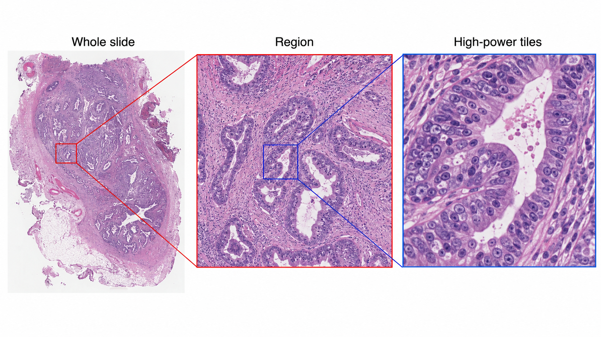
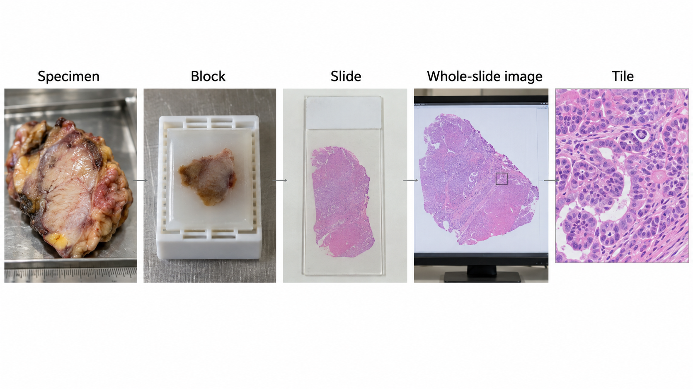
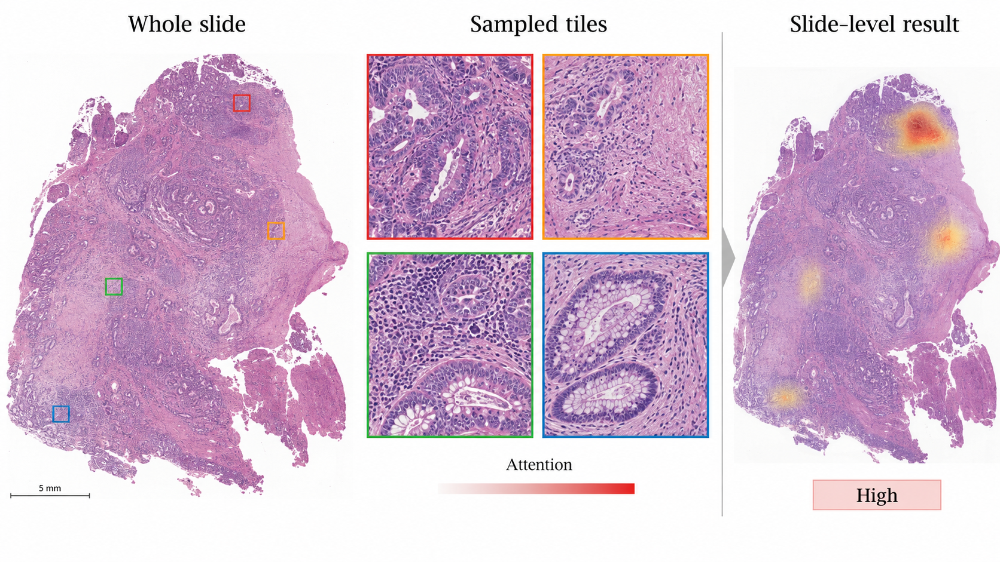
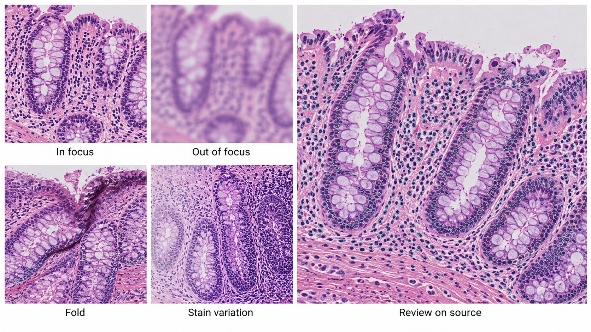

---
execute:
  freeze: false
---

# Digital Pathology {#sec-digital-pathology}

Digital pathology begins long before scanning. Tissue selection, fixation, processing, sectioning, and staining determine what the image contains. A whole-slide image is a high-resolution record of a prepared section, not an exhaustive representation of a patient or even an entire specimen. AI must preserve the connection between pixels and the specimen pathway.

::: {.callout-tip title="For the clinician"}
A negative slide-level prediction cannot exclude disease in tissue that was not sampled, not present on the section, or not adequately scanned. Review the intended specimen, stain, and workflow before interpreting a score.
:::

::: {.callout-tip title="For the engineer"}
The patient–case–specimen–block–slide–tile hierarchy defines both provenance and leakage risk. Tile counts are not independent patient counts. Preserve physical scale and slide coordinates when extracting patches.
:::

## What is digital pathology?

A scanner captures a glass slide as a whole-slide image (WSI), often stored as a multiresolution pyramid. The highest-resolution level preserves fine detail; lower-resolution levels support navigation and overview. Large slides can contain billions of pixels and require gigabytes of storage, depending on tissue area, sampling, and compression. Efficient applications read regions and pyramid levels instead of loading the entire slide into memory.

Hematoxylin and eosin (H&E), immunohistochemical stains, and special stains provide different information. A model trained on one stain and specimen type is not automatically valid on another. Apparent magnification alone is an incomplete scale descriptor: micrometers per pixel and scanner metadata determine the physical field represented by a tile.

{#fig-path-pyramid fig-alt="An H-and-E whole-slide image is magnified into a tissue region and then a high-power glandular field."}

Artifacts include folds, tears, chatter, bubbles, pen marks, out-of-focus areas, staining variation, and tissue fragments. Some can be detected automatically, but quality control should be tied to the downstream task. A small focal defect may be tolerable for a broad tissue classifier and unacceptable if it obscures the only suspicious gland.

## Why and when it's ordered

Pathology evaluates tissue or cells obtained through biopsy, surgery, or other sampling procedures. Diagnosis integrates morphology with clinical history, specimen location, ancillary studies, and sometimes molecular findings. Digital workflows support remote review, consultation, archiving, quantification, education, and computational analysis.

The AI opportunity ranges from finding suspicious regions to counting cells, segmenting structures, assessing a defined biomarker, or predicting a slide-level label. These are not equivalent claims. A model trained to predict a molecular association from H&E has not replaced a molecular assay unless the intended clinical use is separately established.

Sampling is a central limitation. A slide contains a section from a block, which represents part of a specimen. A case may include many blocks and stains. The absence of a target in one scanned section is not the same as a case-level negative diagnosis. The software should expose which slides were included and which were missing or excluded.

## What diagnoses are made from it

| Task | Model output | Required reference and scope |
|---|---|---|
| Tumor detection | Suspicious regions or slide score | Defined tissue, stain, specimen, and expert reference |
| Grading assistance | Pattern or grade estimate | Grading system, aggregation rule, and observer variability |
| Cell or structure quantification | Counts, density, or area | Cell definition, physical scale, and region-selection policy |
| Biomarker scoring | Positive fraction or score | Assay, stain, compartment, and scoring convention |
| Prognostic or molecular prediction | Patient-level estimate | Independent clinical endpoint, follow-up, and external validation |

A patch label inherited from a positive slide is weak supervision. Most patches from that slide may contain normal tissue. Conversely, a negative patch label derived from a case summary may be unreliable if the region was never explicitly reviewed. Annotation provenance should distinguish region contours, point labels, slide diagnoses, and case-level outcomes.

For a detection aid, the clinical value may be finding a small suspicious region that a reader would otherwise miss. For a quantification tool, the key issue may be reproducible region selection. An accurate cell counter can still produce a misleading biomarker score if it counts the wrong tissue compartment.

## How it works in a modern hospital

Specimens enter the laboratory information system, are processed into blocks and slides, and are scanned under a quality process. The pathologist reviews the available material with the clinical record and ancillary studies. Digital image management must maintain accession, specimen, block, slide, stain, and version relationships.

{#fig-path-hierarchy fig-alt="A photographic sequence shows a surgical specimen, tissue block, H-and-E glass slide, digital whole-slide image, and high-power tile."}

### From a slide to model inputs

A typical pipeline detects tissue at low resolution, excludes unsupported or poor-quality regions, extracts tiles at a specified physical scale, runs an encoder, and aggregates outputs. Each stage has failure modes. A tissue detector can exclude pale tissue or tiny fragments. A stain-normalization procedure can alter diagnostically relevant appearance. A tile sampler can miss a small focus.

Store the slide identifier, level, level-zero coordinates, tile dimensions, micrometers per pixel, preprocessing version, and exclusion reason. Return heatmaps in the viewer's coordinate system and allow the reviewer to inspect the original region at diagnostic resolution. A compressed thumbnail alone cannot verify a suspicious microscopic feature.

Libraries such as [OpenSlide](https://github.com/openslide/openslide) provide access to supported WSI formats, but format support and metadata completeness differ. Test the scanners and files in the intended workflow. A reader successfully opening one slide does not prove that physical scale, color, or all pyramid levels were interpreted correctly.

### Keep the clinical record coherent

If a slide is rescanned, the new image must not silently overwrite a result generated from the old scan. If additional levels or stains arrive, case completeness changes. An AI result should identify the exact source slides and whether it is preliminary, reviewed, or superseded.

The laboratory system and image viewer need an explicit result contract. A candidate heatmap is different from a signed diagnostic report. Preserve the pathologist's accepted interpretation and any corrections without erasing the original model output. This supports quality review and investigation of disagreements.

## The data landscape

Public WSI resources vary in specimen type, stain, scanner, annotation granularity, and endpoint. Challenge labels are often designed for one task and should not be generalized to all pathology. Metastasis detection in lymph-node sections is different from prostate grading or molecular prediction.

```{python}
#| echo: false
#| output: asis
import sys
from pathlib import Path
sys.path.insert(0, str(Path("../scripts").resolve()))
from book_catalog import render_catalog
render_catalog('datasets', ['path'], include_general=False)
```

The CAMELYON resources support research on breast-cancer metastases in lymph-node slides. Choose the exact release and patient grouping. Combining editions without checking overlap or provenance can create leakage. For other tasks, require explicit links between slides, cases, patients, and outcomes before claiming patient-level validation.

Split by patient, with all blocks, slides, stains, rescans, and tiles kept in the appropriate partition. Site-level validation is valuable because staining and scanner signatures can act as shortcuts. If outcome labels correlate with the originating institution, a model may learn the site rather than the intended biological target.

An endpoint such as survival requires a time origin, follow-up, censoring policy, and adjustment for the intended clinical setting. A tile-level split cannot validate a patient-level prognostic claim. Treatment and case selection may confound associations, so predictive performance does not establish biological causation.

## The model landscape

Patch encoders transform local tissue into features. Slide-level aggregation combines those features. In multiple-instance learning (MIL), a slide or case is treated as a bag of instances with a higher-level label. Attention can weight patches, but an attention map is not automatically a calibrated tumor-probability map or a causal explanation.

{#fig-path-mil fig-alt="A whole-slide H-and-E image supplies four high-power tiles with attention borders before a slide-level result is produced."}

```{python}
#| echo: false
#| output: asis
import sys
from pathlib import Path
sys.path.insert(0, str(Path("../scripts").resolve()))
from book_catalog import render_catalog
render_catalog('models', ['path'], include_general=True)
```

[UNI](https://github.com/mahmoodlab/UNI) and [Prov-GigaPath](https://github.com/prov-gigapath/prov-gigapath) illustrate reusable pathology representations. The exact checkpoint and license matter; a permissive surrounding codebase does not necessarily confer unrestricted rights to weights or training data. Downstream validation remains necessary for every tissue, stain, and intended task.

A useful baseline freezes a suitable encoder and trains a simple aggregation head under a patient-level split. More complex fine-tuning should be justified by held-out performance and operational cost. Cache embeddings with the slide and preprocessing version so that stale features cannot be mixed with a new encoder.

### Evaluate at the clinical unit

For region detection, assess lesion sensitivity and false-positive regions, including small foci. For slide classification, report slide-level metrics and the policy for combining slides into a case. For quantification, compare accepted measurements under a defined region-selection method. For case-level predictions, use case or patient as the statistical unit and account for correlated material.

Measure quality exclusions and review time. A model may be accurate on accepted slides but reject a large fraction from one scanner or specimen type. A heatmap that requires extensive false-positive navigation may not improve the pathologist's work despite a strong area under the ROC curve.

As an illustrative resource calculation, 10,000 tile embeddings with 1,024 float32 values require about 41 MB in decimal units, before metadata and overhead. This is far smaller than repeatedly retaining all high-resolution tiles, but caching only features prevents revisiting preprocessing errors. Keep source slides and reproducible extraction instructions under the applicable retention policy.

## FDA-cleared AI products

The selected record concerns a specific assistive pathology workflow.

```{python}
#| echo: false
#| output: asis
import sys
from pathlib import Path
sys.path.insert(0, str(Path("../scripts").resolve()))
from book_catalog import render_catalog
render_catalog('fda-products', ['path'], include_general=False)
```

The [Paige Prostate De Novo review](https://www.accessdata.fda.gov/cdrh_docs/reviews/DEN200080.pdf) describes assistance for specified prostate needle-biopsy H&E whole-slide images in a supported scanning and viewing workflow. The original workflow places pathologist review before use of the aid. The product's detection role should not be rewritten as autonomous diagnosis, cancer grading, or tumor measurement. Hardware and workflow compatibility are part of the indication.

## Open challenges

Stain and scanner variation are visible sources of domain shift, but specimen processing and patient selection are equally important. Color normalization can reduce some variation while leaving biological and workflow differences untouched. Validate the complete pipeline across the intended sites rather than assuming normalization solves transfer.

{#fig-path-quality fig-alt="H-and-E crops demonstrate in-focus tissue, blur, a tissue fold, stain variation, and a larger source image with restrained nucleus overlays."}

Small foci challenge both sampling and aggregation. A slide-level average can dilute a rare malignant region; a maximum score can amplify one artifact. The aggregation rule should reflect the task and be evaluated on low-burden cases. Explainability should support finding and reviewing the relevant tissue, not merely decorate a slide with color.

Multimodal pathology models introduce further alignment problems. A molecular result may describe a different block or time point. Clinical text can leak the diagnosis being predicted. Preserve specimen and temporal relationships, and define which information would actually be available at the intended decision point.

## The agentic outlook

A pathology agent can assemble the case, check slide completeness and scan quality, route supported stains to appropriate models, and prepare a review workspace with candidate regions. It can track rescans and additional levels and invalidate stale results when the source material changes.

The agent should not infer that all tissue has been examined because one slide was negative. It should state which material supports each output and what remains unavailable. Draft reports need source-linked facts, explicit uncertainty, and review by the responsible pathologist. The strongest early value is often reliable case organization and measurement support rather than unconstrained diagnostic prose.

## Further reading

- [OpenSlide](https://github.com/openslide/openslide) — WSI access and supported formats.
- [CAMELYON17](https://camelyon17.grand-challenge.org/) — task and release documentation.
- [UNI](https://github.com/mahmoodlab/UNI) and [Prov-GigaPath](https://github.com/prov-gigapath/prov-gigapath) — pathology representation learning.
- [Paige Prostate FDA review](https://www.accessdata.fda.gov/cdrh_docs/reviews/DEN200080.pdf).

**Review questions.** Why is a tile-level test split misleading? What must a heatmap preserve to support microscopic review? Why does a negative slide prediction not establish a negative case?
