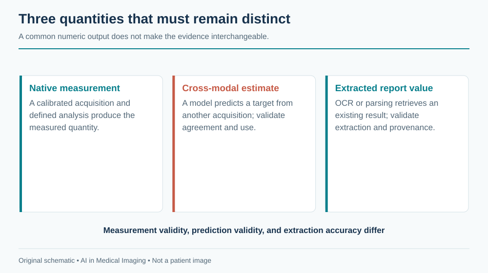
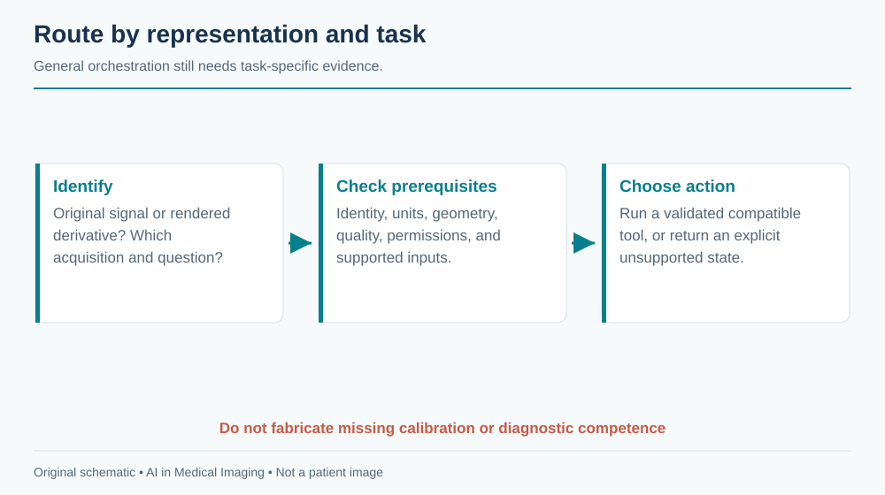

# The Remaining Map {#sec-remaining-map}

The modalities in the preceding chapters cover much of hospital imaging, but the same principles extend to photographs, dental volumes, quantitative projection systems, physiological traces, and emerging optical methods. The useful question is not whether a foundation model can accept an image. It is what the image measures, what information was lost in its creation, and which clinical claim the resulting evidence supports.

::: {.callout-tip title="Two ways to read this chapter"}
Clinicians can use the task and failure boundaries to assess product claims. Engineers can use the acquisition contracts to decide whether a general image pipeline is appropriate or whether native signal, geometry, or calibration must be preserved.
:::

## Dermatology imaging

### Acquisition and clinical questions

Clinical photographs show surface appearance under an uncontrolled combination of illumination, camera processing, distance, and skin context. Dermoscopy uses specialized optics and illumination to reveal additional structures. A smartphone photograph and a dermoscopic image are different domains, even when they depict the same lesion.

Applications include lesion localization, image-quality assessment, differential-category support, longitudinal comparison, and triage. A photograph may omit palpation, symptoms, evolution, and the rest of the skin examination. Histopathology can provide a reference for a sampled lesion, but datasets enriched for biopsied lesions do not reproduce the distribution of all lesions presented in primary care.

### Data, models, and evidence

The [International Skin Imaging Collaboration](https://www.isic-archive.com/) provides a major research resource; verify each collection's labels, rights, and patient or lesion identifiers. Keep repeat images of the same lesion together across splits, and group multiple lesions from one patient when required. Device, site, and acquisition markings can become shortcuts. A ruler or surgical marker may correlate with biopsy selection rather than malignancy.

Image encoders and lesion-segmentation models are useful baselines, but crop selection and available context change the task. Evaluate on the intended acquisition mode, anatomical sites, skin appearances, and user population. Report ungradable images and uncertain outputs. Do not infer broad fairness from a small subgroup or from skin-color categories that were never reliably measured.

Regulatory scope must be checked for the exact device and intended user; this book does not curate a specific dermatology authorization. A research classifier is not a substitute for a defined clinical pathway. An agent can guide capture, request a scale reference where appropriate, and assemble prior photographs, but should not claim to rule out disease from an inadequate image.

## Dental & CBCT

### Acquisition and clinical questions

Intraoral radiographs, panoramic images, and cone-beam CT (CBCT) have different geometry and diagnostic roles. Panoramic imaging has position-dependent distortion. CBCT provides volumetric information but is affected by scatter, metal artifacts, field of view, and system-specific reconstruction. Its gray values should not automatically be treated as calibrated conventional CT HU.

Tasks include tooth localization and numbering, candidate caries or periapical findings, bone-level assessment, canal or nerve localization, and planning support. The relevant reference may require clinical examination, prior images, or operative findings. A model that numbers teeth must handle missing, impacted, supernumerary, restored, and deciduous teeth under an explicit numbering convention.

### Data and implementation

Public dental datasets are fragmented across tasks, institutions, and annotation schemes. A useful release needs patient grouping, projection or volume type, physical geometry, and label definitions. The catalog makes no claim to a universal dental benchmark or a complete product inventory. Select a documented task-specific source before training rather than combining attractive images from unrelated collections.

Detection models can support two-dimensional localization; segmentation frameworks can support CBCT structures after appropriate training. Preserve tooth identity and laterality when mapping results to a chart. An apparently correct box attached to the wrong tooth can generate an incorrect treatment record. For planning tasks, validate physical distances and boundaries in the original geometry, especially near metal artifacts.

Regulatory review must distinguish detection assistance from treatment planning and from autonomous diagnosis. An agent can reconcile tooth labels, retrieve priors, and prepare measurements, but should flag uncertain numbering and incomplete field of view before exporting results.

## DEXA and opportunistic screening

Dual-energy X-ray absorptiometry, often abbreviated DXA or DEXA, uses measurements at different X-ray energies to estimate quantities such as areal bone mineral density under a calibrated acquisition and analysis method. A report image is only a rendered summary of that process. Extracting a displayed number with OCR is different from independently measuring bone density.

Clinical interpretation depends on the measured site, reference population, quality, artifacts, and relevant patient factors. AI can support positioning or region analysis, quality checks, structured extraction, and comparison. A change in device, analysis region, or excluded vertebrae can affect longitudinal interpretation. Preserve units and the exact reported measure; a T-score and a Z-score are not interchangeable labels.

Opportunistic screening uses an examination acquired for another purpose, such as CT, to estimate an additional risk marker or anatomical quantity. This can expand use of existing data but introduces protocol variation and selection bias. A CT-derived bone attenuation measure is not automatically a DXA-equivalent diagnosis. Contrast, reconstruction, vertebral selection, and calibration can influence the estimate.

{#fig-longtail-measurement fig-alt="Native calibrated measurements, measurements inferred from another modality, and OCR-extracted report values remain distinct and require separate validation."}

Research data should include the reference examination, timing, measurement method, and patient grouping. A model trained against paired DXA values must account for the interval and population that received both tests. Evaluate measurement agreement and clinical-pathway consequences, not only correlation. This directory does not assert a specific authorized opportunistic-screening indication; review any proposed product's actual labeling.

An agent can identify potentially eligible examinations and prepare source-linked measurements for review. It should distinguish an incidental quantitative finding from an accepted clinical diagnosis and ensure any follow-up enters a responsible clinical workflow.

## ECG as an image

An electrocardiogram is fundamentally a time series of electrical potential across defined leads. A scanned or rendered ECG is an image of that signal, including layout, gain, paper speed, grid, labels, and possible annotations. If the native waveform is available, preserving it usually avoids the information loss introduced by rasterization and redigitization.

An ECG-image pipeline must identify lead layout, calibrate horizontal and vertical axes, separate the trace from grid lines and text, and handle clipping or overlap. A waveform extracted at the wrong paper speed can have plausible morphology but incorrect intervals. If a model operates directly on the image, it still needs robustness to layout and device changes.

[PTB-XL](https://physionet.org/content/ptb-xl/1.0.3/) is a documented waveform resource with clinical labels. It is not a collection of naturally scanned paper ECGs. Rendering waveforms into synthetic paper layouts can support development, but validation on those renderings alone does not establish performance on photographs, folds, fax artifacts, or unknown printers.

Applications include signal digitization, rhythm or morphology classification, and structured report support. Split by patient and keep rendered derivatives with the original waveform. Evaluate digitization in signal units and time alignment before relying on downstream classification. A classifier can appear accurate despite a poor reconstruction if it exploits report text or device layout.

Regulatory claims must identify whether the device analyzes native signals, rendered images, or a particular acquisition system. This chapter does not curate a specific ECG-image authorization. An agent should prefer the source waveform when available and clearly mark a derived waveform or unreadable trace.

## Emerging modalities

Photoacoustic imaging combines optical excitation with acoustic detection; hyperspectral systems sample wavelength-dependent information; optical microscopy and endomicroscopy provide other spatial scales and contrasts. These methods should not be reduced to ordinary RGB inputs without considering what their channels mean. Acquisition wavelength, calibration, tissue depth, and processing may be essential to interpretation.

A small research collection can establish feasibility without establishing generalization. Early studies need patient-level splits, independent reference standards, and separation of instrument artifacts from biology. Code and model availability may be limited; absence from this book's catalog means only that an entry has not been curated.

| Representation | Preserve before modeling | Frequent category error |
|---|---|---|
| Clinical photograph | Capture context and lesion identity | Treating a photograph as a complete examination |
| Dental projection or CBCT | Geometry, tooth identity, acquisition type | Treating all gray values as CT HU |
| DXA or derived screening measure | Calibration, region, units, reference | Equating a surrogate with an established diagnostic measure |
| ECG image | Lead layout, time and voltage scales | Treating pixels as an already calibrated waveform |
| Spectral or optical acquisition | Channel meaning and instrument calibration | Treating every channel as an interchangeable color plane |

## The agentic outlook

The long tail benefits from reusable orchestration: identify the representation, verify prerequisites, choose a supported tool, preserve provenance, and route uncertainty. General orchestration does not imply general diagnostic competence. Each tool still needs its own task definition, validation, and authorization where applicable.

{#fig-longtail-router fig-alt="Verified acquisition type and clinical task enter an eligibility router; supported tools proceed while missing or unsupported inputs return an explicit no-result state."}

A practical agent should ask three questions before inference: is this the original measurement or a rendered derivative; are the required units and identity available; and is there a validated tool for this exact task? If any answer is unresolved, the agent can still organize the evidence without fabricating a clinical result.

**Further reading.** Start with the [ISIC archive](https://www.isic-archive.com/), [PTB-XL release documentation](https://physionet.org/content/ptb-xl/1.0.3/), and the [DICOM standard](https://www.dicomstandard.org/current) for the relevant image or waveform object. These are entry points, not endorsements of every downstream model.

**Review questions.** Why is CBCT intensity not automatically HU? What information can an ECG screenshot lose? How would you distinguish an opportunistic risk marker from an established diagnostic measurement in a user interface?
