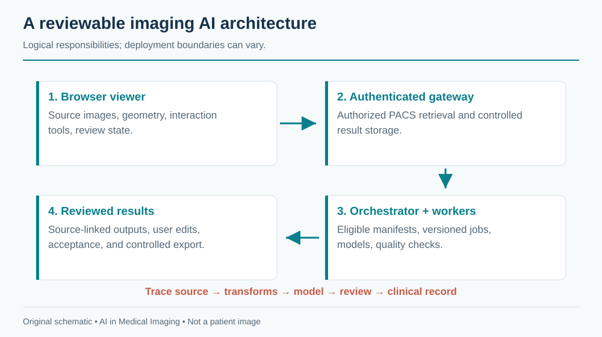
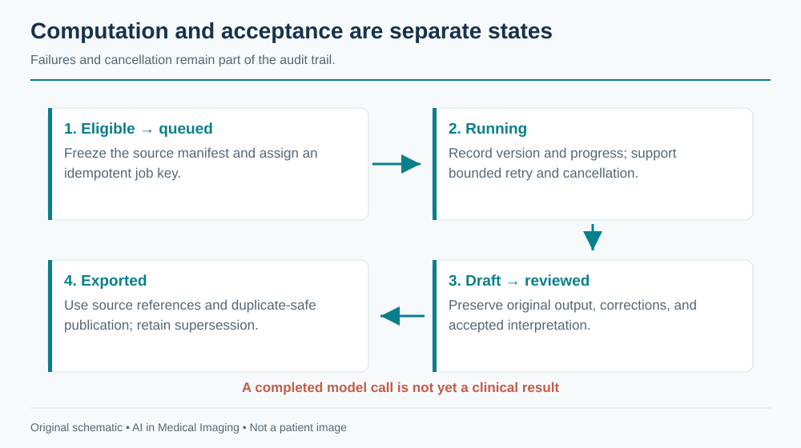

# Building an Imaging AI Platform {#sec-platform}

An imaging AI platform connects acquisition, storage, viewing, computation, review, and the clinical record. Its central artifact is a traceable result: a specific model and configuration applied to specific source data, transformed in documented ways, and accepted or rejected by an authorized user. A polished viewer is only the visible part of that system.

This chapter describes a reference architecture, not an existing application shipped with the book. Code examples are deliberately small design sketches. Library APIs and deployment requirements change; pin versions and consult the linked project documentation when implementing them.

## Anatomy of a web-based viewer

A viewer needs image retrieval, decoding, spatial geometry, rendering, interaction tools, and state management. It must keep patient and study identity distinct from the currently displayed viewport. Switching studies should clear stale overlays, measurements, and interactive model sessions before the new images become actionable.

[OHIF](https://docs.ohif.org/) provides a web-viewer framework and extension patterns. Cornerstone3D supports medical-image rendering and tools; [VTK.js](https://kitware.github.io/vtk-js/) supports scientific visualization, including three-dimensional representations. [ITK-Wasm](https://docs.itk.org/projects/wasm/en/latest/) provides image-processing and data interfaces that can run through WebAssembly. These components overlap in some capabilities but do not automatically form a complete clinical product when combined.

### Separate image state from application state

The image layer owns decoded pixels, geometry, windowing, camera position, and segmentation representation. The application layer owns identity, permissions, task eligibility, job status, result versions, and review state. A segmentation should be keyed to its source series and frame of reference, not merely to a viewport index such as “left panel.”

A volume's origin, spacing, and orientation define its relationship to physical space. Browser rendering conventions, NIfTI conventions, and DICOM patient coordinates may differ. Centralize transformations and verify them with known landmarks. A correct mask displayed with a left–right flip is a failed system regardless of model accuracy.

Large images require progressive loading and cache limits. Keep interactive navigation responsive while background downloads continue, but distinguish a partially loaded volume from a complete inference input. Browser memory, GPU texture limits, and transfer syntax support can constrain the experience. Unsupported decoding should produce a clear error rather than a black image interpreted as normal anatomy.

{#fig-platform-architecture fig-alt="A browser viewer connects through an authenticated gateway to PACS retrieval and an orchestrator; model workers return versioned results for review before export."}

## Feature flags and suites

A suite is a collection of tasks and tools appropriate to a workflow, such as CT segmentation or echo measurement. A feature flag controls availability; it does not establish clinical eligibility. Keep deployment configuration, user authorization, input compatibility, and validation status as separate checks.

A boot-time registry can describe tasks using a stable internal schema:

```yaml
# Illustrative application configuration, not a library-specific API.
id: ct-organ-research
model_version: "1.0.0"
input:
  modality: CT
  dimensions: 3
  anatomy: abdomen
  contrast_policy: explicitly_supported_protocols
output:
  type: segmentation
  coordinate_space: source_series
review_required: true
export_enabled: false
```

An actual `SuiteConfig` type should validate this information and reject unknown or incomplete values. Avoid encoding compatibility only in a display name. Configuration changes deserve review and versioning because they can alter which patients receive an algorithm.

### Auto-detection proposes; eligibility decides

DICOM metadata can suggest modality, anatomy, sequence, and series role. Local descriptions are inconsistent, so auto-detection should return evidence and uncertainty. A task requiring a noncontrast head CT cannot be enabled solely because `Modality` equals `CT`. Confirm anatomy, contrast requirements, coverage, reconstruction, and other model prerequisites.

The interface should explain why a task is unavailable: unsupported acquisition, incomplete series, insufficient permission, model offline, or missing review configuration. These are different operational states. Hiding all unavailable tools can make an incomplete examination look like a complete one with no useful AI tasks.

## Talking to a PACS

DICOMweb commonly separates query, retrieval, and storage operations through QIDO-RS, WADO-RS, and STOW-RS. [Orthanc's DICOMweb plugin documentation](https://orthanc.uclouvain.be/book/plugins/dicomweb.html) describes its implementation and configuration. Verify the specific operations and object types supported by each PACS and gateway; “supports DICOMweb” is not a complete interoperability contract.

A browser should generally access an authenticated service boundary rather than hold privileged PACS credentials. The gateway can enforce authorization, audit access, constrain queries, and handle deployment-specific connectivity. TLS, identity integration, session expiration, and least-privilege service accounts belong in the design from the start. Avoid putting patient identifiers or access tokens in analytics events, exception traces, or unrestricted URLs.

### Decide when a study is ready

A storage notification means something arrived, not necessarily that the intended series is complete. Use a documented readiness policy based on the acquisition workflow and available metadata. Handle late images, retransmission, and corrected studies. A fixed quiet interval may be one signal but is not a universal guarantee of completeness.

Create a manifest of selected source instances and hash or otherwise version the inputs. The job should operate on that immutable selection. If more relevant images arrive, create a new job or require review rather than silently changing the input underneath an active computation.

### Return appropriate objects

A segmentation may be exported as DICOM SEG; measurements may fit an appropriate structured report; other outputs need a clearly defined representation. Preserve references to the source instances and the expected frame of reference. Validate interoperability with the receiving system, including display, units, and label semantics. A file passing syntactic validation does not prove that a clinician can review it correctly.

Separate draft storage from clinical publication. A result can be available in the research workspace before it is accepted for the clinical record. Export should be idempotent and auditable, with duplicate suppression and a policy for superseding results. Do not overwrite a clinician-edited measurement when a retry completes.

## Serving models

A model server handles more than a forward pass: input retrieval, decoding, preprocessing, inference, postprocessing, quality checks, storage, and errors. [MONAI Label](https://github.com/Project-MONAI/MONAILabel) provides patterns for interactive annotation and inference applications. Its abstractions can help organize tasks, but a clinical deployment still needs authentication, integration, validation, monitoring, and change control.

### Single container or separate services?

A single-container research deployment simplifies setup and can be suitable for a bounded demonstration. It also couples dependencies, resource use, and failure domains. Separate services support independent scaling and versioning but add network, authentication, queueing, and observability complexity. Choose the smallest architecture that meets actual isolation, reliability, and workload requirements.

A queue should distinguish accepted, running, succeeded, failed, canceled, and expired jobs. Make retries safe. A useful idempotency key includes source selection, model version, and configuration. A timeout does not prove the worker stopped; cancellation needs cooperative checks and cleanup. Do not start duplicate expensive work merely because the browser refreshed.

{#fig-platform-lifecycle fig-alt="An eligible job moves through queued, running, draft result, reviewed result, and export states, with failure and cancellation paths retained in the audit trail."}

### Interactive sessions and GPU memory

Promptable segmentation may cache image embeddings or other state. Bind that state to user authorization, source series, model version, and session identity. A click from a new patient must never reuse the previous patient's embedding. Expire idle sessions and clean up GPU memory even when a browser disconnects.

Memory budgeting includes weights, activations, workspaces, input volumes, cached embeddings, and concurrency overhead. A rough capacity estimate is

$$M_{required}=M_{weights}+M_{runtime}+\sum_{active\ jobs}M_{job}+M_{margin}.$$

These terms depend on actual shapes and implementation. Measure peak use under representative worst cases and concurrent sessions. Limiting concurrency may be safer and cheaper than repeatedly recovering from out-of-memory failures. Mixed precision and tiling can reduce memory but require validation of numerical and boundary effects.

Expose queue age, inference duration, failure reason, resource use, and result-review status. Keep operational telemetry separate from protected image content. A healthy HTTP endpoint does not prove the model can process a representative study; readiness should check the necessary runtime dependencies without running clinical data through unapproved paths.

## Adding your own model

A practical integration proceeds from a task contract to a versioned adapter, then to a packaged and tested deployment. In MONAI Label-style applications, a `TaskConfig` can describe and construct a task, while an `InferTask` encapsulates inference behavior. Exact imports and signatures depend on the pinned release; consult that release's examples rather than copying a timeless-looking skeleton.

1. **Define the contract.** Name the population, acquisition, required metadata, output labels, units, exclusions, and failure states.
2. **Implement preprocessing and inverse mapping.** Test geometry and intensity handling on known inputs before assessing model performance.
3. **Wrap inference.** Load the pinned checkpoint, enforce input eligibility, run the model, and return output plus provenance and quality flags.
4. **Register the task.** Expose it through the suite registry with supported versions and permissions.
5. **Package dependencies.** Pin the base image, runtime, libraries, and checkpoint checksum in the Docker build or controlled artifact manifest. Keep secrets and patient data out of the image.
6. **Validate the integrated path.** Exercise retrieval, inference, display, editing, acceptance, export, retry, and failure recovery on representative nonclinical test material before the applicable clinical validation.

A minimal result envelope might look like this:

```json
{
  "job_id": "example-job",
  "status": "draft",
  "source_manifest_id": "example-manifest",
  "model": {"name": "organ-segmentation", "version": "1.0.0"},
  "configuration_digest": "example-digest",
  "output": {"kind": "segmentation", "space": "source-series"},
  "quality_flags": [],
  "review": {"required": true, "state": "pending"}
}
```

This example deliberately omits real identifiers and storage endpoints. In production, validate the schema, authorize object access, and retain the full transform and label metadata. An empty quality-flag list means only that implemented checks did not raise a flag; it is not a certificate of diagnostic accuracy.

### Test the failures that can change a result

Useful integration cases include shuffled instance order, inconsistent geometry, missing slices, unsupported transfer syntax, late-arriving images, interrupted jobs, duplicate submissions, stale browser sessions, and export retries. Verify that user edits survive retries and model updates. These tests address concrete risks that a unit test of the neural network cannot detect.

A release package should contain the model and configuration versions, input/output contract, validation report, known limitations, installation requirements, rollback procedure, and monitoring plan. Reproducibility requires more than a checkpoint file.

## Lessons learned

The most costly bugs often cross boundaries: a correct model receives the wrong series, a correct mask is mapped to the wrong coordinates, or a correct draft is posted to the wrong patient. Make these relationships explicit in identifiers and schemas, and verify them at every transition.

Start with one well-defined workflow and a complete review loop. Adding modalities before establishing provenance and lifecycle management multiplies ambiguity. Shared infrastructure should standardize identity, geometry, job state, and auditability while allowing modality-specific acquisition and interpretation requirements.

Do not treat a feature flag as a clinical release process or a model update as an ordinary dependency bump. Changes to preprocessing, labels, supported inputs, or thresholds can alter behavior even when the network weights remain the same. Record them and assess the evidence needed before activation.

Finally, optimize the user's complete task. A model that saves ten seconds of inference but adds several minutes of correction may not help. Measure time to an accepted, reviewable result, failures requiring intervention, and successful integration into the intended workflow.

**Further reading.** [OHIF](https://docs.ohif.org/), [Cornerstone3D](https://github.com/cornerstonejs/cornerstone3D), [VTK.js](https://kitware.github.io/vtk-js/), [ITK-Wasm](https://docs.itk.org/projects/wasm/en/latest/), [Orthanc DICOMweb](https://orthanc.uclouvain.be/book/plugins/dicomweb.html), and [MONAI Label](https://github.com/Project-MONAI/MONAILabel) provide implementation detail. Their availability does not replace application-specific clinical validation.

**Review questions.** What belongs in an inference idempotency key? How can a stale interactive session attach a correct mask to the wrong study? Which evidence distinguishes a successful export from a reviewable clinical result?
