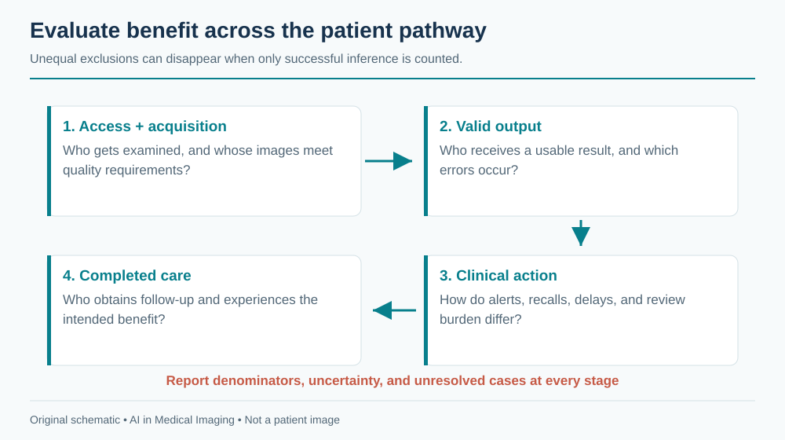
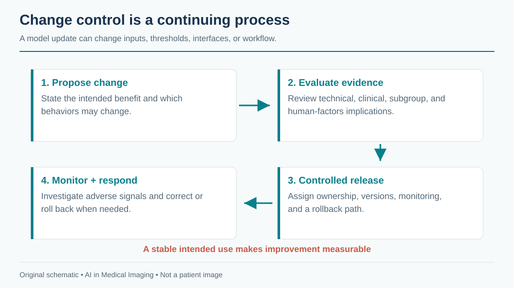

# Ethics, Bias, Safety & The Future {#sec-ethics-future}

Imaging AI changes who receives attention, which evidence is emphasized, and how clinical work is distributed. Its ethical evaluation therefore extends beyond model accuracy. A system can improve average performance while increasing failures for one population, shifting burden onto an understaffed service, or making an uncertain finding appear authoritative.

The practical response is to define the intended benefit, identify plausible harms, assign responsibility, and collect evidence throughout the system's life. The [NIST AI Risk Management Framework](https://www.nist.gov/itl/ai-risk-management-framework) offers a general structure for governing, mapping, measuring, and managing AI risks. Clinical implementation also requires the applicable institutional and regulatory processes.

## Fairness across populations

Bias can enter through access to imaging, acquisition quality, labels, sampling, model development, and downstream care. A dataset reflects who was examined and how their outcomes were recorded. If some patients receive less follow-up, their labels may be less complete. If an algorithm rejects more images from a particular setting, reporting accuracy only among accepted images hides a meaningful disparity.

### Choose the unit of benefit and harm

Fairness is not one universal scalar. Relevant outcomes can include missed disease, false-positive investigations, delays, technical failure, time to specialist care, and patient costs. Similar area under the ROC curve across groups does not imply similar sensitivity at the deployed threshold or equal access to follow-up.

Select subgroup analyses based on the clinical task and plausible mechanisms, including acquisition site and device as well as patient characteristics where appropriate and lawfully available. Explain how attributes were measured, what is missing, and how small samples limit conclusions. Do not infer a person's race or other sensitive characteristics from an image to fill a convenient evaluation column.

Intersectional analysis can reveal problems hidden in broad averages, but rapidly creates small groups and uncertain estimates. Report denominators and intervals. A lack of statistical significance is not proof of equivalence; a noisy apparent difference is not automatically evidence of a stable disparity. Use findings to direct further data collection and investigation.

{#fig-ethics-fairness fig-alt="Access, acquisition quality, valid model results, clinical action, and completed follow-up each contribute to the distribution of benefit and harm."}

### Avoid easy statistical fixes to structural problems

Reweighting, augmentation, calibration, and threshold adjustments can help particular problems, but they cannot repair missing access to care or an invalid reference standard. A threshold chosen separately for groups also raises clinical and governance questions that must be justified in the intended setting. Evaluate the complete policy and its consequences rather than treating a fairness metric as a tuning target detached from patients.

A deployment report should include technical exclusions and unresolved cases. If the model works well where equipment is newest but fails at smaller sites, those failures belong in the assessment of the service. Monitoring should identify whether improvements in one stage shift burden to another.

## Automation bias and human–AI teaming

People can anchor on a confident suggestion, accept a plausible explanation without inspecting its source, or treat an absent alert as reassurance. Conversely, repeated false alarms can cause useful output to be ignored. These are properties of the combined interface, workflow, and user population, not simply defects in individual judgment.

A human in the loop is meaningful only if that person has time, expertise, access to source evidence, and authority to disagree. A nominal approval click under severe workload may provide little protection. Define what the reviewer is expected to verify and make the relevant images, measurements, and limitations available at that moment.

### Design for informed disagreement

Show source-linked outputs, distinguish a score from a calibrated probability, and represent no-result states explicitly. Make overlays reversible and corrections easy. Avoid presenting a generated paragraph with more certainty than the underlying evidence. If the model did not assess a finding, the report should not imply that it was absent.

The timing of assistance matters. Showing an answer before independent review may influence attention differently from presenting it afterward. Neither ordering is universally best; evaluate the intended interaction. Reader and operator studies should measure errors, time, correction burden, and relevant downstream actions under realistic conditions.

Consider a hypothetical triage model with high sensitivity but frequent false alerts. It may accelerate some positive cases while delaying unflagged cases and exhausting the receiving team. A study should examine the distribution of reporting times and missed cases, not only the mean time for alerted patients. The intervention is the worklist policy plus the model, not the classifier alone.

## Liability and accountability

Responsibility should be assigned before deployment. Who owns the intended-use definition? Who approves a model update? Who responds when input compatibility changes? Who investigates an incorrect exported result? A vendor contract, a hospital policy, and a clinician's professional duties may allocate different responsibilities; legal obligations depend on jurisdiction and circumstances.

This chapter provides a governance framework, not jurisdiction-specific legal advice. The [FDA's AI-enabled device list](https://www.fda.gov/medical-devices/artificial-intelligence-enabled-medical-devices/list-artificial-intelligence-enabled-medical-devices) links to public authorization records and explicitly describes its coverage limits. An entry on a list does not establish suitability for every local workflow. Review the actual device indication, labeling, and version.

| Responsibility | Concrete artifact |
|---|---|
| Clinical owner | Intended use, acceptance criteria, escalation pathway |
| Technical owner | Versioned pipeline, access controls, monitoring, rollback |
| Data steward | Permitted uses, retention, provenance, access review |
| Quality or safety lead | Incident process, change assessment, corrective actions |
| End user | Defined review task and documented accepted result |

The organization may assign these roles differently, but none should be left implicit. A failure spanning systems should have a clear incident owner rather than being passed indefinitely between the PACS team, model vendor, and clinical service.

### Privacy and secondary use

Removing a name is not sufficient de-identification. DICOM metadata, private fields, burned-in text, dates, facial anatomy, slide labels, and video audio can retain identifying information. The [DICOM confidentiality profiles](https://dicom.nema.org/medical/dicom/current/output/chtml/part15/chapter_E.html) describe technical approaches and options. In the US, [HHS guidance](https://www.hhs.gov/hipaa/for-professionals/special-topics/de-identification/index.html) explains the HIPAA de-identification framework. Other jurisdictions and institutional agreements may impose different requirements.

Technical de-identification does not automatically grant permission for every secondary use or redistribution. Dataset agreements, consent where applicable, institutional approvals, and model-provider terms must be considered. Keep a record of where data and derived artifacts came from and which uses are permitted. External model calls require an approved data flow, not merely a technically functioning API.

### Preserve the evidence needed to investigate

An audit trail should identify source data, preprocessing, model and configuration versions, output, human edits, acceptance, and export. Logs should be access-controlled and minimize unnecessary sensitive content. Retaining everything indefinitely is not a substitute for a reasoned retention policy.

When an incident occurs, distinguish acquisition failure, routing error, model error, display error, and workflow failure. Corrective action should address the mechanism. Retraining the model will not repair a laterality mapping bug or a duplicate export race.

## The economics and sustainability of imaging AI

The relevant cost is the complete service: integration, licensing or development, compute, storage, security, validation, training, monitoring, review, and maintenance. Open weights can reduce one cost while leaving the others unchanged. A model with low inference cost may create expensive downstream investigations or additional review work.

A simple planning model is

$$C_{annual}=C_{fixed}+N(C_{compute}+C_{review}+C_{followup})+C_{maintenance},$$

where $N$ is the number of examinations and each term must be defined for the intended pathway. This is a budgeting structure, not a reimbursement forecast. Costs may fall on different organizations or patients, so a local saving can be a transfer rather than a system-wide benefit.

Estimate benefits with the same care. Time saved matters only if it translates into usable capacity, better access, reduced delay, or improved quality. Avoid multiplying a laboratory timing difference by annual examination volume without accounting for interruptions, correction, and workflow adoption. Evaluate costs and outcomes at plausible utilization levels, including technical failures.

Environmental impact depends on training, inference, hardware utilization, data transfer, and storage over time. Measure the workload before optimizing. Smaller task-specific models, cached reusable features, sensible retention, and efficient scheduling may reduce resource use, but any change affecting outputs needs appropriate validation. Sustainability and reliability can align when unnecessary computation and duplicate processing are removed.

## Foundation-model consolidation and agentic radiology

Foundation models can reduce the need to train every representation from scratch. They may support multiple tasks, modalities, and interactions through a common interface. That convenience can also concentrate dependency on a small number of checkpoints, providers, data sources, and licensing terms.

A general model's breadth does not establish equal competence across tasks. Evaluate each intended use, including rare and unsupported inputs. Benchmark contamination, incomplete training-data disclosure, and changing hosted versions can make evidence difficult to interpret. Prefer versioned interfaces, recorded configuration, and an evaluation set that reflects the actual workflow.

Agents add tool selection and sequencing. This can make failures compositional: a correct model is called on the wrong series, a unit conversion is omitted, or a valid measurement is attached to an incorrect report. The agent needs constrained permissions, typed inputs and outputs, provenance, and explicit stopping conditions. Tool success is not the same as clinical success.

{#fig-ethics-lifecycle fig-alt="A proposed model or workflow change passes evidence review and controlled release, then monitoring; adverse signals can trigger rollback and investigation."}

Claims about future autonomous practice should remain conditional. A system that reliably gathers priors and detects unsupported inputs may provide substantial benefit before a system can safely complete an entire diagnostic workflow. Progress should be judged by demonstrated improvements in defined tasks and patient pathways.

## What to watch next

Watch for evidence that moves beyond retrospective leaderboards: prospective multicenter evaluations, realistic human–AI studies, subgroup analyses with adequate denominators, transparent failure reporting, and assessments of downstream outcomes. Stronger evidence should clarify when a tool helps, when it fails, and what resources its use requires.

Interoperability will also determine value. Standardized result objects, source references, calibration metadata, and review-state exchange can make AI outputs portable and inspectable. A high-performing model trapped in a brittle proprietary workflow may be less useful than a modest model integrated reliably into care.

Change management will grow more important as models and agents update frequently. Organizations need to know what changed, which evidence remains applicable, and how to return to a known working version. A continuously improving service still needs a stable definition of its intended use and a controlled way to expand it.

Finally, include patients and front-line staff in evaluating whether the system solves the right problem. Access, understandable communication, timely follow-up, and the ability to correct errors are part of quality. The goal is a dependable clinical service whose benefits and limitations can be explained and checked.

**Review questions.** Which denominators reveal unequal technical failure? What makes human review substantive rather than ceremonial? How would you determine whether an AI deployment saves total work or merely transfers it to another team?
